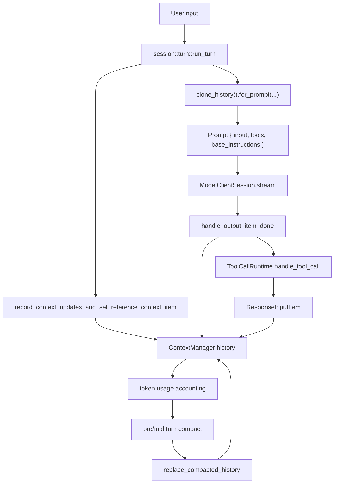

# AILIS 长程任务上下文 Runtime：Codex 源码级分析与开发方案

日期：2026-06-30
范围：AILIS Agent Loop、Artifact Tools、长程任务执行、上下文压缩、工具结果管理
核心目标：基于本机公开/参考 Codex 源码，整理一套可落地的 AILIS 长程任务上下文管理 Runtime，而不是继续依赖零散 prompt 压缩。

## 0. 结论先行

AILIS 目前的 `Context Compiler V1` 做到了“把旧工具结果从 prompt 里清掉”，但没有做到 Codex 更关键的部分：在清掉之前，把工具 observation 归约进稳定的 canonical working state。

因此最近 GAIA XLSX 地图题会失败：

- 模型调用 `artifact_tools.search START`，得到 `START=A1`。
- 下一轮调用 `artifact_tools.search END`，得到 `END=I20`。
- V1 只保留最新 active observation，于是 `START=A1` 被清成 placeholder。
- 模型又回去查 `START`。
- 下一轮 `END=I20` 又被清掉。
- 最终形成 `START/END` 交替搜索，直到 max loop。

这不是 XLSX adapter 的核心失败，也不是单纯模型超时，而是上下文管理语义错误：清理工具结果之前没有先做 `observation -> working_state` 的状态归约。

Codex 源码的核心思想可以概括为：

```text
ResponseItem history
  -> normalize / truncate at record boundary
  -> token accounting
  -> pre-turn or mid-turn compaction
  -> replacement history installation
  -> canonical context reinjection
  -> prompt = history.for_prompt() + model_visible_tool_specs
```

AILIS 下一版应该变成：

```text
StepResult / ToolObservation
  -> AilisResponseItem history
  -> ObservationReducer
  -> AilisWorkingState
  -> ActiveObservation selection
  -> ContextPack / PromptPack
  -> optional CompactionCheckpoint
```

不能继续是：

```text
StepResult string
  -> 保留最新一个 observation
  -> 旧 observation 清成 placeholder
  -> 希望模型自己记得所有事实
```

## 1. 参考源码范围

本分析使用本机源码：

- `F:\CODEX\openai-codex-reference\codex-rs\core\src\context_manager\history.rs`
- `F:\CODEX\openai-codex-reference\codex-rs\core\src\session\turn.rs`
- `F:\CODEX\openai-codex-reference\codex-rs\core\src\session\mod.rs`
- `F:\CODEX\openai-codex-reference\codex-rs\core\src\stream_events_utils.rs`
- `F:\CODEX\openai-codex-reference\codex-rs\core\src\compact.rs`
- `F:\CODEX\openai-codex-reference\codex-rs\core\src\compact_remote.rs`
- `F:\CODEX\openai-codex-reference\codex-rs\core\src\compact_remote_v2.rs`
- `F:\CODEX\openai-codex-reference\codex-rs\core\src\tools\router.rs`
- `F:\CODEX\openai-codex-reference\codex-rs\core\src\tools\spec_plan.rs`

AILIS 当前相关源码：

- `F:\AILIS_self_evolution_runtime\electron\ailis-agent-runner.cjs`
- `F:\AILIS_self_evolution_runtime\electron\ailis-context-compiler.cjs`
- `F:\AILIS_self_evolution_runtime\electron\ailis-turn-items.cjs`

Artifact Tools 协议参考：

- `C:\Users\Lenovo\Documents\New project 9\ARTIFACT_TOOLS_SYSTEM_DESIGN.md`

## 2. Codex 源码架构图



关键点：

- `ContextManager` 是长期上下文的内存模型。
- `ResponseItem` 是模型可见历史的基本单位。
- 工具调用和工具输出是 history 的一等项，不是拼在一段文本里的日志。
- prompt 构建时用 `history.for_prompt()`，并单独注入 `tools: router.model_visible_specs()`。
- compact 不是字符串截断，而是生成并安装 replacement history。
- compact 后通过 `reference_context_item` 决定下一轮是否重注入 canonical initial context。

## 3. Codex 核心源码摘录与解释

### 3.1 `ContextManager`：历史不是聊天文本，而是结构化 ResponseItem

源码位置：`codex-rs/core/src/context_manager/history.rs`

关键结构：

```rust
pub(crate) struct ContextManager {
    /// The oldest items are at the beginning of the vector.
    items: Vec<ResponseItem>,
    /// Bumped whenever history is rewritten, such as compaction or rollback.
    history_version: u64,
    token_info: Option<TokenUsageInfo>,
    /// Reference context snapshot used for diffing and producing model-visible
    /// settings update items.
    reference_context_item: Option<TurnContextItem>,
}
```

源码意义：

- `items` 是模型上下文历史，不是 UI 消息列表。
- `history_version` 标记 compaction/rollback 后的历史重写。
- `token_info` 让 runtime 可以根据真实 token usage 决定是否 compact。
- `reference_context_item` 是“当前系统/环境/权限上下文的基线”，用于决定下一轮只发 diff 还是完整重注入。

AILIS 对应缺口：

- 现在 `stepResults` 只是数组日志，没有正式的 `AilisResponseItem` 历史模型。
- `context_pack` 是从 `stepResults` 临时编译出来的，不是长期上下文的 canonical record。
- 没有 `reference_context_item` 等价机制来保证压缩后系统/任务上下文重注入。

### 3.2 写入 history 时就处理工具输出，而不是最后粗暴压缩

源码位置：`history.rs`

关键函数：

```rust
pub(crate) fn record_items<I>(&mut self, items: I, policy: TruncationPolicy)
where
    I: IntoIterator,
    I::Item: std::ops::Deref<Target = ResponseItem>,
{
    for item in items {
        let item_ref = item.deref();
        if !is_api_message(item_ref) {
            continue;
        }

        let processed = self.process_item(item_ref, policy);
        self.items.push(processed);
    }
}
```

工具输出处理：

```rust
fn process_item(&self, item: &ResponseItem, policy: TruncationPolicy) -> ResponseItem {
    let policy_with_serialization_budget = policy * 1.2;
    match item {
        ResponseItem::FunctionCallOutput { call_id, output } => {
            ResponseItem::FunctionCallOutput {
                call_id: call_id.clone(),
                output: truncate_function_output_payload(
                    output,
                    policy_with_serialization_budget,
                ),
            }
        }
        ...
    }
}
```

源码意义：

- 截断发生在“写入历史边界”，不是 prompt 构建最后一刻随便砍字符串。
- 截断对象是 `FunctionCallOutputPayload`，保留 call_id 和结构。
- 后续 prompt 看到的是结构化历史。

AILIS 对应开发要求：

- `artifact_tools.query` 的 `compactRows` 不能普通字符串中间截断。
- 对工具输出的压缩必须发生在 adapter/output contract 层，保留行、列、ref、continuation、truncated 标记。
- `Context Compiler` 只能决定 prompt retention，不应该破坏 observation 结构。

### 3.3 `for_prompt()` 前会 normalize，保证工具调用链合法

源码位置：`history.rs`

关键函数：

```rust
pub(crate) fn for_prompt(mut self, input_modalities: &[InputModality]) -> Vec<ResponseItem> {
    self.normalize_history(input_modalities);
    self.items
}
```

normalize 注释：

```rust
/// This function enforces a couple of invariants on the in-memory history:
/// 1. every call (function/custom) has a corresponding output entry
/// 2. every output has a corresponding call entry
/// 3. when images are unsupported, image content is stripped from messages and tool outputs
fn normalize_history(&mut self, input_modalities: &[InputModality]) {
    normalize::ensure_call_outputs_present(&mut self.items);
    normalize::remove_orphan_outputs(&mut self.items);
    normalize::strip_images_when_unsupported(input_modalities, &mut self.items);
}
```

源码意义：

- Codex 不允许 prompt 里出现“孤儿工具输出”或“工具调用没有结果”。
- 多模态上下文也在这里按模型能力处理。

AILIS 对应开发要求：

- `recent_turn_items` 和 `tool_observations` 只是 prompt view，不应该成为唯一历史。
- 要增加 `AilisResponseHistory.normalizeForPrompt()`：
  - 每个 tool_call 必须有 tool_result 或 aborted result。
  - 每个 tool_result 必须能追溯 call_id/step_id。
  - artifact render/image observation 在非视觉模型下要降级为 metadata/ref，不要塞图片。

### 3.4 `run_turn`：模型每轮看的是 history snapshot

源码位置：`codex-rs/core/src/session/turn.rs`

关键流程：

```rust
pub(crate) async fn run_turn(...) -> Option<String> {
    let pre_sampling_compact =
        match run_pre_sampling_compact(&sess, &turn_context, &mut client_session).await {
            ...
        };

    sess.record_context_updates_and_set_reference_context_item(turn_context.as_ref())
        .await;

    ...

    let sampling_request_input: Vec<ResponseItem> = {
        sess.clone_history()
            .await
            .for_prompt(&turn_context.model_info.input_modalities)
    };

    match run_sampling_request(..., sampling_request_input.clone(), ...).await {
        ...
    }
}
```

源码意义：

- 每轮模型调用前先检查是否需要 compact。
- 先记录 context updates，再记录用户输入和能力注入。
- prompt input 是 history snapshot，不是现场拼装的巨大任务 JSON。

AILIS 当前情况：

- `executeAgentLoop` 每轮从 `events + stepResults + messageHistory + memoryContext` 现场构造 prompt。
- `compileAgentPromptPayloadV1` 只在构造 prompt 的末端做压缩。
- 缺少“历史先规范化，再生成 prompt view”的层。

AILIS 对应开发要求：

- 引入 `AilisContextRuntime`，让 `executeAgentLoop` 不直接以 `stepResults` 为核心构建上下文。
- 每轮顺序应改为：
  1. record incoming user/context items
  2. record previous tool outputs
  3. reduce observations into working_state
  4. maybe compact
  5. build prompt pack from normalized history + working_state

### 3.5 工具调用结果会立刻进入 history，并触发 follow-up

源码位置：`codex-rs/core/src/stream_events_utils.rs`

模型输出工具调用：

```rust
// The model emitted a tool call; log it, persist the item immediately, and queue the tool execution.
Ok(Some(call)) => {
    record_completed_response_item(ctx.sess.as_ref(), ctx.turn_context.as_ref(), &item)
        .await;

    let tool_future: InFlightFuture<'static> = Box::pin(
        ctx.tool_runtime
            .clone()
            .handle_tool_call(call, cancellation_token),
    );

    output.needs_follow_up = true;
    output.tool_future = Some(tool_future);
}
```

工具 future drain：

```rust
async fn drain_in_flight(...) -> CodexResult<()> {
    while let Some(res) = in_flight.next().await {
        match res {
            Ok(response_input) => {
                let response_item = response_input.into();
                sess.record_conversation_items(&turn_context, std::slice::from_ref(&response_item))
                    .await;
                ...
            }
            ...
        }
    }
}
```

源码意义：

- 工具调用本身是 history item。
- 工具结果完成后立刻写 history。
- `needs_follow_up = true` 表示模型需要看到工具结果后再决策。

AILIS 对应开发要求：

- `stepResults` 应转成 `ToolCallItem + ToolResultItem`，而不是只有工具结果数组。
- 工具失败也是 observation，但应该经过 reducer 进入：
  - latest failure state
  - retry/suppression state
  - capability health state
- 不应靠 prompt 文字反复提醒“失败也是 observation”。

### 3.6 Token 触发 compact：pre-turn 与 mid-turn 都有

源码位置：`turn.rs`

token 状态：

```rust
async fn auto_compact_token_status(...) -> AutoCompactTokenStatus {
    let active_context_tokens = sess.get_total_token_usage().await;
    ...
    let token_limit_reached =
        auto_compact_scope_tokens >= auto_compact_scope_limit || full_context_window_limit_reached;
    ...
}
```

pre-sampling compact：

```rust
async fn run_pre_sampling_compact(...) -> CodexResult<PreSamplingCompactResult> {
    let token_status = auto_compact_token_status(sess.as_ref(), turn_context.as_ref()).await;
    if token_status.token_limit_reached {
        reset_client_session |= run_auto_compact(
            sess,
            turn_context,
            client_session,
            InitialContextInjection::DoNotInject,
            CompactionReason::ContextLimit,
            CompactionPhase::PreTurn,
        )
        .await?;
    }
    ...
}
```

mid-turn compact：

```rust
if token_limit_reached && needs_follow_up {
    let reset_client_session = match run_auto_compact(
        &sess,
        &turn_context,
        &mut client_session,
        InitialContextInjection::BeforeLastUserMessage,
        CompactionReason::ContextLimit,
        CompactionPhase::MidTurn,
    )
    .await
    ...
}
```

源码意义：

- pre-turn compact：新采样前先整理历史。
- mid-turn compact：如果工具调用后还要继续，但上下文超限，先 compact 再继续。
- mid-turn 需要 `BeforeLastUserMessage`，保证模型继续看见当前任务上下文。

AILIS 对应开发要求：

- 不能只用 `MAX_AGENT_LOOP_STEPS` 控制长程任务。
- 要增加上下文预算状态：
  - `activePromptChars`
  - `activeToolObservationChars`
  - `workingStateChars`
  - `directToolSchemaChars`
  - `modelTimeoutRisk`
- 如果需要 follow-up 且 prompt 预算超限，先 compact/reduce，再继续下一轮。

### 3.7 Compact 不是摘要字符串，而是 replacement history

源码位置：`compact.rs`

本地 compact 关键逻辑：

```rust
let history_snapshot = sess.clone_history().await;
let history_items = history_snapshot.raw_items();
let summary_suffix = get_last_assistant_message_from_turn(history_items).unwrap_or_default();
let summary_text = format!("{SUMMARY_PREFIX}\n{summary_suffix}");
let user_messages = collect_user_messages(history_items);

let mut new_history = build_compacted_history(Vec::new(), &user_messages, &summary_text);

if matches!(initial_context_injection, InitialContextInjection::BeforeLastUserMessage) {
    let initial_context = sess.build_initial_context(turn_context.as_ref()).await;
    new_history =
        insert_initial_context_before_last_real_user_or_summary(new_history, initial_context);
}

sess.replace_compacted_history(new_history, reference_context_item, compacted_item)
    .await;
```

关键设计：

- 生成 `summary_text`。
- 保留用户消息的一部分。
- 构造 `new_history`。
- 必要时重注入 initial context。
- 调用 `replace_compacted_history` 安装新历史。

AILIS 对应开发要求：

- `prompt_compaction` 不能只是 prompt 字段。
- 要有 `CompactionCheckpoint`：
  - compacted range
  - replacement history
  - working_state snapshot
  - cold_store refs
  - token/char budget before and after
- compact 后，下一轮应以 checkpoint 后的 history 为准。

### 3.8 Initial context 注入规则非常具体

源码位置：`compact.rs`

源码注释：

```rust
/// Inserts canonical initial context into compacted replacement history at the
/// model-expected boundary.
///
/// Placement rules:
/// - Prefer immediately before the last real user message.
/// - If no real user messages remain, insert before the compaction summary so
///   the summary stays last.
/// - If there are no user messages, insert before the last compaction item so
///   that item remains last (remote compaction may return only compaction items).
/// - If there are no user messages or compaction items, append the context.
```

源码意义：

- Codex 并不相信“摘要自然会保留所有系统上下文”。
- 它明确知道哪些 context 是 canonical，compact 后要重新放回模型视野。

AILIS 对应开发要求：

- 对 AILIS，canonical context 至少包括：
  - current user goal
  - file attachments metadata
  - runtime environment
  - active artifact sessions
  - artifact working facts
  - tool exposure state
  - loop guard state
  - latest failed tool state
- 这些不应该被普通摘要吞掉。

### 3.9 `replace_compacted_history` 会推进 window generation

源码位置：`session/mod.rs`

关键函数：

```rust
pub(crate) async fn replace_compacted_history(
    &self,
    items: Vec<ResponseItem>,
    reference_context_item: Option<TurnContextItem>,
    compacted_item: CompactedItem,
) {
    {
        let mut state = self.state.lock().await;
        state.replace_history(items, reference_context_item.clone());
        state.start_next_auto_compact_window();
    }

    self.persist_rollout_items(&[RolloutItem::Compacted(compacted_item)])
        .await;
    if let Some(turn_context_item) = reference_context_item {
        self.persist_rollout_items(&[RolloutItem::TurnContext(turn_context_item)])
            .await;
    }
    ...
    self.services.model_client.advance_window_generation();
}
```

源码意义：

- compact 是 session state 的真实变更。
- compact 被持久化到 rollout。
- auto compact window 推进。
- model client 的 window generation 也推进。

AILIS 对应开发要求：

- `context_pack` 不能只存在于 prompt 里。
- `.ailis-state/transcripts` 中应持久化 `context_checkpoint` item。
- Debug replay 应能恢复：
  - history
  - working_state
  - checkpoint
  - cold-store references

### 3.10 `reference_context_item` 控制 full context reinjection

源码位置：`session/mod.rs`

关键函数：

```rust
pub(crate) async fn record_context_updates_and_set_reference_context_item(
    &self,
    turn_context: &TurnContext,
) {
    let reference_context_item = {
        let state = self.state.lock().await;
        state.reference_context_item()
    };
    let should_inject_full_context = reference_context_item.is_none();
    let context_items = if should_inject_full_context {
        self.build_initial_context(turn_context).await
    } else {
        self.build_settings_update_items(reference_context_item.as_ref(), turn_context)
            .await
    };
    ...
    state.set_reference_context_item(Some(turn_context_item));
}
```

源码测试：

`record_context_updates_and_set_reference_context_item_reinjects_full_context_after_clear`

测试含义：

- 当 baseline 被清掉，下一轮必须完整重注入 initial context。
- 这和我们现在的问题完全对应：AILIS 清掉 observation 后，没有对应的 working_state/baseline 重注入。

AILIS 对应开发要求：

- 增加 `working_state_reference_version`。
- 如果 prompt compiler 清掉了某类 observation，但 reducer 没有把它写进 working_state，必须禁止清理。
- 如果 checkpoint 重建后 `working_state` 缺 baseline，下一轮必须 full reinjection。

### 3.11 Tool schema 暴露：direct/deferred，不是压缩坏 schema

源码位置：

- `tools/router.rs`
- `tools/spec_plan.rs`

关键结构：

```rust
pub struct ToolRouter {
    registry: ToolRegistry,
    model_visible_specs: Vec<ToolSpec>,
}
```

构建 model-visible specs：

```rust
for runtime in &runtimes {
    let exposure = runtime.exposure();
    if exposure.is_direct() {
        let spec = runtime.spec();
        specs.push(spec_for_model_request(turn_context, exposure, spec));
    }
}
...
let model_visible_specs = merge_into_namespaces(specs)
```

deferred tools：

```rust
if let Some(deferred_mcp_tools) = context.deferred_mcp_tools {
    for tool in deferred_mcp_tools {
        ...
        planned_tools.add_with_exposure(handler, ToolExposure::Deferred)
    }
}
```

tool_search：

```rust
let search_infos = planned_tools
    .runtimes()
    .iter()
    .filter(|executor| executor.exposure() == ToolExposure::Deferred)
    .filter_map(|executor| executor.search_info())
    .collect::<Vec<_>>();
...
planned_tools.add(ToolSearchHandler::new(search_infos));
```

源码意义：

- Codex 不是把所有工具 schema 都塞给模型。
- 直接工具只放必要子集。
- deferred 工具通过 `tool_search` 暴露。
- schema 是结构化 tool spec，不是用户 prompt 字符串。

AILIS 对应开发要求：

- 不要压缩工具 schema 到不可调用。
- `artifact_tools` 这种核心工具应常驻 direct 或高优先级 direct。
- 大量 MCP/external tools 应 deferred，通过 tool_search 暴露。
- direct tool validation 必须基于真实本轮 tools 数组。

## 4. AILIS 当前实现对照

### 4.1 当前 Prompt 构建点

源码位置：`electron/ailis-agent-runner.cjs`

JSON meta decision 路径：

- `buildLlmAgentExecutorMessages(...)`
- 构建 `promptPayload`
- 调用 `compileAgentPromptPayloadV1(promptPayload, { stepResults, events, promptProfile })`
- 再调用 `compactAgentUserPayloadForLocalModel(...)`

Direct tool 路径：

- `buildLlmAgentDirectToolMessages(...)`
- 同样构建 `promptPayload`
- 同样调用 `compileAgentPromptPayloadV1(...)`
- 如果 compact profile，则再压缩 payload

Loop 主体：

- `executeAgentLoop`
- 每轮根据 `stepResults` 重新构造 prompt
- 再调用 LLM decision
- 再执行一个 tool
- 把 `stepResult` push 到数组

### 4.2 当前 V1 Context Compiler 的关键问题

源码位置：`electron/ailis-context-compiler.cjs`

当前逻辑：

```js
const active = selectActiveObservations(items);
const coverage = computeObservationCoverage(items, active);
const cleared = buildClearedObservations(items, active, coverage);
const promptObservations = active.map(buildPromptObservation);
const canonicalState = buildCanonicalState(items, active, payload);
```

`buildCanonicalState` 当前只有：

```js
artifact: latestArtifact ? {
    sessionId: artifactSessionId(latestArtifact) || null,
    sheet: artifactSheet(activeItem || latestArtifact) || null,
    range: artifactRange(activeItem || latestArtifact) || null,
    action: (activeItem || latestArtifact).action || null
} : null
```

问题：

- 没有 artifact facts。
- 没有 search/query 累积结果。
- 没有 working state。
- 没有 `START=A1`、`END=I20`、`usedRange=A1:I20` 这类任务事实。
- 没有 repeated call state。
- 没有 observation reducer。

### 4.3 当前失败的直接机制

对 XLSX map 任务：

```text
search START -> observation has START=A1
search END   -> only END active; START cleared
search START -> only START active; END cleared
search END   -> only END active; START cleared
...
```

`progress_ledger` 只保留类似：

```text
artifact_tools:search completed
```

这对模型没有帮助，因为它没有事实值。

正确机制应该是：

```json
{
  "working_state": {
    "artifact": {
      "sessions": {
        "arts_xxx": {
          "sheets": {
            "Sheet1": {
              "usedRange": "A1:I20",
              "textCells": {
                "START": ["A1"],
                "END": ["I20"]
              },
              "queries": [],
              "neededNext": [
                "query Sheet1!A1:I20 include values/styles"
              ]
            }
          }
        }
      }
    }
  }
}
```

这里的 `neededNext` 不是硬编码解题器，而是状态提示：已经知道起终点和范围，但还没读范围格子。

## 5. AILIS Context Runtime 目标架构

### 5.1 新增核心模块

建议新增或重构为这些模块：

```text
electron/
  ailis-response-history.cjs
  ailis-context-runtime.cjs
  ailis-observation-reducer.cjs
  ailis-working-state.cjs
  ailis-prompt-pack-builder.cjs
  ailis-compaction-runtime.cjs
  ailis-tool-exposure-planner.cjs
  ailis-context-cold-store.cjs
```

各模块职责：

`ailis-response-history.cjs`

- 管理 `AilisResponseItem[]`。
- 提供 `recordItems`、`normalizeForPrompt`、`cloneForPrompt`、`replaceHistory`。
- 保证 tool_call/tool_result 成对。
- 保留 call_id、step_id、tool、args、result ref。

`ailis-observation-reducer.cjs`

- 把工具 observation 归约进 `AilisWorkingState`。
- 每类工具有 reducer：
  - `reduceArtifactObservation`
  - `reduceWebObservation`
  - `reduceExecObservation`
  - `reduceEmailObservation`
  - `reduceFileObservation`
  - `reduceFailureObservation`

`ailis-working-state.cjs`

- 存 canonical state。
- 这是 prompt compaction 后必须保留的状态。
- 保存 facts，不保存大原文。

`ailis-prompt-pack-builder.cjs`

- 从 history + working_state + active observation + tool exposure 构建 prompt。
- 不直接从原始 `stepResults` 现场猜。

`ailis-compaction-runtime.cjs`

- 负责 token/char budget 检测。
- 生成 `CompactionCheckpoint`。
- 安装 replacement history。
- 持久化 checkpoint。

`ailis-context-cold-store.cjs`

- 保存完整工具输出。
- prompt 里只放 ref。
- 支持按 ref 恢复具体 observation。

`ailis-tool-exposure-planner.cjs`

- 管 direct/deferred 工具暴露。
- `artifact_tools` 核心保持 direct。
- MCP/external 大量工具通过 tool_search deferred。

### 5.2 核心对象模型

```ts
type AilisResponseItem =
  | { type: "user_message"; id: string; text: string; createdAt: string }
  | { type: "assistant_message"; id: string; text: string; phase?: string }
  | { type: "tool_call"; id: string; callId: string; tool: string; args: object }
  | { type: "tool_result"; id: string; callId: string; tool: string; ok: boolean; outputRef: ColdStoreRef; observation?: object }
  | { type: "context_update"; id: string; context: object }
  | { type: "compaction"; id: string; checkpointId: string; summary: string };
```

```ts
type AilisWorkingState = {
  schema: "ailis_working_state.v1";
  task: {
    userGoal: string;
    exactAnswerMode: boolean;
    status: "active" | "ready_to_answer" | "blocked";
  };
  artifacts: Record<string, ArtifactWorkingState>;
  tools: {
    repeatedCalls: Array<{ tool: string; action?: string; signature: string; count: number }>;
    latestFailure?: ToolFailureState;
  };
  evidence: {
    candidateRefs: string[];
    rejectedRefs: string[];
  };
};
```

```ts
type ArtifactWorkingState = {
  sessionId: string;
  artifactId?: string;
  path?: string;
  format?: string;
  kind?: string;
  sheets?: Record<string, {
    usedRange?: string;
    knownCells?: Record<string, {
      ref: string;
      value?: string | number | boolean | null;
      formula?: string;
      fill?: string;
      sourceObservationId: string;
    }>;
    textIndexFacts?: Record<string, string[]>;
    queriedRanges?: Array<{
      range: string;
      include: string[];
      truncated: boolean;
      observationId: string;
    }>;
    renderRefs?: Array<{ target: string; imagePath: string; nonblank?: boolean }>;
  }>;
};
```

### 5.3 Observation Reducer 规则

Reducer 是这个 Runtime 的核心。原则：

1. 工具结果进入 prompt 前，必须先被 reducer 看见。
2. 只要 observation 会被清理，就必须满足以下至少一个条件：
   - 关键信息已经进入 working_state。
   - 该 observation 被更完整的 active observation 覆盖。
   - cold store ref 可恢复，且 prompt 中明确提示如何恢复。
3. `lossless=false` 不能被标成 lossless。
4. 行列结构不能被字符串中间截断。
5. repeated call 信息要进入 working_state，防止模型反复调用同一个搜索。

Artifact reducer 示例逻辑：

```js
function reduceArtifactObservation(state, item) {
  const obs = item.artifactObservation;
  if (!obs) return state;

  const artifact = upsertArtifactState(state, obs.sessionId, obs);

  if (item.action === 'open_session') {
    artifact.sessionId = obs.sessionId;
    artifact.path = obs.path;
    artifact.format = obs.format;
  }

  if (item.action === 'inspect') {
    mergeWorkbookOrSheetInventory(artifact, obs, item.id);
  }

  if (item.action === 'search') {
    mergeSearchHitsAsFacts(artifact, obs, item.id);
  }

  if (item.action === 'query') {
    mergeRangeRowsAsKnownCells(artifact, obs, item.id);
  }

  if (item.action === 'render') {
    mergeRenderRef(artifact, obs, item.id);
  }

  return state;
}
```

注意：这不是 `solve_map`。Reducer 不解题，只保存工具已经观察到的结构化事实，让模型能在后续轮同时看到事实。

### 5.4 Prompt Pack Builder

Prompt pack 应该分成明确层次：

```json
{
  "user_goal": "...",
  "working_state": {},
  "recent_history": [],
  "active_observations": [],
  "cleared_observations": [],
  "cold_store_refs": [],
  "tool_exposure": {},
  "budget_report": {}
}
```

关键区别：

- `working_state` 是 canonical。
- `active_observations` 是当前决策材料。
- `cleared_observations` 只是索引，不承担证据表达。
- `recent_history` 只保留最近未归约或需要语义连续性的项。
- `tool_exposure` 与 tools schema 分离。

### 5.5 Compaction Checkpoint

```ts
type CompactionCheckpoint = {
  id: string;
  createdAt: string;
  trigger: "pre_turn_budget" | "mid_turn_budget" | "manual" | "loop_guard";
  inputHistoryRange: { fromIndex: number; toIndex: number };
  replacementHistory: AilisResponseItem[];
  workingStateSnapshot: AilisWorkingState;
  coldStoreRefs: ColdStoreRef[];
  budgetBefore: PromptBudget;
  budgetAfter: PromptBudget;
};
```

Checkpoint 必须持久化到 transcript：

```json
{
  "type": "agent.context_checkpoint",
  "checkpoint": { "...": "..." }
}
```

这样后续 debug/replay 不依赖当前内存。

## 6. AILIS 开发路线

### Phase 1：修正 Context Compiler V1 的语义

目标：先解决“清理过度导致模型缺事实”。

改动：

- 在 `ailis-context-compiler.cjs` 增加正式的 `buildWorkingStateFromItems(items, payload)`。
- `buildCanonicalState` 改名或升级为 `buildContextPackState`。
- 对 artifact_tools 增加 reducer：
  - open_session -> artifact session
  - inspect -> workbook/sheet inventory
  - search -> text cells/search hits/usedRange
  - query -> known cells/ranges/compactRows
  - render -> render refs/nonblank diagnostics
  - validate -> diagnostics
- 清理 observation 前检查 reducer coverage。

验收：

- 重放失败 transcript，prompt 中同时包含 `START=A1` 和 `END=I20`。
- 不再反复 `search START` / `search END`。
- 不增加 `solve_map` 这类死板工具。

### Phase 2：正式引入 AilisResponseHistory

目标：让 history 成为 Runtime 状态，而不是 `stepResults` 临时数组。

改动：

- 新建 `ailis-response-history.cjs`。
- `executeAgentLoop` 每轮将 step result 记录成：
  - tool_call item
  - tool_result item
  - runtime_note item
- prompt builder 从 `history.cloneForPrompt()` 取上下文。

验收：

- tool_result 必须能追溯 tool_call。
- failed tool result 不会孤立。
- debug pause/resume 后 history 完整。

### Phase 3：Compaction Runtime

目标：从 prompt 末端压缩，升级为 session state 级 compact。

改动：

- 新建 `ailis-compaction-runtime.cjs`。
- 每轮决策前做 budget check。
- 超限时生成 checkpoint。
- compact 后安装 replacement history。
- working_state 不参与普通摘要丢失。

验收：

- 长链路任务 prompt 不随 stepResults 线性膨胀。
- compact 后仍保留 artifact facts。
- checkpoint 可从 transcript 恢复。

### Phase 4：Tool Exposure Planner

目标：接近 Codex direct/deferred 工具体系。

改动：

- `artifact_tools`、`tool_search`、`update_plan`、必要 file/read 工具保持 direct。
- MCP/external tools 通过 deferred search 暴露。
- schema 不进入普通 prompt 文本压缩路径。

验收：

- direct tools 的 schema 永远可调用。
- 工具过多不会导致 prompt 超大。
- 工具搜索命中后下一轮 direct tool 可用。

### Phase 5：Long-run Eval

目标：用真实失败任务做回归。

测试集：

- GAIA XLSX map 题。
- BBC Earth 搜索/公开转写题。
- 复杂 XLSX blind test。
- PDF 局部字段查找。
- DOCX 表格/批注查找。
- PPTX 图片/shape inventory。
- Web research 多轮检索题。

每个测试要记录：

- 是否完成。
- loop 数。
- prompt chars/token estimate。
- active_observation 数。
- working_state chars。
- repeated tool call count。
- 是否发生 compact。
- compact 前后关键信息是否保留。

## 7. 关键测试设计

### 7.1 Reducer coverage 测试

输入：

```text
artifact_tools search START -> Sheet1!A1
artifact_tools search END -> Sheet1!I20
```

断言：

```js
state.artifacts[sessionId].sheets.Sheet1.textIndexFacts.START includes "A1"
state.artifacts[sessionId].sheets.Sheet1.textIndexFacts.END includes "I20"
```

### 7.2 Clearing safety 测试

如果 `search START` 被清理，必须满足：

```js
working_state contains START=A1
```

否则不能清理。

### 7.3 Query compactRows lossless 测试

如果 artifact query 返回：

```json
{ "truncated": false, "compactRows": [...] }
```

断言：

- prompt 中保留完整 `compactRows`。
- 不做中间字符串截断。
- 如果超预算，必须分页或 rows-level truncation。

### 7.4 Repeated call loop guard

输入连续：

```text
search START
search END
search START
search END
```

断言：

- working_state 中出现 repeatedCalls。
- prompt 中提示已有事实和重复模式。
- 模型下一步应选择 query/inspect/final，而不是继续同 query。

### 7.5 Checkpoint replay

构造 20 轮工具链路，触发 compact。

断言：

- compact 后 transcript 有 `agent.context_checkpoint`。
- 从 checkpoint 恢复 prompt 仍包含关键 artifact facts。
- 不依赖旧 raw tool result 留在 prompt。

## 8. 不应该做的事

1. 不要为 GAIA XLSX 地图题写 `solve_map`。
   这会把系统变成题库工具，不是 agent runtime。

2. 不要把所有旧 observation 都保留在 prompt。
   这会重新导致超时。

3. 不要让工具返回“高置信/低置信/应该继续”这类硬判断。
   工具返回 facts、diagnostics、coverage、continuation，由模型判断。

4. 不要把 `lossless_tool_observations` 做成实际 1200 字摘要。
   名字和行为必须一致。

5. 不要把 tool schema 当普通 prompt 字符串压缩。
   schema 应走 direct/deferred tool spec。

6. 不要依赖最近 N 条历史。
   最近 N 条会丢任务事实，必须有 working_state。

## 9. 下一步最小可行改动

优先做 Phase 1，不要先大重构。

最小改动：

1. 在 `electron/ailis-context-compiler.cjs` 增加：
   - `buildWorkingStateFromItems`
   - `reduceArtifactObservation`
   - `extractArtifactSearchFacts`
   - `extractArtifactQueryFacts`
   - `buildRepeatedCallFacts`

2. `context_pack` 增加：

```json
{
  "working_state": {
    "schema": "ailis_working_state.v1",
    "artifacts": {},
    "tools": {}
  }
}
```

3. 清理规则改成：

```js
if (item.tool === 'artifact_tools' && !isRepresentedInWorkingState(item, workingState)) {
  keepAsActiveOrRecent(item);
} else {
  clear(item);
}
```

4. 测试先补：

- `Context Compiler V1 carries START and END search facts after clearing older observations`
- `Context Compiler V1 does not clear artifact observation if reducer cannot represent it`
- `Context Compiler V1 keeps complete compactRows without middle truncation`
- `Context Compiler V1 flags repeated identical artifact searches`

这个改动不会锁死模型，也不会添加死板 solver。它只是让模型在长程任务中不失忆。

## 10. 与 Artifact Tools 协议的关系

Artifact Tools 协议强调：

- `inspect` 是 AGENT 的眼睛。
- 输出要小而结构化。
- 大区域分页。
- 样式、公式、merge、comment、relationship、image、shape 要结构化。
- render 和 validate 是一等能力。

Context Runtime 要做的是把这些工具 observation 变成模型可长期操作的世界状态。

因此 Artifact Tools 和 Context Runtime 的边界是：

```text
Artifact Tools:
  解析文件，返回结构化 observation。

Observation Reducer:
  把 observation 中的稳定事实归约到 working_state。

Prompt Pack Builder:
  把 working_state + active observation 交给模型。

LLM:
  自己判断下一步和答案。
```

如果这条边界不清楚，就会继续出现两个极端：

- 工具太智能，替模型做错误判断。
- 工具太原始，把大 JSON 扔给模型导致超时。

正确平衡点是：工具负责结构化事实，Runtime 负责状态保持，模型负责决策和推理。

## 11. 对当前 GAIA XLSX 任务的预期修复结果

修复后，执行链路应变成：

```text
iter0 tool_search artifact_tools
iter1 artifact_tools open_session
iter2 artifact_tools inspect workbook/sheet
iter3 artifact_tools search START
  working_state records START=A1 and usedRange=A1:I20
iter4 artifact_tools search END
  working_state records END=I20 and keeps START=A1
iter5 model sees START, END, usedRange simultaneously
  next likely calls artifact_tools query Sheet1!A1:I20 include values/styles
iter6 model reasons on returned grid/styles
  final F478A7
```

如果模型仍然重复 `search START/END`：

- loop guard 会显示 repeated calls。
- working_state 会提示已有 facts。
- 这时问题才可能是模型策略问题，而不是 Runtime 失忆。

## 12. 最终判断

Codex 长程上下文管理的工程核心不是某个神奇 prompt，而是：

- 结构化 history。
- 工具调用和工具输出作为一等 ResponseItem。
- 写入时截断和 normalize。
- token usage 驱动的 pre/mid-turn compaction。
- compact 后 replacement history 安装。
- canonical initial context 重注入。
- direct/deferred 工具 schema 分层。

AILIS 当前最该补的是：

```text
Observation Reducer + Working State + Safe Clearing
```

这比继续调提示词、加死板工具、或扩大超时时间更重要。
