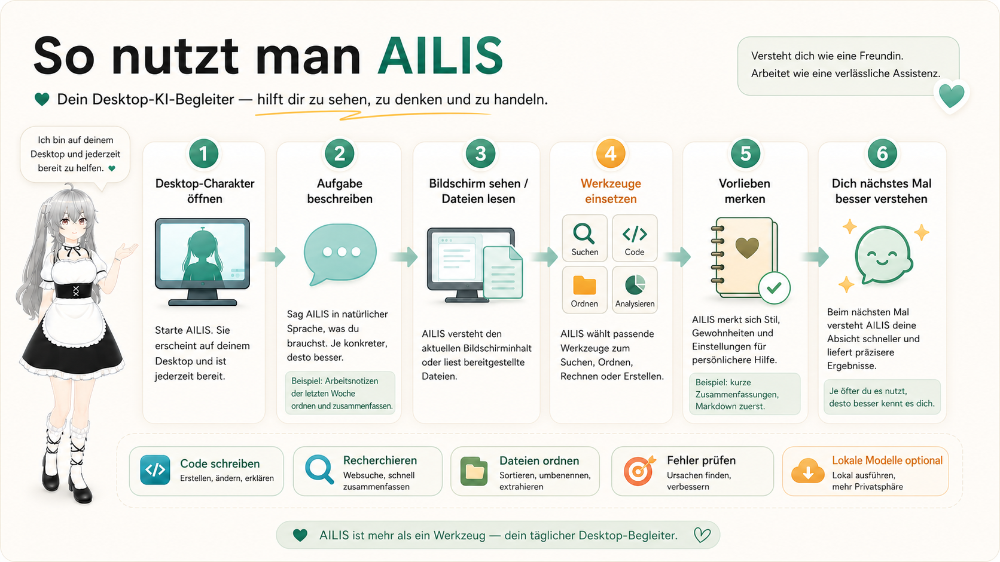
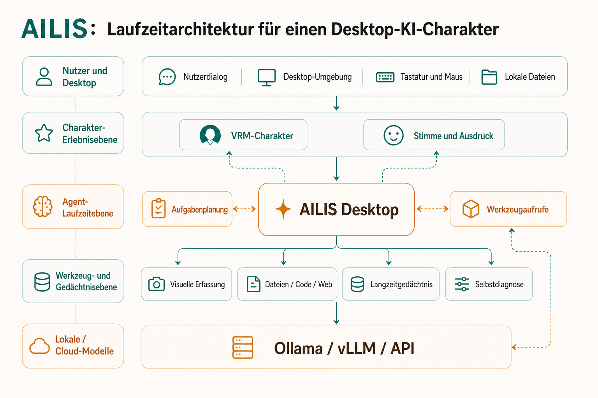

<div align="center">
  <h1>AILIS Assistant</h1>
  <p><strong>Ein Open-Source-Desktop-Assistent mit verkörperter KI, VRM-Charakter, Echtzeitstimme, visuellem Kontext, Gedächtnis und Codex-artigem Agent Harness.</strong></p>
  <p>
    
    
    
  </p>
  <p>
    <a href="README.md">English</a> ·
    <a href="README.zh-CN.md">简体中文</a> ·
    <a href="README.ja.md">日本語</a> ·
    <a href="README.ko.md">한국어</a> ·
    <a href="README.fr.md">Français</a> ·
    <a href="README.de.md">Deutsch</a>
  </p>
</div>

---

## Was ist AILIS

AILIS Assistant ist ein desktop-first Assistent mit verkörperter KI. Das Projekt verbindet einen 3D-VRM-Charakter, Electron-Desktopfenster, Sprachinteraktion, visuellen Kontext aus Screenshots, Gedächtnis und einen strukturierten Agent Runtime.

AILIS ist kein einfacher Web-Chatbot. Ziel ist ein persönlicher Desktop-Assistent, der mit dem Nutzer sprechen, bei Erlaubnis den Bildschirmkontext verstehen, nützliche Präferenzen behalten und Aufgaben über explizite, auditierbare Tools ausführen kann.

<p align="center">
  
</p>

## Projektausrichtung

AILIS verbindet eine ausdrucksstarke Charakterebene mit zuverlässiger Aufgabenausführung.

- Eine Charakterebene mit Präsenz, Ausdrücken, Bewegungen, Stimme und Beziehungsgefühl.
- Ein Agent Harness für Planung, Tool-Routing, Genehmigungen, Evidence Logs und Recovery.
- Eine Desktop Runtime, in der wichtige Tool-Aktionen genehmigt, protokolliert und nach Fehlern wiederhergestellt werden können.

## Aktuelle Fähigkeiten

- VRM-Desktopcharakter mit Ausdrücken, Bewegungen, Lip Sync und Dialogblasen.
- Electron-Pet-Fenster, Chatfenster, Control Panel, Tray-Integration und lokaler persistenter Zustand.
- Desktop-TTS-Worker, Cloud-Voice-Pfade und optionaler lokaler Spracherkennungs-Worker.
- Berechtigungsbewusster visueller Kontext über Screenshot-, Fenster- und Region-Capture.
- Memory Blocks, Projektkontext, Beziehungszustand und leichte Reflection.
- Tool-Layer für Dateien, Code, Computeraktionen, E-Mail, MCP Skills, Web/Search und lokale Runtime-Utilities.
- Explizites Genehmigungsmodell für Aktionen, die Dateien, Apps, Konten oder externe Dienste betreffen.
- Humanlike Experience Evals, Tool-Contract-Tests, Gateway Checks und Agent Execution Smoke Tests.

## Architektur

<p align="center">
  
</p>

```text
Nutzer / Stimme / Bildschirm
        |
        v
AILIS Desktop UI
  - VRM-Charakter
  - Chatfenster
  - Control Panel
        |
        v
Agent Harness
  - planner
  - tool router
  - approval gate
  - evidence log
  - recovery loop
        |
        v
Runtime Services
  - model providers
  - voice / ASR / TTS
  - vision capture
  - memory store
  - local tools / MCP
        |
        v
Validation
  - tests
  - evals
  - smoke checks
```

## Repository-Struktur

```text
electron/   Electron Main Process, Preload Bridge, Runtime Services, lokale Tool-Adapter
src/        Renderer Apps für Pet, Chat, Control Panel, Voice, Vision UI und Bubbles
backend/    Optionales FastAPI Backend, API Schemas, Memory Services und statische Assets
Resources/  VRM Model, VRMA Motions, Reference Audio und Character Assets
docs/       Architektur, Memory Design, Tool Ecosystem, Evaluation und Release Planning
evals/      Humanlike Experience Szenarien und Long-Term Companionship Eval-Daten
scripts/    Runtime Preparation, Validation, Smoke Tests, Benchmarks und Packaging Helpers
tests/      Tests für Runtime, Memory, Tools, Contracts, Gateway und Agent Behavior
```

## Schnellstart

```bash
pnpm install
pnpm desktop:dev
```

Bauen und starten:

```bash
pnpm desktop:start
```

Windows Desktop App packen:

```bash
pnpm desktop:package
```

Optionales Backend:

```bash
python -m venv .venv
.venv\Scripts\activate
pip install -r requirements.txt
copy backend\.env.example backend\.env
python -m uvicorn backend.main:app --reload
```

## Modell- und Sprachkonfiguration

Die aktuelle Version verbindet sich über AILIS Cloud mit dem Modelldienst. Persona, Memory, TaskAgent, Genehmigungen sowie Datei- und Computer-Tools laufen weiterhin auf dem PC des Nutzers.

- Optionale Vorbereitung von local ASR und desktop TTS runtime.

Committen Sie niemals echte API keys, Zugangsdaten, Chat-Transkripte, Runtime Logs oder generierte Eval-Ergebnisse.

## Nützliche Befehle

```bash
pnpm test:ailis-runtime
pnpm test:ailis-agent
pnpm test:ailis-tool-contracts
pnpm test:ailis-memory
pnpm ailis:validate-harness
```

Vollständige Gateway-Validierung:

```bash
pnpm ailis:validate-gateway
```

## Wichtige Dokumente

- [Embodied Agent Architecture](docs/ailis-embodied-agent-architecture.md)
- [Memory Architecture V2](docs/ailis-memory-architecture-v2.md)
- [Humanlike Eval](docs/ailis-humanlike-eval.md)
- [Tool Ecosystem Driver Guide](docs/tool-ecosystem-driver-guide.md)

## Projektstatus

Aktuelle Release-Linie: `v1.4.0`.

AILIS wird aktiv entwickelt. Desktop Runtime, Agent Harness, Tool-Layer und Evaluation Surface sind bereits substanziell, das Projekt sollte aber noch als Alpha-Produkt/Runtime und nicht als production-grade Agent OS betrachtet werden. Kurzfristige Prioritäten sind klarere Tool Contracts, sicherere Genehmigungen, bessere Memory-Qualität, zuverlässigere Langzeitaufgaben und robustere End-to-End-Evaluation.

## Datenschutz und Sicherheit

- Vision Capture ist berechtigungsbewusst und dient dem Kontextverständnis.
- Aktionen, die Dateien, Apps, Konten oder externe Dienste betreffen, müssen explizit genehmigt werden.
- Memory und Runtime State bleiben lokal, sofern der Nutzer nichts anderes wählt.
- Secrets gehören in lokale Konfiguration, niemals ins Repository.

## Lizenz

Der AILIS source code steht unter der [MIT License](LICENSE). Einige gebündelte oder Drittanbieter-Assets, Modelle, Motions und Voice-Ressourcen können eigene Lizenzen haben; prüfen Sie die asset-spezifischen Hinweise vor einer Weiterverteilung.
