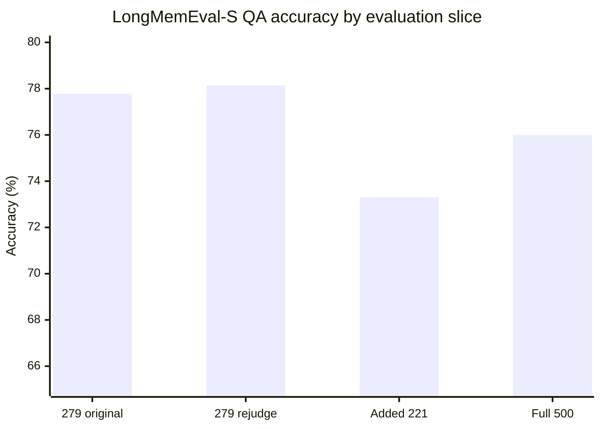
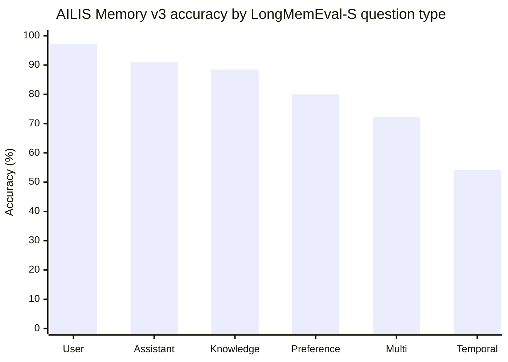
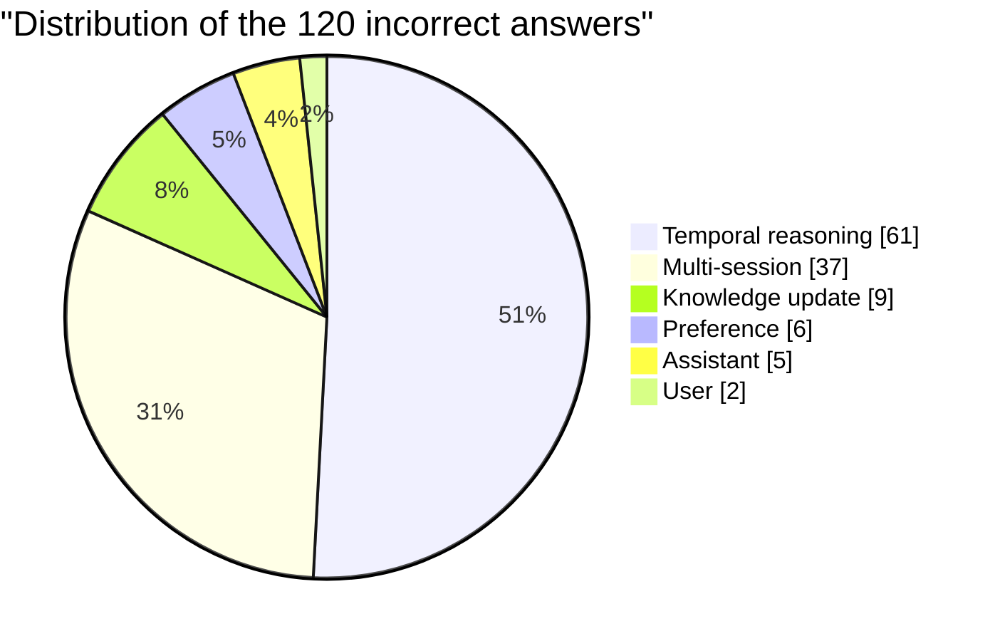
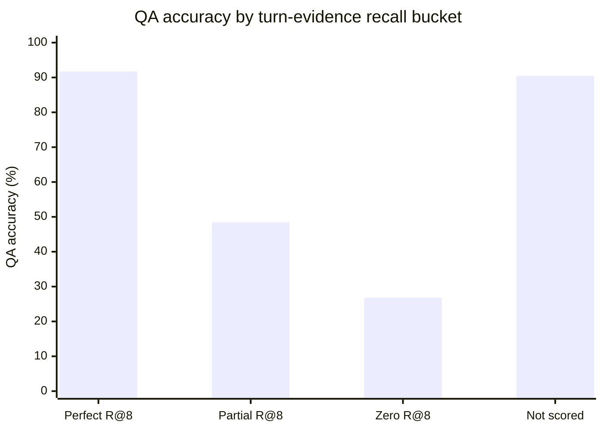

<div align="center">
  
  <h1>AILIS</h1>
  <p><strong>A desktop AI companion with a visible character, voice, memory, and a Codex-style tool runtime.</strong></p>
  <p>
    
    
    
  </p>
  <p>
    
    
    
    
  </p>
  <p>
    <a href="README.md">English</a> ·
    <a href="README.zh-CN.md">简体中文</a> ·
    <a href="README.ja.md">日本語</a> ·
    <a href="README.ko.md">한국어</a> ·
    <a href="README.fr.md">Français</a> ·
    <a href="README.de.md">Deutsch</a>
  </p>
  <p>
    <a href="https://101.133.239.56/">Homepage</a> ·
    <a href="https://github.com/haowenGuo/AILIS/releases/tag/v1.1.0">Download</a> ·
    <a href="docs/ailis-embodied-agent-architecture.md">Architecture</a> ·
    <a href="docs/ailis-demo-benchmark-scorecard.md">Benchmarks</a>
  </p>
</div>

---

## Evaluation Snapshot

AILIS is developed as an evaluated agent system, not only as a character demo. The current evidence spans stateful tool use, general assistant tasks, long-term companion behavior, and desktop operation. Each number below includes its scale and claim boundary.

| Evaluation track | Result | Scale | Evidence status |
| --- | ---: | ---: | --- |
| **Apple ToolSandbox** | **71.51%** frozen holdout mean | 239 / 239 officially scored, 0 errors | Primary public task-quality result |
| **GAIA Level 1 strict rerun** | Run 1: **41 / 53, 77.36%** | First of two required full runs | Provisional strict-memory-isolated result; Run 2 is pending |
| **GAIA Level 1 historical** | **85.85%** two-run mean; best run **90.57%** | 53 public validation tasks x 2 | Historical local diagnostic; task-memory isolation was missing |
| **LongMemEval-S Memory v3** | **380 / 500, 76.00%** | 500 / 500 generated and judged, 0 failures | Complete internal run using the verbatim official QA prompt; Luna Judge, so not leaderboard-comparable |
| **Longitudinal companion eval** | **78.46 / 100** weighted mean | 171 judged checkpoints from 30-day scenarios | Internal product evaluation |
| **OSWorld small run** | **2 / 4**, 50% | 4 historical desktop tasks | Early external-benchmark signal; sample is too small for a broad claim |
| **Humanlike dataset validation** | **1000 / 1000** valid | 9 categories, 251 negative probes | Evaluation coverage, not model quality |

> **Primary headline:** the frozen Apple ToolSandbox holdout mean is **71.51%**. The current strict GAIA protocol has completed its first full run at **77.36%**, with benchmark memory disabled and no failed-task replacement. It remains provisional until the second independent 53-task run finishes. The higher 85.85% historical mean stays visible for transparency, but is not the current reproducibility claim. The completed LongMemEval-S result is reported separately at **76.00%** under the internal Luna Reader/Judge protocol described below.

[Full benchmark scorecard](docs/ailis-demo-benchmark-scorecard.md) ·
[GAIA methodology](docs/ailis-desktop-real-gaia-eval.md) ·
[ToolSandbox protocol and gates](docs/ailis-toolsandbox-v4-optimization-plan.md)

<p align="center">
  
</p>

## LongMemEval-S: Memory v3 Full Evaluation

AILIS Memory v3 completed a full **500-question LongMemEval-S** run on 2026-08-02. Generation and judging both completed without a failed question. The final QA result is **380 / 500 (76.00%)**. This is a complete internal benchmark result, not an official leaderboard submission: AILIS preserves the verbatim LongMemEval QA prompt and binary aggregation, but uses `gpt-5.6-luna` as both Reader and Judge rather than the reference GPT-4o Judge shown by the [official LongMemEval evaluator](https://github.com/xiaowu0162/LongMemEval).

### Evaluation contract and result

| Item | Frozen value |
| --- | --- |
| Dataset | `longmemeval_s_cleaned.json`, 500 questions, SHA-256 `d6f21ea9...8c3a442` |
| Candidate / Reader | `gpt-5.6-luna`, reasoning effort `medium` |
| Memory strategy | `hybrid_rrf_ledger_v3`, 4,800-token context budget |
| Dense retriever | `Xenova/multilingual-e5-small`, revision `761b726dd34fb83930e26aab4e9ac3899aa1fa78` |
| Dense execution | Batch size 1, one native thread per worker, fallback disabled |
| Generation | 3 workers; **500 / 500 completed**, 0 failed |
| Judge | Verbatim official QA prompt; `gpt-5.6-luna`, `medium`, 3 workers |
| Judge result | **380 / 500 correct, 76.00%**, 0 failed |
| Official evaluator source | SHA-256 `5085eb9...00a430a` |
| Isolation invariants | TaskAgent steps 0; short-term messages 0; dense fallback rows 0 |
| Provenance gate | Missing Ledger 0; empty/missing/task sources 0/0/0; actual dangling supersession 0 |
| Ledger scale | 63,124 records from 124,351 processed events |

### Stage-to-full comparison

The earlier fixed 279-question checkpoint and the final run used the same Reader and Judge configuration. All 279 candidate hypotheses were byte-for-byte identical between the two runs. Rejudging those same answers inside the 500-question run produced nearly the same score, so the final decrease is attributable to the composition of the additional 221 questions rather than answer drift.



| Evaluation slice | Correct | Accuracy | Interpretation |
| --- | ---: | ---: | --- |
| Fixed 279 checkpoint | 217 / 279 | **77.78%** | Original stage Judge result |
| Same 279 inside full rejudge | 218 / 279 | **78.14%** | Same hypotheses, independent Judge pass |
| Additional 221 questions | 162 / 221 | **73.30%** | Harder added slice |
| Full run | 380 / 500 | **76.00%** | Final accepted result |

Repeat-Judge agreement on the shared 279 questions was **98.92%**: 216 were correct both times, 60 were wrong both times, one changed from correct to wrong, and two changed from wrong to correct. Cohen's kappa was **0.9687**, and the exact McNemar test was `p = 1.0`. Judge drift is therefore negligible relative to the difficulty shift in the added slice.

The additional slice contained 73 new temporal-reasoning questions, scoring only **32 / 73 (43.84%)**. The fixed-stage temporal questions scored **40 / 60 (66.67%)**. As a descriptive counterfactual, matching the stage temporal rate on the additional temporal questions would add about 16.7 correct answers and place the full result near **79.3%**; this is an estimate, not a measured score.

### Accuracy and retrieval by question type



| Question type | Correct | Accuracy | Errors | Share of all errors | Session R@8 | Turn R@8 |
| --- | ---: | ---: | ---: | ---: | ---: | ---: |
| Single-session user | 68 / 70 | **97.14%** | 2 | 1.67% | 98.57% | 84.29% |
| Single-session assistant | 51 / 56 | **91.07%** | 5 | 4.17% | 100.00% | 98.21% |
| Knowledge update | 69 / 78 | **88.46%** | 9 | 7.50% | 96.79% | 85.47% |
| Single-session preference | 24 / 30 | **80.00%** | 6 | 5.00% | 93.33% | 76.67% |
| Multi-session | 96 / 133 | **72.18%** | 37 | 30.83% | 88.25% | 71.17% |
| Temporal reasoning | 72 / 133 | **54.14%** | 61 | 50.83% | 67.84% | 58.32% |
| **Overall / macro retrieval** | **380 / 500** | **76.00%** | **120** | **100.00%** | **87.22%** | **75.18%** |

Micro Session R@8 was **83.54%** and Micro Turn R@8 was **73.80%**. Temporal reasoning and multi-session questions account for **98 / 120 errors (81.67%)**, while simple user-side fact recall is already near saturation.



### Retrieval quality versus QA accuracy

Correct answers had much stronger evidence recall than incorrect answers:

| Judge outcome | Questions | Mean Session R@8 | Mean Turn R@8 |
| --- | ---: | ---: | ---: |
| Correct | 380 | **95.25%** | **85.04%** |
| Incorrect | 120 | **61.78%** | **43.96%** |



| Turn-evidence bucket | Correct | Accuracy | Incorrect |
| --- | ---: | ---: | ---: |
| Perfect Turn R@8 = 1 | 299 / 326 | **91.72%** | 27 |
| Partial 0 < Turn R@8 < 1 | 47 / 97 | **48.45%** | 50 |
| Zero Turn R@8 = 0 | 15 / 56 | **26.79%** | 41 |
| Turn metric not scored | 19 / 21 | **90.48%** | 2 |

**91 / 120 errors (75.8%)** occur when turn-level evidence is partial or absent, making retrieval coverage the primary bottleneck. Another **27 / 120 errors (22.5%)** remain despite perfect turn recall; these form the Reader/reasoning, temporal interpretation, answer formulation, and Judge-boundary bucket. These relationships are diagnostic correlations, not a controlled causal decomposition.

The 30 abstention questions scored **27 / 30 (90.00%)**, compared with **353 / 470 (75.11%)** on non-abstention questions. Abstention behavior is not the principal source of error.

### Historical AILIS comparison

Against the earlier internally reported AILIS result of **46.2%**, Memory v3 improves by **29.8 percentage points**, a **64.5% relative accuracy increase**. Error rate falls from 53.8% to 24.0%, a **55.4% relative error reduction**. The old 46.2% artifact was not independently revalidated during this final audit, so this remains a historical internal comparison unless dataset, Reader, and Judge equivalence are established.

### Audit correction and evidence paths

The original controller verdict reported 1,296 dangling supersession references and therefore rejected an otherwise complete run. This was a verifier false positive: the verifier spread scalar `supersededBy` record-id strings into individual JavaScript characters. There were 48 scalar references across 39 newly generated question states; their combined string length was exactly 1,296, all 48 resolved inside their own ledgers, and none of the 289 migrated states was affected. The original artifacts remain unchanged, while the schema-aware corrected audit records **zero actual dangling references** and accepts the run.

Durable local evidence:

```text
eval-results/longmemeval-ailis/memory-v3-full500-luna3-20260802-v1/
  hypotheses.jsonl
  results.jsonl
  official-prompt-luna-judge-memory-v3-luna3-full500/
    judgments.jsonl
    summary.json
  MEMORY_V3_FULL_REPORT_CORRECTED.md

longrun/jobs/ailis-memory-v3-longmemeval-full-luna3-20260802/
  final-report.corrected.md
  verdict.corrected.json
```

### Optimization priorities supported by the result

1. **Temporal retrieval:** normalize dates and intervals, infer query-time ranges, distinguish current state from history, and traverse supersession chains explicitly.
2. **Multi-session evidence coverage:** decompose questions into evidence subgoals and optimize context packing for coverage rather than only top similarity.
3. **Evidence-complete Reader verification:** target the 27 failures that occur despite perfect Turn R@8 with chronology, conflict, and evidence-faithfulness checks.
4. **Regression protection:** preserve the already strong single-session user, assistant, and knowledge-update performance while changing temporal ranking.

<p align="center">
  
</p>

## Meet AILIS

AILIS is built to feel less like a blank chat box and more like a presence on your desktop. It combines a 3D character surface, realtime dialogue, voice output, memory, screen/file context, and a tool-using agent runtime for real work.

The product direction is simple: a companion you can talk with naturally, and a work partner that can switch into task mode when you need help with code, research, files, email, or desktop workflows.

## Product Surface

<p align="center">
  
  
  
</p>

AILIS brings three layers together:

- **Character layer**: VRM character, expressions, motions, lip sync, speech bubbles, tray and desktop windows.
- **Companion layer**: conversational style, user preferences, memory blocks, relationship state, and lightweight reflection.
- **Agent layer**: tool routing, approvals, evidence logs, recovery loops, model provider configuration, and local runtime utilities.

## What It Can Do

- VRM desktop character with expressions, motions, lip sync, and dialogue bubbles.
- Electron pet window, chat window, control panel, tray integration, and local persistent state.
- OpenAI-compatible model provider configuration, including custom base URLs and local-provider workflows.
- Voice output through desktop TTS workers and cloud provider paths.
- Optional local speech recognition worker for desktop voice input.
- Permission-aware visual context through screenshot, window, and region capture flows.
- Memory blocks, project context, relationship state, and lightweight reflection.
- Tool layer for file operations, code work, computer actions, email, MCP skills, web/search support, and local runtime utilities.
- Approval-aware execution model for actions that can affect files, apps, accounts, or external services.
- EMBER-Harness stage gates for checking untrusted inputs, tool calls, tool results, and final outputs during agent execution.
- Humanlike experience evals, tool-contract tests, gateway checks, and agent execution smoke tests.

## Why It Is Different

AILIS is not only an expressive avatar and not only an automation console. The interesting part is the bridge:

- It can stay soft and conversational during daily interaction.
- It can become explicit and auditable during task execution.
- It keeps provider, memory, model, voice, and local runtime choices under the user's control.
- It is open source under MIT, so the character surface and the agent harness can evolve together.

## GAIA: General Agent Capability

The current strict-memory-isolated protocol is frozen at commit `6afc0ae`. Its first complete run scored **41 / 53 (77.36%)**; the required second run has not yet been incorporated into a final mean or stability score. An unexpected Windows reboot interrupted the first run after 46 completed rows. Recovery reused the same run ID, skipped every completed task, and executed only the seven unfinished tasks; no failed task was retried, replaced, or re-scored.

<p align="center">
  
</p>

AILIS completed two fixed-commit runs of the 53-task GAIA 2023 Level 1 public validation set. Codex's ChatGPT OAuth bridge supplied the `gpt-5.5` model, while AILIS retained ownership of the agent harness, context management, tool execution, and answer pipeline.

| Metric | Result |
| --- | ---: |
| Run 1 | 43 / 53, **81.13%** |
| Run 2 | 48 / 53, **90.57%** |
| Two-run mean | 45.5 / 53, **85.85%** |
| Stable pass | 40 / 53 tasks passed both runs |
| Outcome agreement | 42 / 53, **79.25%** |

These are retained as historical diagnostics, not the current reproducibility claim. A post-run audit found that workspace isolation did not disable persistent semantic-memory retrieval between tasks inside each run. That task-to-task contamination risk invalidates calling the runs independent, even though run IDs, workspaces, retries, and score files were isolated. The evaluation runner now sets `memoryPolicy: disabled`; a new full rerun is required before publishing a replacement primary score.

This is a local `desktop-real` visible-answer evaluation on the public validation split, not an official submission to the private 93-task Level 1 test leaderboard. Both historical runs used commit `4f8f435`, separate run IDs and isolated workspaces, with no resume, per-task retry, failed-task replacement, or score merging, but without strict per-task memory isolation. See the [evaluation methodology](docs/ailis-desktop-real-gaia-eval.md) and [benchmark scorecard](docs/ailis-demo-benchmark-scorecard.md).

## ToolSandbox: Stateful Tool Use

<p align="center">
  
</p>

AILIS completed official offline scoring for all **728 non-RapidAPI** Apple ToolSandbox scenarios through the production agent and the official on-policy user simulator. The remaining 304 RapidAPI-dependent scenarios were excluded from calls, cost, and every metric.

ToolSandbox returns a continuous scenario similarity score from `0` to `1`, reflecting milestone completion and minefield avoidance. It is therefore better read as a quality score than as a binary pass rate. We disclose several views instead of hiding them behind one headline number:

| Evidence lens | Result | How to interpret it |
| --- | ---: | --- |
| Certified coverage | **728 / 728, 100%** | Evaluation completeness, not task accuracy |
| Frozen v3 primary holdout | **71.51%** mean, 239 / 239 scored, 0 errors | Primary frozen-source generalization estimate |
| Holdout non-zero / perfect | **81.17% / 38.08%** | 194 non-zero and 91 perfect scores out of 239 |
| Targeted recovery | **81.49%** mean, 155 / 155 valid, 0 zeros | Selected analyzed failures; diagnostic, not an unbiased global score |
| Stability sample | **75.01% -> 88.31%**, paired **+13.29 pp** | Separate no-material-regression evidence on 64 original positives |
| Stability outcomes | 29 improved / 22 unchanged / 13 regressed | Includes 2 severe regressions; all preregistered gates passed |

The primary public quality number is the frozen holdout mean, **71.51%**. `valid-only` and `errors-as-zero` are identical because the v3 and stability primary batches had zero errors. The targeted-recovery and stability means answer different questions and must not be averaged with the holdout score or presented as a randomized causal gain. V1, V2, raw intermediate, cross-drift, and quarantined results are excluded from the primary claim.

## Reproduce And Audit

The repository keeps benchmark planning, task-level results, progress streams, audit events, transcripts, and readable reports separate. GAIA regression admission requires two complete baseline runs and two complete candidate runs over an identical task set:

```bash
pnpm bench:gaia:desktop-real:smoke
pnpm bench:gaia:desktop-real:l1
pnpm bench:gaia:compare -- \
  --baseline baseline-run-1.jsonl \
  --baseline baseline-run-2.jsonl \
  --candidate candidate-run-1.jsonl \
  --candidate candidate-run-2.jsonl \
  --expected-tasks 53 \
  --output eval-results/engineering/gaia-regression-gate.md
pnpm eval:ailis-humanlike:longitudinal-agent:validate
pnpm bench:osworld:readiness
```

The default GAIA comparison gate rejects missing or replaced tasks, lower visible success, more timeouts, P95 latency increases above 15%, mean-token increases above 10%, and stable per-task regressions. Benchmark-specific answer routing is not an accepted optimization strategy.

## Architecture

<p align="center">
  
</p>

```text
User / Voice / Screen
        |
        v
AILIS Desktop UI
  - VRM character
  - Chat window
  - Control panel
        |
        v
Agent Harness
  - planner
  - tool router
  - approval gate
  - EMBER-Harness stage gates
  - evidence log
  - recovery loop
        |
        v
Runtime Services
  - model providers
  - voice / ASR / TTS
  - vision capture
  - memory store
  - local tools / MCP
        |
        v
Validation
  - tests
  - evals
  - smoke checks
```

## EMBER-Harness Stage Gates

AILIS includes an EMBER-Harness integration for stage-level safety control inside the agent execution chain. Instead of only checking the final answer, the harness can inspect several boundaries where risk may enter or spread:

- User input before it enters the agent context.
- Tool calls before execution, especially actions with side effects.
- Tool results before they are added back into the model context.
- Final output before it is shown to the user.

The harness records auditable check events with snapshot hashes, approximate token counts, stage names, decisions, and rollback targets. The control panel exposes Off, Observe, and Enforce modes; Off neither loads nor downloads a safety model. The default evaluator runs a quantized multilingual DistilBERT ONNX classifier locally without a generative LLM. Its first enable downloads about 136 MB into the persistent AILIS state directory. This lightweight profile targets overt toxicity and hate risk, not subtle implicit-bias or stereotype reasoning. Deployments can override it through `AILIS_EMBER_HARNESS`, `AILIS_EMBER_HARNESS_MODE`, `AILIS_EMBER_SAFETY_MODEL`, and threshold environment variables. Runtime status remains available at `/ember-harness/status`.

## Repository Layout

```text
electron/   Desktop main process, preload bridge, runtime services, local tool adapters
src/        Renderer apps for the pet, chat, control panel, speech, vision UI, and bubbles
backend/    Optional FastAPI backend, API schemas, memory services, and static assets
Resources/  VRM model, VRMA motions, reference audio, and character assets
docs/       Architecture notes, memory design, tool ecosystem, evaluation, and release planning
evals/      Humanlike experience scenarios and long-term companionship evaluation data
scripts/    Runtime preparation, validation, smoke tests, benchmarks, and packaging helpers
tests/      Node test suites for runtime, memory, tools, contracts, gateway, and agent behavior
```

## Quick Start

Install dependencies:

```bash
pnpm install
```

Run the desktop app in development mode:

```bash
pnpm desktop:dev
```

Build and start the desktop app:

```bash
pnpm desktop:start
```

Package the Windows desktop app:

```bash
pnpm desktop:package
```

Optional backend setup:

```bash
python -m venv .venv
.venv\Scripts\activate
pip install -r requirements.txt
copy backend\.env.example backend\.env
python -m uvicorn backend.main:app --reload
```

## Model And Voice Setup

AILIS is provider-agnostic at the application layer. Configure providers through the desktop control panel or local environment files:

- OpenAI-compatible cloud providers.
- Local vLLM endpoints.
- Ollama-oriented local workflows.
- Custom base URLs, model names, request timeouts, and private API keys.
- Optional local ASR and desktop TTS runtime preparation.

Never commit real API keys, account credentials, chat transcripts, local model caches, runtime logs, or generated eval outputs.

## Useful Commands

```bash
pnpm test:ailis-runtime
pnpm test:ailis-agent
pnpm test:ailis-tool-contracts
pnpm test:ailis-memory
pnpm ailis:validate-harness
```

Full gateway validation is heavier and runs a larger set of runtime, contract, tool, memory, agent, and smoke checks:

```bash
pnpm ailis:validate-gateway
```

## Core Documents

- [Documentation Index](docs/README.md)
- [Embodied Agent Architecture](docs/ailis-embodied-agent-architecture.md)
- [System TaskAgent Architecture](docs/ailis-system-taskagent-architecture.md)
- [Codex Multi-Agent Data-Flow Migration](docs/ailis-codex-multi-agent-dataflow-migration.md)
- [Memory Architecture V2](docs/ailis-memory-architecture-v2.md)
- [Humanlike Eval](docs/ailis-humanlike-eval.md)
- [Tool Ecosystem Driver Guide](docs/tool-ecosystem-driver-guide.md)

## Project Status

Current release line: `v1.1.0`.

AILIS is in active development. It already has a substantial desktop runtime, agent harness, tool layer, and evaluation surface, but it should still be treated as an alpha-stage product/runtime rather than a production-grade Agent OS. The near-term priority is reliability: clearer tool contracts, safer approvals, stronger memory behavior, better local model setup, and higher-quality end-to-end evaluation.

## Privacy And Safety

AILIS is designed for personal desktop use, so privacy and control are part of the architecture:

- Vision capture is permission-aware and should be used to understand context, not to silently act.
- Mutating or high-risk tool actions should pass through explicit approval.
- Local memory and runtime state should remain machine-local unless the user chooses otherwise.
- Secrets belong in local configuration, never in source control.

## License

AILIS source code is released under the [MIT License](LICENSE). Some bundled or third-party assets, models, motions, and voice resources may have their own licenses; check asset-specific notes before redistribution.
