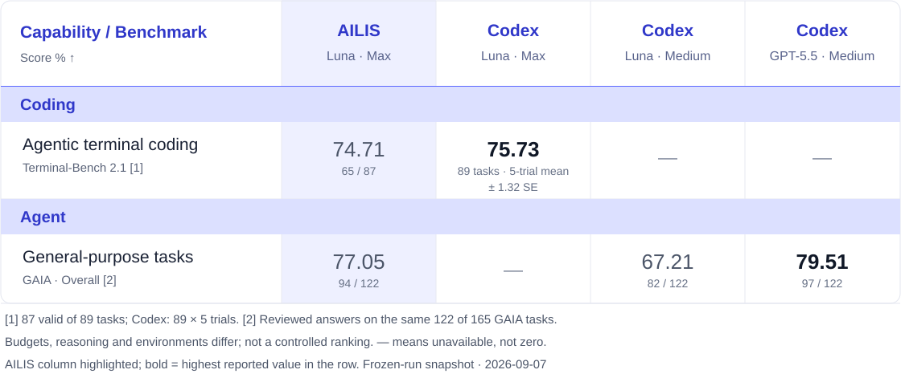
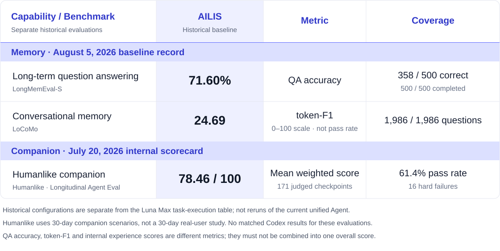

<div align="center">
  
  <h1>AILIS</h1>
  <p><strong>An open-source desktop AI companion that can see, listen, remember, and get real work done.</strong></p>
  <p>
    
    
    
  </p>
  <p>
    <a href="https://101.133.239.56/Test/"><strong>Try AILIS</strong></a> ·
    <a href="https://github.com/haowenGuo/AILIS/releases"><strong>Download</strong></a> ·
    <a href="docs/guide/desktop.md">Quick Start</a> ·
    <a href="docs/README.md">Documentation</a>
  </p>
  <p>
    <a href="README.md">English</a> ·
    <a href="README.zh-CN.md">简体中文</a> ·
    <a href="README.ja.md">日本語</a> ·
    <a href="README.ko.md">한국어</a> ·
    <a href="README.fr.md">Français</a> ·
    <a href="README.de.md">Deutsch</a>
  </p>
</div>

## More Than a Chat Window

AILIS is designed to become a personal AI that actually lives on your desktop. She has a visible 3D character, voice, expressions, and long-term memory, backed by an Agent Runtime that can research, read files, write code, organize content, and operate computer tools.

Talk to AILIS naturally, like a companion. When there is work to do, she can understand approved screen and file context, choose the right tools, complete the task, and remember the preferences that matter next time.

## Core Experience

<table>
  <tr>
    <td width="33%" valign="top"><h3>Visible</h3>A VRM desktop character with expressions, motions, lip sync, and dialogue bubbles. AI no longer has to feel like an empty text box.</td>
    <td width="33%" valign="top"><h3>Conversational</h3>Voice input and natural speech output are available alongside quiet, fast text interaction.</td>
    <td width="33%" valign="top"><h3>Context-aware</h3>With permission, AILIS can understand screens, windows, captured regions, and local files without making you repeat the context.</td>
  </tr>
  <tr>
    <td width="33%" valign="top"><h3>Capable</h3>Search, code, files, web, email, and computer actions share one auditable tool execution path.</td>
    <td width="33%" valign="top"><h3>Memorable</h3>Long-term memory keeps useful preferences, project background, and relationship context for better collaboration.</td>
    <td width="33%" valign="top"><h3>Controllable</h3>Important tool actions enter approval and audit flows, so users know what the system plans to do and what it has done.</td>
  </tr>
</table>

## How AILIS Works

| 1. Describe | 2. Understand | 3. Execute | 4. Remember |
| :---: | :---: | :---: | :---: |
| Explain the goal naturally | Read approved screen and file context | Use search, code, file, and computer tools | Keep useful preferences and project background |

## Evaluation Results

End-to-end Agent evaluation · **2026-09-07** · scores in %. AILIS is highlighted; columns identify both the system and its model / reasoning setting.



**[1] Terminal-Bench:** 65 passes / 87 valid tasks, with 2 of 89 unresolved. Codex is the official archived mean across 89 tasks, with five trials per task. **[2] GAIA:** reviewed answers on 122 completed tasks, with 43 of 165 unresolved; AILIS uses Max / 3000s, the Codex references use Medium / 600s. These are different-budget frozen-run results, not full-suite certification of the current release.

<details>
<summary>Text table · scores, sample counts, and missing values</summary>

| Capability / Benchmark | AILIS<br>Luna Max | Codex<br>Luna Max | Codex<br>Luna Medium | Codex<br>GPT-5.5 Medium |
| :--- | ---: | ---: | ---: | ---: |
| **Coding** | | | | |
| **Agentic terminal coding**<br>Terminal-Bench 2.1 [1] | 74.71<br><sub>65 / 87</sub> | **75.73**<br><sub>89 tasks · 5-trial mean · ± 1.32 SE</sub> | — | — |
| **Agent** | | | | |
| **General-purpose tasks**<br>GAIA · Overall [2] | 77.05<br><sub>94 / 122</sub> | — | 67.21<br><sub>82 / 122</sub> | **79.51**<br><sub>97 / 122</sub> |

Scores are percentages. Bold indicates the highest reported value in a row, not a controlled ranking. — means no corresponding evidence, not failure or zero.

</details>

### Memory & Humanlike Companion



LongMemEval-S and LoCoMo use the **August 5 memory baseline**; Humanlike uses the **July 20 internal longitudinal summary**. These are separate historical evaluations, not Luna Max results from the task-execution table or reruns of the current unified Agent. LoCoMo is token-F1, not a task pass rate; Humanlike is an internal rubric score, not an external benchmark ranking.

<details>
<summary>Text table · memory, stateful tools, and companion experience</summary>

| Capability | Benchmark | AILIS historical result | Metric / coverage |
| :--- | :--- | ---: | :--- |
| Long-term question answering | **LongMemEval-S** | **71.60%** | QA accuracy · 358 / 500 |
| Conversational memory | **LoCoMo** | **24.69** | token-F1 on a 0–100 scale · 1,986 questions |
| Humanlike companion | **Humanlike · Longitudinal Agent Eval** | **78.46 / 100** | 171 judged checkpoints · 61.4% pass rate · 16 hard failures |
| Stateful tool use | ToolSandbox | 71.51% | Frozen holdout mean |
| Personalized memory | PersonaMem Balanced-140 | 65.71% | 92 / 140 |

Humanlike checkpoints come from 30-day companion scenarios, not a 30-day real-user study. See the [full scorecard](docs/evaluation.md#memory-and-companion-experience--historical-baselines) for retrieval recall, latency, experience dimensions and archived sources. No matched Codex results are available for these three evaluations.

</details>

<p align="center">
  <a href="docs/evaluation.md"><strong>Full scorecard, efficiency, historical comparisons, and evaluation protocols →</strong></a>
</p>

## What Works Today

- [x] A resident VRM character, chat window, and control panel on Windows
- [x] Realtime interaction through text, voice, expressions, and motion
- [x] Permission-aware screen, window, file, and code context
- [x] Search, web, code, file, email, and computer-operation tools
- [x] Long-term memory for preferences, projects, and relationship context
- [x] Approval, evidence, and recovery paths for consequential tool actions
- [ ] Stronger reliability, caching, and recovery for long-horizon work
- [ ] A more complete realtime voice, cross-device, and plugin experience

## Quick Start

### v1.4.4 update

AILIS Server now activates reliably on upgraded installations and other computers without asking users for an API Base, model ID, or API key. This release also verifies the packaged terminal and lightweight chess runtime, while keeping the Windows packages free of Unity and large voice/model weights. See the [release notes](docs/releases/v1.4.4.md) and [v1.4.4 downloads](https://github.com/haowenGuo/AILIS/releases/tag/v1.4.4).

### Use AILIS

Download the desktop build from [Releases](https://github.com/haowenGuo/AILIS/releases), or meet AILIS first through the [web experience](https://101.133.239.56/Test/).

### Develop Locally

```bash
pnpm install
pnpm desktop:dev
```

Desktop builds, voice, validation, the optional backend, and packaging are documented in the [Getting Started guide](docs/guide/desktop.md).

## Direction

AILIS is neither a roleplay chat app with no execution ability nor a terminal wrapped in an avatar. The project brings three ideas together:

1. **A digital companion with presence**: conversation, voice, expression, relationships, and long-term memory.
2. **A reliable personal Agent**: contextual understanding, general tools, and long-horizon task execution.
3. **An understandable, controllable execution system**: approved actions, traceable progress, and recoverable failures.

## Learn More

<p align="center">
  <a href="docs/guide/desktop.md"><strong>Install and Configure</strong></a> ·
  <a href="docs/README.md"><strong>Documentation Center</strong></a> ·
  <a href="docs/evaluation.md"><strong>Complete Evaluation Scorecard</strong></a>
</p>

## Community

If AILIS is useful to you, star the repository to follow its progress. Bug reports, workflow ideas, and focused pull requests are welcome through [Issues](https://github.com/haowenGuo/AILIS/issues) and the [contribution guide](CONTRIBUTING.md).

## Privacy and Control

AILIS is built for personal desktop use. Visual context requires permission, actions that affect files, apps, accounts, or external services enter an approval flow, and local memory and runtime state remain on the user's machine by default. Only context needed for the current request is sent to the configured model service.

## License

AILIS source code is released under the [MIT License](LICENSE). Some third-party models, motions, voice assets, and character resources may use their own licenses.
