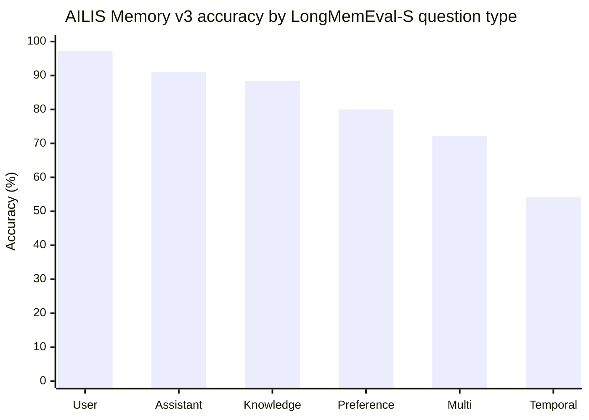

# AILIS Assistant

AILIS Assistant is a desktop embodied-agent project built around a VRM character, a local Electron runtime, speech interaction, visual understanding, memory, and an AILIS-style tool harness.

This repository is no longer just a browser companion demo. It keeps some avatar and frontend foundations from the earlier AILIS work, but its product direction is different: AILIS Assistant is meant to feel like a personal desktop assistant that can talk, see context when permitted, remember preferences, and help with real tasks through a stable agent runtime.

## Product Direction

The project has two goals that must stay balanced:

- Humanlike experience: AILIS should feel like a character sharing the desktop with the user, not a control panel wrapped around a chatbot.
- Reliable task execution: tools, approvals, memory, vision, and model calls should be structured enough to support complex work without making the user feel they are operating a developer console.

In short, the bottom layer should be engineering-stable like Codex or Claude Code, while the top layer should feel like a warm desktop character.

## What Makes This Different From AILIS

The older AILIS project focused mainly on a web/desktop-pet companion experience. AILIS Assistant is moving toward a fuller local assistant architecture:

- Desktop-first Electron runtime instead of a public web demo first
- AILIS agent loop for planning, tool calls, approvals, event flow, and recovery
- Vision tools for chat-window, full-screen, and region screenshots as model context
- Speech routes focused on safe defaults, ElevenLabs cloud output, and a bundled CosyVoice3 local runtime path
- Local ASR direction with automatic voice activity detection
- Memory v3 with provenance-preserving Event/Action Ledger, multilingual E5, temporal/entity retrieval, and raw evidence anchors
- Humanlike experience evals for persona, tone, memory use, emotion response, and low tool-feel
- Codex-style tool discovery with deferred MCP/Web/research tools, stricter schemas, and evidence-aware stopping
- Local-first retrieval upgrades with Crawl4AI-style rendered fetch fallback and bundled runtime preparation

## Current Capabilities

- VRM desktop character with expressions, actions, lip sync, and dialogue bubble rendering
- Electron desktop shell with pet window, chat window, control panel, and local settings
- Chat flow backed by an OpenAI-compatible model provider
- Screenshot-based visual understanding through a permission-aware vision layer
- AILIS tool layer for file, code, computer, email, MCP, and vision skills
- Durable pending approval and local state storage
- Speech output through desktop TTS workers and cloud TTS providers
- Local speech recognition worker and recognition-mode controls
- AILIS humanlike eval dataset, judge rules, runners, and long-term companionship cases
- Local LLM provider configuration for OpenAI-compatible APIs, vLLM, and Ollama-oriented workflows

## Release Status

Current release candidate: `v1.0.5`.

This release line focuses on making AILIS feel shippable as a desktop assistant: AILIS naming cleanup, safer default voice behavior, memory controls, local-model setup guidance, stronger Web/Search evidence handling, Crawl4AI-backed fetch preparation, and GAIA-derived tool-loop hardening.

## AILIS Memory v3: LongMemEval-S Full Evaluation

AILIS Memory v3 completed all **500 LongMemEval-S questions** on 2026-08-02. Generation and judging both finished with zero failed questions. The accepted result is **380 / 500 (76.00%)**.

This is a complete internal AILIS evaluation, not an official leaderboard submission. It preserves the verbatim LongMemEval QA prompt and binary aggregation, but uses `gpt-5.6-luna` as both Reader and Judge. Results from different datasets, Readers, Judges, or retrieval budgets are not treated as directly comparable.

| Evaluation contract | Frozen value |
| --- | --- |
| Dataset | `longmemeval_s_cleaned.json`, 500 questions |
| Candidate / Reader | `gpt-5.6-luna`, reasoning effort `medium` |
| Memory strategy | `hybrid_rrf_ledger_v3`, 4,800-token memory budget |
| Dense retriever | `Xenova/multilingual-e5-small` |
| Dense revision | `761b726dd34fb83930e26aab4e9ac3899aa1fa78` |
| Dense execution | Batch 1, one native thread per worker, fallback disabled |
| Generation | 3 workers; **500 / 500**, 0 failed |
| Judge | Verbatim official QA prompt; 3 Luna workers |
| Final result | **380 / 500, 76.00%** |
| Isolation | TaskAgent 0; short-term messages 0; dense fallback 0 |
| Provenance | Missing Ledger 0; missing/empty/task sources 0; dangling supersession 0 |
| Ledger corpus | 500 / 500 question states; 63,124 records; 124,351 processed events |
| Audit verdict | Corrected schema-aware verdict accepted; original verifier artifacts retained |

### Audit correction

The controller's original terminal state recorded `verifier_failed` because its supersession check treated the scalar string field `supersededBy` as an iterable list and expanded each identifier into characters. Across 39 newly generated question states, 48 valid scalar references therefore became 1,296 false "dangling" entries. A schema-aware audit resolved all 48 references against their question-local Ledger: the actual dangling-supersession count is **0**. The corrected verdict is accepted, while the original report and state files remain preserved for traceability. This correction changes the acceptance status, not the **380 / 500** Judge score.

### Accuracy by question type



| Question type | Correct | Accuracy | Errors | Session R@8 | Turn R@8 |
| --- | ---: | ---: | ---: | ---: | ---: |
| Single-session user | 68 / 70 | **97.14%** | 2 | 98.57% | 84.29% |
| Single-session assistant | 51 / 56 | **91.07%** | 5 | 100.00% | 98.21% |
| Knowledge update | 69 / 78 | **88.46%** | 9 | 96.79% | 85.47% |
| Single-session preference | 24 / 30 | **80.00%** | 6 | 93.33% | 76.67% |
| Multi-session | 96 / 133 | **72.18%** | 37 | 88.25% | 71.17% |
| Temporal reasoning | 72 / 133 | **54.14%** | 61 | 67.84% | 58.32% |
| **Overall / macro retrieval** | **380 / 500** | **76.00%** | **120** | **87.22%** | **75.18%** |

Micro Session R@8 is **83.54%** and Micro Turn R@8 is **73.80%**. Temporal and multi-session questions account for **98 / 120 errors (81.67%)**.

### Retrieval coverage and final accuracy

| Turn-evidence bucket | Correct | Accuracy | Incorrect |
| --- | ---: | ---: | ---: |
| Perfect Turn R@8 = 1 | 299 / 326 | **91.72%** | 27 |
| Partial 0 < Turn R@8 < 1 | 47 / 97 | **48.45%** | 50 |
| Zero Turn R@8 = 0 | 15 / 56 | **26.79%** | 41 |
| Turn metric not scored | 19 / 21 | **90.48%** | 2 |

**91 / 120 errors (75.8%)** occur when turn-level evidence is partial or absent. The remaining 27 failures with perfect Turn R@8 are primarily Reader reasoning, temporal interpretation, answer formulation, or Judge-boundary cases. These are diagnostic correlations, not a controlled causal decomposition.

Compared with the earlier internally reported AILIS result of **46.2%**, Memory v3 is **29.8 percentage points higher** and reduces relative error by about **55.4%**. The earlier artifact was not revalidated under the same Reader/Judge contract, so this remains an internal historical comparison rather than a same-protocol leaderboard claim.

The earlier fixed 279-question checkpoint scored **77.78%**; the full 500-question run is **1.78 percentage points lower** at 76.00%. That checkpoint is reported only as a within-run stage comparison and is not a separate leaderboard result.

## Architecture

```text
electron/   Desktop main process, AILIS runtime, TTS/ASR workers, tool implementations
src/        Renderer apps for chat, pet avatar, control panel, speech, vision UI, and bubbles
backend/    Optional FastAPI backend, API schemas, education/Vivix services, and static assets
Resources/  VRM model, VRMA motions, and reference voice assets
evals/      AILIS humanlike experience scenarios and dataset plans
tests/      Node test suites for AILIS, memory, tools, evals, provider, and runtime behavior
docs/       Architecture notes, OpenClaw research, AILIS design, memory, vision, and eval docs
scripts/    Validation, smoke tests, eval runners, generation tools, and build helpers
```

Core design documents:

- [Embodied Agent Architecture](docs/ailis-embodied-agent-architecture.md)
- [Memory v3 Hybrid RRF + Event/Action Ledger](docs/ailis-memory-v3-hybrid-ledger.md)
- [Humanlike Eval](docs/ailis-humanlike-eval.md)
- [OpenClaw From Zero](docs/openclaw-from-zero.md)
- [Tool Ecosystem Driver Guide](docs/tool-ecosystem-driver-guide.md)

## Local Development

Install dependencies:

```bash
pnpm install
```

Run the desktop app in development mode:

```bash
pnpm desktop:dev
```

Build and start the desktop app:

```bash
pnpm desktop:start
```

Package the Windows desktop app:

```bash
pnpm desktop:package
```

Optional backend setup:

```bash
python -m venv .venv
.venv\Scripts\activate
pip install -r requirements.txt
copy backend\.env.example backend\.env
python -m uvicorn backend.main:app --reload
```

## Configuration

Most desktop settings are managed through the Electron control panel and local desktop state. The project supports OpenAI-compatible providers, including custom base URLs, model names, request timeouts, and local/private credentials.

AILIS has one memory implementation: Memory v3. The desktop LLM performs query planning and Event/Action Ledger curation; retrieval still remains available through the local sparse, dense, temporal, and entity channels if a planning call fails.

```powershell
$env:AILIS_MEMORY_EMBEDDING_BATCH_SIZE = '2'
```

The local Gateway exposes `POST /memory/search`, `GET /memory/ledger/status`, and `POST /memory/ledger/curate`. There is no runtime strategy switch or legacy memory configuration.

Useful environment examples live in:

- `backend/.env.example`
- `requirements-desktop-asr.txt`
- `package.json`

Local caches, downloaded models, runtime logs, eval outputs, and AILIS state are intentionally ignored by Git. They are machine-local data, not source assets.

## Validation

Common checks:

```bash
pnpm test:ailis-memory
pnpm test:ailis-humanlike-eval
pnpm test:ailis-runtime
pnpm test:ailis-tool-contracts
pnpm ailis:validate-gateway
```

Humanlike eval commands:

```bash
pnpm eval:ailis-humanlike:validate
pnpm eval:ailis-humanlike:generate
pnpm eval:ailis-humanlike:report
pnpm eval:ailis-humanlike:long-term:validate
```

## Privacy Notes

AILIS Assistant is designed as a personal desktop assistant, so local secrets and private memory can exist on the user's own machine. The codebase should still avoid committing real API keys, runtime transcripts, logs, local model caches, generated eval results, or downloaded model weights.

Vision is treated as a perception layer, not a screen-control agent. Screenshots are intended to help the model understand context and answer better, not to silently click, type, purchase, send, or submit actions.

## Status

This project is in active development. The current priority is to keep the existing stable runtime intact while improving the presentation layer, memory quality, speech/vision experience, tool contracts, and eval coverage.
