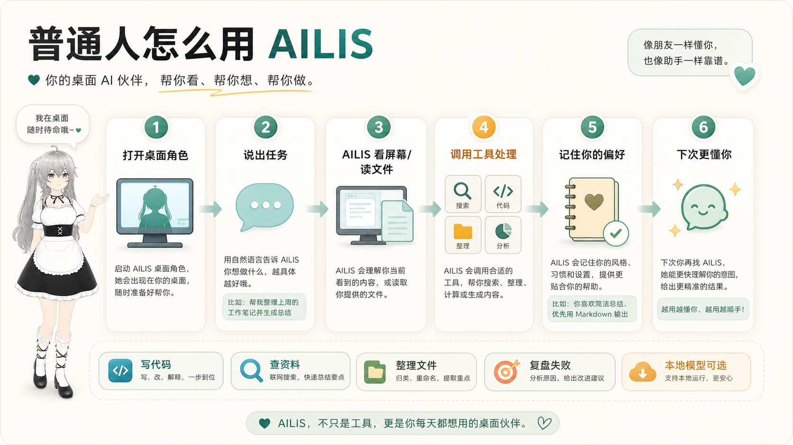
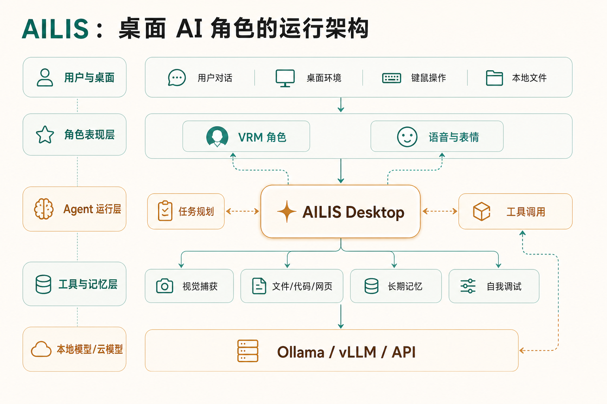

<div align="center">
  
  <h1>AILIS</h1>
  <p><strong>A desktop AI companion with a visible character, voice, memory, and a Codex-style tool runtime.</strong></p>
  <p>
    
    
    
  </p>
  <p>
    <a href="README.md">English</a> ·
    <a href="README.zh-CN.md">简体中文</a> ·
    <a href="README.ja.md">日本語</a> ·
    <a href="README.ko.md">한국어</a> ·
    <a href="README.fr.md">Français</a> ·
    <a href="README.de.md">Deutsch</a>
  </p>
  <p>
    <a href="https://haowenguo.github.io/AILIS/">Homepage</a> ·
    <a href="https://github.com/haowenGuo/AILIS/releases/tag/v1.1.0">Download</a> ·
    <a href="docs/ailis-embodied-agent-architecture.md">Architecture</a> ·
    <a href="docs/ailis-demo-benchmark-scorecard.md">Benchmarks</a>
  </p>
</div>

---

<p align="center">
  
</p>

## Meet AILIS

AILIS is built to feel less like a blank chat box and more like a presence on your desktop. It combines a 3D character surface, realtime dialogue, voice output, memory, screen/file context, and a tool-using agent runtime for real work.

The product direction is simple: a companion you can talk with naturally, and a work partner that can switch into task mode when you need help with code, research, files, email, or desktop workflows.

## Product Surface

<p align="center">
  
  
  
</p>

AILIS brings three layers together:

- **Character layer**: VRM character, expressions, motions, lip sync, speech bubbles, tray and desktop windows.
- **Companion layer**: conversational style, user preferences, memory blocks, relationship state, and lightweight reflection.
- **Agent layer**: tool routing, approvals, evidence logs, recovery loops, model provider configuration, and local runtime utilities.

## What It Can Do

- VRM desktop character with expressions, motions, lip sync, and dialogue bubbles.
- Electron pet window, chat window, control panel, tray integration, and local persistent state.
- OpenAI-compatible model provider configuration, including custom base URLs and local-provider workflows.
- Voice output through desktop TTS workers and cloud provider paths.
- Optional local speech recognition worker for desktop voice input.
- Permission-aware visual context through screenshot, window, and region capture flows.
- Memory blocks, project context, relationship state, and lightweight reflection.
- Tool layer for file operations, code work, computer actions, email, MCP skills, web/search support, and local runtime utilities.
- Approval-aware execution model for actions that can affect files, apps, accounts, or external services.
- EMBER-Harness stage gates for checking untrusted inputs, tool calls, tool results, and final outputs during agent execution.
- Humanlike experience evals, tool-contract tests, gateway checks, and agent execution smoke tests.

## Why It Is Different

AILIS is not only an expressive avatar and not only an automation console. The interesting part is the bridge:

- It can stay soft and conversational during daily interaction.
- It can become explicit and auditable during task execution.
- It keeps provider, memory, model, voice, and local runtime choices under the user's control.
- It is open source under MIT, so the character surface and the agent harness can evolve together.

## GAIA Evaluation

<p align="center">
  
</p>

AILIS completed two fixed-commit runs of the 53-task GAIA 2023 Level 1 public validation set. Codex's ChatGPT OAuth bridge supplied the `gpt-5.5` model, while AILIS retained ownership of the agent harness, context management, tool execution, and answer pipeline.

| Metric | Result |
| --- | ---: |
| Run 1 | 43 / 53, **81.13%** |
| Run 2 | 48 / 53, **90.57%** |
| Two-run mean | 45.5 / 53, **85.85%** |
| Stable pass | 40 / 53 tasks passed both runs |
| Outcome agreement | 42 / 53, **79.25%** |

These are retained as historical diagnostics, not the current reproducibility claim. A post-run audit found that workspace isolation did not disable persistent semantic-memory retrieval between tasks inside each run. That task-to-task contamination risk invalidates calling the runs independent, even though run IDs, workspaces, retries, and score files were isolated. The evaluation runner now sets `memoryPolicy: disabled`; a new full rerun is required before publishing a replacement primary score.

This is a local `desktop-real` visible-answer evaluation on the public validation split, not an official submission to the private 93-task Level 1 test leaderboard. Both historical runs used commit `4f8f435`, separate run IDs and isolated workspaces, with no resume, per-task retry, failed-task replacement, or score merging, but without strict per-task memory isolation. See the [evaluation methodology](docs/ailis-desktop-real-gaia-eval.md) and [benchmark scorecard](docs/ailis-demo-benchmark-scorecard.md).

## Apple ToolSandbox Evaluation

<p align="center">
  
</p>

AILIS completed official offline scoring for all **728 non-RapidAPI** Apple ToolSandbox scenarios through the production agent and the official on-policy user simulator. The remaining 304 RapidAPI-dependent scenarios were excluded from calls, cost, and every metric.

ToolSandbox returns a continuous scenario similarity score from `0` to `1`, reflecting milestone completion and minefield avoidance. It is therefore better read as a quality score than as a binary pass rate. We disclose several views instead of hiding them behind one headline number:

| Evidence lens | Result | How to interpret it |
| --- | ---: | --- |
| Certified coverage | **728 / 728, 100%** | Evaluation completeness, not task accuracy |
| Frozen v3 primary holdout | **71.51%** mean, 239 / 239 scored, 0 errors | Primary frozen-source generalization estimate |
| Holdout non-zero / perfect | **81.17% / 38.08%** | 194 non-zero and 91 perfect scores out of 239 |
| Targeted recovery | **81.49%** mean, 155 / 155 valid, 0 zeros | Selected analyzed failures; diagnostic, not an unbiased global score |
| Stability sample | **75.01% -> 88.31%**, paired **+13.29 pp** | Separate no-material-regression evidence on 64 original positives |
| Stability outcomes | 29 improved / 22 unchanged / 13 regressed | Includes 2 severe regressions; all preregistered gates passed |

The primary public quality number is the frozen holdout mean, **71.51%**. `valid-only` and `errors-as-zero` are identical because the v3 and stability primary batches had zero errors. The targeted-recovery and stability means answer different questions and must not be averaged with the holdout score or presented as a randomized causal gain. V1, V2, raw intermediate, cross-drift, and quarantined results are excluded from the primary claim.

## Architecture

<p align="center">
  
</p>

```text
User / Voice / Screen
        |
        v
AILIS Desktop UI
  - VRM character
  - Chat window
  - Control panel
        |
        v
Agent Harness
  - planner
  - tool router
  - approval gate
  - EMBER-Harness stage gates
  - evidence log
  - recovery loop
        |
        v
Runtime Services
  - model providers
  - voice / ASR / TTS
  - vision capture
  - memory store
  - local tools / MCP
        |
        v
Validation
  - tests
  - evals
  - smoke checks
```

## EMBER-Harness Stage Gates

AILIS includes an EMBER-Harness integration for stage-level safety control inside the agent execution chain. Instead of only checking the final answer, the harness can inspect several boundaries where risk may enter or spread:

- User input before it enters the agent context.
- Tool calls before execution, especially actions with side effects.
- Tool results before they are added back into the model context.
- Final output before it is shown to the user.

The harness records auditable check events with snapshot hashes, approximate token counts, stage names, decisions, and rollback targets. The control panel exposes Off, Observe, and Enforce modes; Off neither loads nor downloads a safety model. The default evaluator runs a quantized multilingual DistilBERT ONNX classifier locally without a generative LLM. Its first enable downloads about 136 MB into the persistent AILIS state directory. This lightweight profile targets overt toxicity and hate risk, not subtle implicit-bias or stereotype reasoning. Deployments can override it through `AILIS_EMBER_HARNESS`, `AILIS_EMBER_HARNESS_MODE`, `AILIS_EMBER_SAFETY_MODEL`, and threshold environment variables. Runtime status remains available at `/ember-harness/status`.

## Repository Layout

```text
electron/   Desktop main process, preload bridge, runtime services, local tool adapters
src/        Renderer apps for the pet, chat, control panel, speech, vision UI, and bubbles
backend/    Optional FastAPI backend, API schemas, memory services, and static assets
Resources/  VRM model, VRMA motions, reference audio, and character assets
docs/       Architecture notes, memory design, tool ecosystem, evaluation, and release planning
evals/      Humanlike experience scenarios and long-term companionship evaluation data
scripts/    Runtime preparation, validation, smoke tests, benchmarks, and packaging helpers
tests/      Node test suites for runtime, memory, tools, contracts, gateway, and agent behavior
```

## Quick Start

Install dependencies:

```bash
pnpm install
```

Run the desktop app in development mode:

```bash
pnpm desktop:dev
```

Build and start the desktop app:

```bash
pnpm desktop:start
```

Package the Windows desktop app:

```bash
pnpm desktop:package
```

Optional backend setup:

```bash
python -m venv .venv
.venv\Scripts\activate
pip install -r requirements.txt
copy backend\.env.example backend\.env
python -m uvicorn backend.main:app --reload
```

## Model And Voice Setup

AILIS is provider-agnostic at the application layer. Configure providers through the desktop control panel or local environment files:

- OpenAI-compatible cloud providers.
- Local vLLM endpoints.
- Ollama-oriented local workflows.
- Custom base URLs, model names, request timeouts, and private API keys.
- Optional local ASR and desktop TTS runtime preparation.

Never commit real API keys, account credentials, chat transcripts, local model caches, runtime logs, or generated eval outputs.

## Useful Commands

```bash
pnpm test:ailis-runtime
pnpm test:ailis-agent
pnpm test:ailis-tool-contracts
pnpm test:ailis-memory
pnpm ailis:validate-harness
```

Full gateway validation is heavier and runs a larger set of runtime, contract, tool, memory, agent, and smoke checks:

```bash
pnpm ailis:validate-gateway
```

## Core Documents

- [Documentation Index](docs/README.md)
- [Embodied Agent Architecture](docs/ailis-embodied-agent-architecture.md)
- [System TaskAgent Architecture](docs/ailis-system-taskagent-architecture.md)
- [Codex Multi-Agent Data-Flow Migration](docs/ailis-codex-multi-agent-dataflow-migration.md)
- [Memory Architecture V2](docs/ailis-memory-architecture-v2.md)
- [Humanlike Eval](docs/ailis-humanlike-eval.md)
- [Tool Ecosystem Driver Guide](docs/tool-ecosystem-driver-guide.md)

## Project Status

Current release line: `v1.1.0`.

AILIS is in active development. It already has a substantial desktop runtime, agent harness, tool layer, and evaluation surface, but it should still be treated as an alpha-stage product/runtime rather than a production-grade Agent OS. The near-term priority is reliability: clearer tool contracts, safer approvals, stronger memory behavior, better local model setup, and higher-quality end-to-end evaluation.

## Privacy And Safety

AILIS is designed for personal desktop use, so privacy and control are part of the architecture:

- Vision capture is permission-aware and should be used to understand context, not to silently act.
- Mutating or high-risk tool actions should pass through explicit approval.
- Local memory and runtime state should remain machine-local unless the user chooses otherwise.
- Secrets belong in local configuration, never in source control.

## License

AILIS source code is released under the [MIT License](LICENSE). Some bundled or third-party assets, models, motions, and voice resources may have their own licenses; check asset-specific notes before redistribution.
