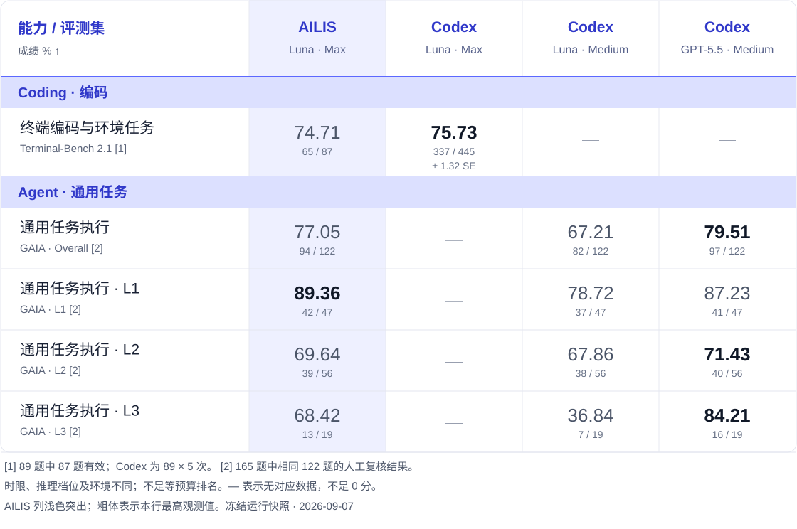
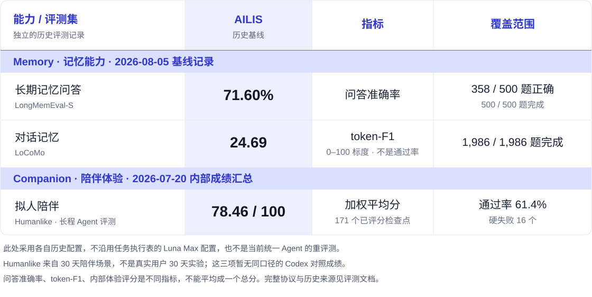

<div align="center">
  
  <h1>AILIS</h1>
  <p><strong>能看、能听、能记住，也能真正把事情做完的开源桌面 AI 伙伴。</strong></p>
  <p>
    
    
    
  </p>
  <p>
    <a href="https://101.133.239.56/Test/"><strong>在线体验</strong></a> ·
    <a href="https://github.com/haowenGuo/AILIS/releases"><strong>下载桌面版</strong></a> ·
    <a href="docs/guide/desktop.md">快速开始</a> ·
    <a href="docs/README.md">文档</a>
  </p>
  <p>
    <a href="README.md">English</a> ·
    <a href="README.zh-CN.md">简体中文</a> ·
    <a href="README.ja.md">日本語</a> ·
    <a href="README.ko.md">한국어</a> ·
    <a href="README.fr.md">Français</a> ·
    <a href="README.de.md">Deutsch</a>
  </p>
</div>

## 不只是聊天窗口

AILIS 希望成为真正生活在桌面上的个人 AI。她有可见的 3D 角色、声音、表情和长期记忆，也有能够搜索资料、阅读文件、编写代码、整理内容和操作电脑的 Agent Runtime。

你可以像和伙伴说话一样自然地表达需求。需要做事时，AILIS 会理解屏幕与文件上下文，选择工具执行任务，并在下一次见面时记得真正重要的偏好。

## 核心体验

<table>
  <tr>
    <td width="33%" valign="top"><h3>有形象</h3>VRM 桌面角色、表情、动作、口型同步和对话气泡，让 AI 不再只是空白输入框。</td>
    <td width="33%" valign="top"><h3>能交流</h3>支持语音输入与自然语音输出，也保留安静、快速的文字交互。</td>
    <td width="33%" valign="top"><h3>懂现场</h3>在获得许可后理解屏幕、窗口、区域截图和本地文件，不必让你反复解释上下文。</td>
  </tr>
  <tr>
    <td width="33%" valign="top"><h3>会做事</h3>搜索、代码、文件、网页、邮件与电脑操作统一进入可审计的工具执行链。</td>
    <td width="33%" valign="top"><h3>记得你</h3>长期记忆保存偏好、项目背景和关系状态，让后续协作更自然、更准确。</td>
    <td width="33%" valign="top"><h3>可控制</h3>重要工具动作进入审批与记录流程，用户始终知道系统准备做什么、已经做了什么。</td>
  </tr>
</table>

## AILIS 如何工作

| 1. 说出需求 | 2. 理解现场 | 3. 调用工具 | 4. 记住重点 |
| :---: | :---: | :---: | :---: |
| 用自然语言描述目标 | 读取获准的屏幕与文件 | 搜索、代码、文件与电脑操作 | 保存有价值的偏好与项目背景 |

## 评测成绩

端到端 Agent 评测 · **2026-09-07** · 成绩单位 %。浅色突出 AILIS；每列明确标注系统、模型与推理档位。



**[1] Terminal-Bench：**65 通过 / 87 有效，计划 89 题中 2 题未决；Codex 为官方存档的 89 题成绩，每题 5 次取均值。**[2] GAIA：**相同 122 道已完成题的答案复核，计划 165 题中 43 题未决；AILIS 为 Max / 3000s，Codex 对照为 Medium / 600s。这是不同预算的冻结运行对照，不是当前版本的全量评测认证。

<details>
<summary>展开文本表格：成绩、样本量与缺失数据</summary>

| 能力 / 评测集 | AILIS<br>Luna Max | Codex<br>Luna Max | Codex<br>Luna Medium | Codex<br>GPT-5.5 Medium |
| :--- | ---: | ---: | ---: | ---: |
| **Coding · 编码** | | | | |
| **终端编码与环境任务**<br>Terminal-Bench 2.1 [1] | 74.71<br><sub>65 / 87</sub> | **75.73**<br><sub>89 题 · 5 次均值 · ± 1.32 SE</sub> | — | — |
| **Agent · 通用任务** | | | | |
| **通用任务执行**<br>GAIA · Overall [2] | 77.05<br><sub>94 / 122</sub> | — | 67.21<br><sub>82 / 122</sub> | **79.51**<br><sub>97 / 122</sub> |

成绩单位为 %；粗体仅表示本行最高观测值，不代表等条件排名。— 表示无对应证据，不是失败或 0 分。

</details>

### 记忆与拟人陪伴



LongMemEval-S、LoCoMo 来自 **8 月 5 日记忆基线记录**；Humanlike 来自 **7 月 20 日内部长程评测汇总**。这些是独立的历史评测，不是上表 Luna Max 任务执行成绩，也不是当前统一 Agent 的重评测。LoCoMo 是 token-F1，不是题目通过率；Humanlike 是内部量表评分，不是外部榜单排名。

<details>
<summary>展开文本表格：记忆、有状态工具与陪伴体验</summary>

| 能力 | 评测集 | AILIS 历史成绩 | 指标 / 覆盖范围 |
| :--- | :--- | ---: | :--- |
| 长期记忆问答 | **LongMemEval-S** | **71.60%** | 问答准确率 · 358 / 500 |
| 对话记忆 | **LoCoMo** | **24.69** | token-F1，0–100 标度 · 1,986 题 |
| 拟人陪伴 | **Humanlike · 长程 Agent 评测** | **78.46 / 100** | 171 个已评分检查点 · 通过率 61.4% · 硬失败 16 个 |
| 有状态工具调用 | ToolSandbox | 71.51% | 冻结 holdout 均值 |
| 个性化记忆 | PersonaMem Balanced-140 | 65.71% | 92 / 140 |

Humanlike 检查点来自 30 天陪伴场景，不代表真实用户连续使用 30 天的实验。召回率、时延、体验分项及历史来源见[完整评测页](docs/evaluation.zh-CN.md#记忆与陪伴体验--历史基线)。这三项暂无同口径的 Codex 对照成绩。

</details>

<p align="center">
  <a href="docs/evaluation.zh-CN.md"><strong>完整成绩、效率、历史对照与评测口径 →</strong></a>
</p>

## 现在可以做什么

- [x] 在 Windows 桌面常驻运行 VRM 角色、聊天窗口与控制面板
- [x] 使用文字、语音、表情和动作进行实时互动
- [x] 在许可范围内读取屏幕、窗口、文件与代码上下文
- [x] 调用搜索、网页、代码、文件、邮件和电脑操作工具
- [x] 保存长期记忆、用户偏好、项目上下文和关系状态
- [x] 对有影响的工具动作进行审批、记录与恢复
- [ ] 进一步提升长程任务的稳定性、缓存效率和错误恢复
- [ ] 让实时语音、跨设备体验和插件生态更加完整

## 快速开始

### v1.4.2 更新

本版整合统一 Agent/Session 运行时、新对话窗口与控制面板、人物快捷菜单、配置保存改进及本地 ASR 修复。Windows 安装包保持轻量，不捆绑 Unity 或大型语音、模型运行时。使用条件与边界见[版本说明](docs/releases/v1.4.2.md)，安装包和校验值见 [v1.4.2 下载](https://github.com/haowenGuo/AILIS/releases/tag/v1.4.2)。

### 直接使用

从 [Releases](https://github.com/haowenGuo/AILIS/releases) 下载桌面版，或先打开 [Web 体验](https://101.133.239.56/Test/) 认识 AILIS。

### 本地开发

```bash
pnpm install
pnpm desktop:dev
```

桌面构建、语音、验证、可选后端和打包说明统一放在 [快速开始文档](docs/guide/desktop.md)。

## 项目方向

AILIS 的目标不是做一个只会扮演角色的聊天应用，也不是把终端包上一层头像。我们希望把两种体验真正合在一起：

1. **有存在感的数字伙伴**：自然对话、声音、表情、关系与长期记忆。
2. **可靠的个人 Agent**：理解上下文，调用通用工具，完成长程任务。
3. **可理解、可控制的执行系统**：工具动作可审批，过程可追踪，失败可以恢复。

## 继续了解

<p align="center">
  <a href="docs/guide/desktop.md"><strong>安装与配置</strong></a> ·
  <a href="docs/README.md"><strong>中文文档中心</strong></a> ·
  <a href="docs/evaluation.zh-CN.md"><strong>完整评测成绩</strong></a>
</p>

## 参与项目

如果 AILIS 对你有帮助，可以 Star 仓库关注后续进展。欢迎通过 [Issues](https://github.com/haowenGuo/AILIS/issues) 提交 Bug、真实工作流和功能建议，代码贡献说明见 [CONTRIBUTING.md](CONTRIBUTING.md)。

## 隐私与控制

AILIS 面向个人桌面使用。视觉上下文需要用户许可；会影响文件、应用、账号或外部服务的动作进入审批流程；本地记忆与运行状态默认保存在用户机器上。发送给模型服务的内容以完成当前请求所需的上下文为限。

## License

AILIS 源代码采用 [MIT License](LICENSE) 开源。部分第三方模型、动作、语音和角色资源可能使用各自的许可协议。
