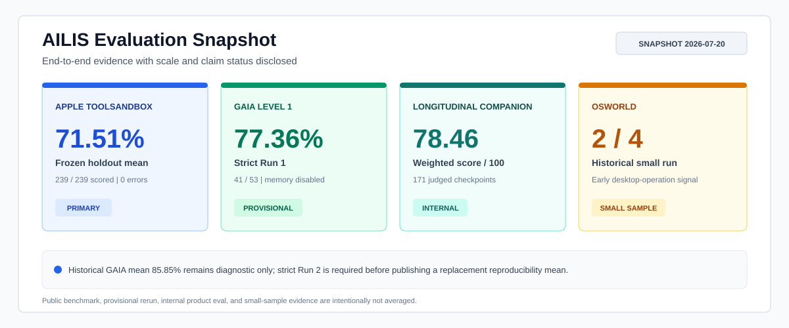

<div align="center">
  <h1>AILIS Assistant</h1>
  <p><strong>开源桌面具身 AI 助手：集成 VRM 角色、实时语音、视觉上下文、记忆系统，以及接近 Codex 工作方式的 Agent Harness。</strong></p>
  <p>
    
    
    
  </p>
  <p>
    
    
    
  </p>
  <p>
    <a href="README.md">English</a> ·
    <a href="README.zh-CN.md">简体中文</a> ·
    <a href="README.ja.md">日本語</a> ·
    <a href="README.ko.md">한국어</a> ·
    <a href="README.fr.md">Français</a> ·
    <a href="README.de.md">Deutsch</a>
  </p>
</div>

---

## 评测结果总览

AILIS 不只是角色演示，而是一套持续接受端到端评测的 Agent 系统。当前证据覆盖有状态工具调用、通用助理任务、长期陪伴表现和桌面操作；每个分数都同时公开样本规模与可宣称边界。

| 评测方向 | 结果 | 规模 | 证据定位 |
| --- | ---: | ---: | --- |
| **Apple ToolSandbox** | 冻结 holdout 均值 **71.51%** | 239 / 239 官方评分，0 errors | 当前主要公开任务质量分数 |
| **GAIA Level 1 严格复现** | 第一轮 **41 / 53，77.36%** | 规定两轮中的第一轮 | 严格逐题记忆隔离的暂定结果；第二轮待完成 |
| **GAIA Level 1 历史结果** | 两轮均值 **85.85%**；最佳单轮 **90.57%** | 53 道公开 validation 题 x 2 | 历史本地诊断；当时缺少逐题记忆隔离 |
| **长期陪伴评测** | 加权均值 **78.46 / 100** | 30 天场景中的 171 个 Judge checkpoint | 内部产品质量评测 |
| **OSWorld 小样本** | **2 / 4，50%** | 4 个历史桌面任务 | 早期外部信号，样本不足以做广泛结论 |
| **人类化数据集校验** | **1000 / 1000** 有效 | 9 类任务、251 个负向探针 | 表示评测覆盖度，不表示模型能力 |

> **当前主分数：**Apple ToolSandbox 冻结 holdout 均值 **71.51%**。GAIA 严格协议已经完成第一轮，成绩为 **77.36%**，运行中禁用 benchmark memory，并且没有替换失败题；在第二轮 53 题完整结束前，它仍是暂定结果。历史 85.85% 均值继续公开用于透明对照，但不作为当前可复现主张。

[完整 Benchmark Scorecard](docs/ailis-demo-benchmark-scorecard.md) ·
[GAIA 评测方法](docs/ailis-desktop-real-gaia-eval.md) ·
[ToolSandbox 协议与门禁](docs/ailis-toolsandbox-v4-optimization-plan.md)

<p align="center">
  
</p>

## AILIS 是什么

AILIS Assistant 是一个桌面优先的具身 AI 助手项目。它把 3D VRM 角色、Electron 桌面窗口、语音交互、截图视觉上下文、长期记忆，以及结构化 Agent Runtime 放在同一个系统里。

它不只是一个网页聊天机器人。AILIS 的目标是成为真正常驻桌面的个人 AI 助手：可以和用户自然交流，在得到许可时理解屏幕上下文，记住有价值的偏好，并通过可审计、可批准的工具完成实际任务。

## 项目定位

多数 AI 助手项目容易分成两种：一种有角色表现力，但没有稳定执行能力；另一种有自动化能力，却像开发者控制台。AILIS 希望同时保留两边的优势：

- 表层是有存在感、表情、动作、语音和关系感的角色体验。
- 底层是可规划、可路由、可审批、可记录证据、可恢复的 Agent Harness。
- 运行时优先本地桌面，让用户自己的设置、记忆、日志和模型配置留在自己机器上。

## 当前能力

- VRM 桌面角色，支持表情、动作、口型同步和对话气泡。
- Electron 桌宠窗口、聊天窗口、控制面板、托盘集成和本地持久化状态。
- OpenAI 兼容模型提供商配置，支持自定义 base URL 和本地模型工作流。
- 桌面 TTS worker、云端语音路径和可选本地语音识别 worker。
- 基于截图、窗口和区域捕获的权限感知视觉上下文。
- 记忆块、项目上下文、关系状态和轻量反思机制。
- 文件、代码、电脑操作、邮件、MCP 技能、Web/Search 和本地运行时工具层。
- 对文件、应用、账号或外部服务有影响的动作使用显式审批模型。
- 在 Agent 执行链路中接入 EMBER-Harness 阶段门控，对不可信输入、工具调用、工具返回和最终输出进行检查。
- 人类化体验评测、工具契约测试、Gateway 检查和 Agent 执行烟测。

## GAIA：通用 Agent 能力

当前严格逐题记忆隔离协议冻结在提交 `6afc0ae`。第一轮完整成绩为 **41 / 53（77.36%）**；规定的第二轮尚未计入最终均值和稳定率。第一轮在完成 46 行后遇到 Windows 非正常重启，恢复过程沿用同一个 run ID，跳过全部已完成题目，只执行剩余 7 题；没有重试、替换或重新计分任何失败题。

<p align="center">
  
</p>

AILIS 在同一个固定代码提交上，对 GAIA 2023 Level 1 的 53 道公开 validation 题进行了两次完整运行。Codex ChatGPT OAuth bridge 只提供 `gpt-5.5` 大模型，Agent Harness、上下文管理、工具执行和答案出口均由 AILIS 负责。

| 指标 | 结果 |
| --- | ---: |
| 第一次运行 | 43 / 53，**81.13%** |
| 第二次运行 | 48 / 53，**90.57%** |
| 两次均值 | 45.5 / 53，**85.85%** |
| 稳定通过 | 40 / 53 题两次都正确 |
| 结果一致率 | 42 / 53，**79.25%** |

这些数字目前只保留为历史诊断结果，不再作为严谨的可复现主成绩。事后审计发现，隔离 workspace 并没有禁用同一轮不同题目之间的持久语义记忆检索，因此存在题间污染风险，不能再称为“独立运行”。评测入口现已显式设置 `memoryPolicy: disabled`；必须在新协议下重新全量运行，才能发布替代主成绩。

这属于公开 validation split 上的本地 `desktop-real` 可见答案评测，不是提交到私有 93 题 Level 1 test 排行榜的官方成绩。两轮都使用提交 `4f8f435`、独立 run ID 和隔离 workspace，并禁止 resume、逐题重试、失败题替换和成绩合并，但当时没有严格隔离逐题记忆。详细口径见 [GAIA 评测方法](docs/ailis-desktop-real-gaia-eval.md) 与 [Benchmark Scorecard](docs/ailis-demo-benchmark-scorecard.md)。

## ToolSandbox：有状态工具执行

<p align="center">
  
</p>

AILIS 通过正式生产 Agent 链路和官方 on-policy user simulator，完成了全部 **728 个非 RapidAPI** Apple ToolSandbox 场景的官方离线评分。其余 304 个依赖 RapidAPI 的场景不调用、不产生费用，也不进入任何指标。

ToolSandbox 为每个场景返回 `0` 到 `1` 的连续相似度分数，反映任务里程碑完成度和 minefield 规避情况。因此，它更适合被理解为“任务质量分”，而不是简单的二元成功率。这里同时公开多个口径，避免用一个数字掩盖差异：

| 证据口径 | 结果 | 正确解释 |
| --- | ---: | --- |
| 认证覆盖率 | **728 / 728，100%** | 表示评测完整性，不等于任务准确率 |
| 冻结 v3 主 holdout | **71.51%** 均值，239 / 239 有效，0 errors | 当前冻结源码的主要泛化估计 |
| Holdout 非零率 / 满分率 | **81.17% / 38.08%** | 239 个场景中 194 个非零、91 个满分 |
| 定向修复 | **81.49%** 均值，155 / 155 有效，0 零分 | 已分析失败队列的诊断结果，不是无偏全局分数 |
| 稳定性样本 | **75.01% -> 88.31%**，配对 **+13.29 个百分点** | 64 个原正分场景的独立无重大回退证据 |
| 稳定性结果 | 29 提升 / 22 持平 / 13 回退 | 含 2 个严重回退；全部预注册门禁通过 |

对外最应采用的任务质量主分数是冻结 holdout 均值 **71.51%**。由于 v3 和稳定性 primary batch 都是 0 errors，`valid-only` 与 `errors-as-zero` 完全相同。定向修复与稳定性均值回答的是不同问题，不能与 holdout 分数求平均，也不能宣称为随机因果提升。V1、V2、raw 中间结果、跨漂移和 quarantine 结果均不进入主结论。

## 复现与审计

仓库会分别保存 benchmark 计划、逐题结果、进度流、审计事件、完整 transcript 和可读报告。GAIA 回归准入要求 baseline 和 candidate 各自至少完成两次相同任务集的全量运行：

```bash
pnpm bench:gaia:desktop-real:smoke
pnpm bench:gaia:desktop-real:l1
pnpm bench:gaia:compare -- \
  --baseline baseline-run-1.jsonl \
  --baseline baseline-run-2.jsonl \
  --candidate candidate-run-1.jsonl \
  --candidate candidate-run-2.jsonl \
  --expected-tasks 53 \
  --output eval-results/engineering/gaia-regression-gate.md
pnpm eval:ailis-humanlike:longitudinal-agent:validate
pnpm bench:osworld:readiness
```

默认 GAIA 门禁会拒绝任务缺失或替换、可见成功率下降、超时增加、P95 延迟增加超过 15%、平均 token 增加超过 10%，以及稳定正确题变为稳定错误。针对 benchmark 答案编写专用硬路由不属于可接受优化。

## 架构概览

```text
用户 / 语音 / 屏幕
        |
        v
AILIS 桌面 UI
  - VRM 角色
  - 聊天窗口
  - 控制面板
        |
        v
Agent Harness
  - 规划器
  - 工具路由
  - 审批门禁
  - EMBER-Harness 阶段门控
  - 证据日志
  - 恢复循环
        |
        v
运行时服务
  - 模型提供商
  - 语音 / ASR / TTS
  - 视觉捕获
  - 记忆存储
  - 本地工具 / MCP
        |
        v
验证体系
  - 测试
  - 评测
  - 烟测
```

## EMBER-Harness 阶段门控

AILIS 中接入了 EMBER-Harness，用于在智能体执行链路中做阶段级安全控制。它不是只在最后回答处做一次检查，而是在风险内容可能进入或传播的关键边界进行检查：

- 用户输入进入 Agent 上下文之前。
- 工具调用执行之前，尤其是可能产生副作用的操作。
- 工具返回结果重新进入模型上下文之前。
- 最终回答展示给用户之前。

每次检查都会形成可审计记录，包括阶段名称、边界位置、快照哈希、估算词元数、检查决策和可回退的稳定快照。控制面板可将本地安全判定设为“关闭 / 仅观察 / 启用拦截”；关闭时不会加载或下载模型。默认判定器使用量化多语言 DistilBERT ONNX 模型在本机运行，不调用生成式大模型，首次启用约下载 136 MB，缓存保存在持久化 AILIS 状态目录。该轻量模型适合识别显性毒性和仇恨风险，但不能替代细粒度的隐性偏见或刻板印象推理器。也可通过 `AILIS_EMBER_HARNESS`、`AILIS_EMBER_HARNESS_MODE`、`AILIS_EMBER_SAFETY_MODEL` 和阈值环境变量覆盖部署配置；运行状态可通过 `/ember-harness/status` 查看。

## 仓库结构

```text
electron/   Electron 主进程、预加载桥、本地运行时服务和工具适配器
src/        桌宠、聊天、控制面板、语音、视觉 UI、气泡等渲染端应用
backend/    可选 FastAPI 后端、API schema、记忆服务和静态资源
Resources/  VRM 模型、VRMA 动作、参考音频和角色资源
docs/       架构、记忆、工具生态、评测和发布规划文档
evals/      人类化体验场景和长期陪伴评测数据
scripts/    运行时准备、验证、烟测、基准测试和打包脚本
tests/      Runtime、Memory、Tools、Contracts、Gateway、Agent 等测试
```

## 快速启动

安装依赖：

```bash
pnpm install
```

以开发模式启动桌面端：

```bash
pnpm desktop:dev
```

构建并启动桌面端：

```bash
pnpm desktop:start
```

打包 Windows 桌面应用：

```bash
pnpm desktop:package
```

可选后端启动：

```bash
python -m venv .venv
.venv\Scripts\activate
pip install -r requirements.txt
copy backend\.env.example backend\.env
python -m uvicorn backend.main:app --reload
```

## 模型与语音配置

AILIS 在应用层不绑定单一模型供应商。可以通过桌面控制面板或本地环境文件配置：

- OpenAI 兼容云端提供商。
- 本地 vLLM endpoint。
- Ollama 方向的本地工作流。
- 自定义 base URL、模型名、请求超时和私有 API Key。
- 可选本地 ASR 和桌面 TTS 运行时准备。

不要把真实 API Key、账号凭证、聊天记录、本地模型缓存、运行日志或生成的评测结果提交到仓库。

## 常用命令

```bash
pnpm test:ailis-runtime
pnpm test:ailis-agent
pnpm test:ailis-tool-contracts
pnpm test:ailis-memory
pnpm ailis:validate-harness
```

完整 Gateway 验证较重，会运行更多 Runtime、契约、工具、记忆、Agent 和烟测检查：

```bash
pnpm ailis:validate-gateway
```

## 核心文档

- [完整文档导航](docs/README.md)
- [具身 Agent 架构](docs/ailis-embodied-agent-architecture.md)
- [System TaskAgent 架构](docs/ailis-system-taskagent-architecture.md)
- [Codex 多 Agent 数据流迁移](docs/ailis-codex-multi-agent-dataflow-migration.md)
- [记忆架构 V3](docs/ailis-memory-v3-hybrid-ledger.md)
- [人类化体验评测](docs/ailis-humanlike-eval.md)
- [Benchmark 总览与 Scorecard](docs/ailis-demo-benchmark-scorecard.md)
- [工具生态驱动指南](docs/tool-ecosystem-driver-guide.md)

## 项目状态

当前发布线：`v1.1.0`。

AILIS 正在积极开发。它已经具备较完整的桌面运行时、Agent Harness、工具层和评测面，但仍应被视为 alpha 阶段产品/运行时，而不是生产级 Agent OS。近期重点是可靠性：更清晰的工具契约、更安全的审批、更稳定的记忆行为、更顺滑的本地模型配置，以及更高质量的端到端评测。

## 隐私与安全

AILIS 面向个人桌面使用，所以隐私和控制是架构的一部分：

- 视觉捕获需要权限意识，目的是理解上下文，不是静默操作。
- 会影响文件、应用、账号或外部服务的动作应经过显式审批。
- 本地记忆和运行时状态默认留在用户机器上。
- 密钥应放在本地配置中，绝不能进入源码仓库。

## 开源许可

AILIS 源代码采用 [MIT License](LICENSE) 开源。部分随包资源、第三方模型、动作和语音资源可能有独立许可；重新分发前请确认对应资源说明。
