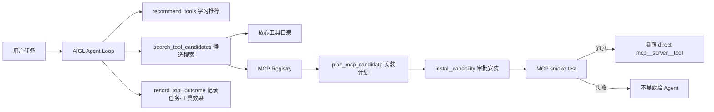

# AIGL 对齐 Codex 的工具/MCP 获取与验收网关设计

日期：2026-06-07

## 结论

Codex 的核心思路不是把全世界的工具一次性塞给模型，而是：

1. 内置少量稳定核心工具。
2. 把外部 MCP 接成受控连接。
3. 按工具数量和任务需求决定直接曝光还是延迟搜索。
4. 每次调用都有事件、审批、权限和结果包装。
5. 新工具进入 runtime 前必须能初始化、能列出 schema、能被转成模型可调用的 tool spec。

AIGL 本次补齐的是 Codex 风格的“工具获取前置层”：



## Codex 源码级对照

### 1. MCP 配置与权限

Codex 源码：

- `F:\AIGril\build-cache\codex-runtime\codex-rs\config\src\mcp_types.rs:21`
- `F:\AIGril\build-cache\codex-runtime\codex-rs\config\src\mcp_types.rs:130`
- `F:\AIGril\build-cache\codex-runtime\codex-rs\config\src\mcp_types.rs:167`
- `F:\AIGril\build-cache\codex-runtime\codex-rs\config\src\mcp_types.rs:171`
- `F:\AIGril\build-cache\codex-runtime\codex-rs\config\src\mcp_types.rs:424`

Codex 的 MCP server config 里有 transport、默认审批模式、enabled_tools、disabled_tools、per-tool config、stdio/streamable-http transport。也就是说，MCP 不是裸连，而是先进入配置层，再进入权限/曝光层。

AIGL 对齐：

- `F:\AIGril\electron\humanclaw-mcp-session.cjs` 已有 stdio/http MCP session、config store、tool schema cache。
- `F:\AIGril\electron\humanclaw-tool-acquisition-gateway.cjs:258` 把 Registry server 归一化成 AIGL 可安装的 mcpConfig。
- `F:\AIGril\electron\humanclaw-runtime.cjs:937` 把 `plan_mcp_candidate`、`record_tool_outcome` 等动作纳入权限分类。

### 2. MCP 连接管理

Codex 源码：

- `F:\AIGril\build-cache\codex-runtime\codex-rs\codex-mcp\src\connection_manager.rs:71`
- `F:\AIGril\build-cache\codex-runtime\codex-rs\codex-mcp\src\connection_manager.rs:171`
- `F:\AIGril\build-cache\codex-runtime\codex-rs\codex-mcp\src\connection_manager.rs:334`
- `F:\AIGril\build-cache\codex-runtime\codex-rs\codex-mcp\src\connection_manager.rs:403`
- `F:\AIGril\build-cache\codex-runtime\codex-rs\codex-mcp\src\connection_manager.rs:590`

Codex 的 `McpConnectionManager` 负责 server startup、status event、list tools、call tool、shutdown。模型并不直接管理进程，而是调用 runtime 暴露的工具。

AIGL 对齐：

- `F:\AIGril\electron\humanclaw-mcp-session.cjs:722` 是 AIGL 的 MCP Manager。
- `F:\AIGril\electron\humanclaw-capability-manager.cjs:549` 使用 Tool Acquisition Gateway 生成 plan，再交给已有安装器。
- `F:\AIGril\electron\humanclaw-capability-manager.cjs:568` 暴露临时 smoke test，但要求 approval。

### 3. MCP tool spec 转换

Codex 源码：

- `F:\AIGril\build-cache\codex-runtime\codex-rs\core\src\tools\handlers\mcp.rs:29`
- `F:\AIGril\build-cache\codex-runtime\codex-rs\core\src\tools\handlers\mcp.rs:77`
- `F:\AIGril\build-cache\codex-runtime\codex-rs\core\src\tools\handlers\mcp.rs:191`
- `F:\AIGril\build-cache\codex-runtime\codex-rs\core\src\tools\handlers\mcp.rs:225`

Codex 的 `McpHandler` 做三件事：

1. 把 MCP tool 转成模型可见的 namespace tool。
2. 调用时把参数交给 MCP connection manager。
3. 为 tool_search 构造搜索文本。

AIGL 对齐：

- `F:\AIGril\electron\humanclaw-mcp-session.cjs:129` 已有 `makeMcpToolSpec`，输出 `mcp__server__tool` direct spec。
- `F:\AIGril\electron\humanclaw-mcp-session.cjs:936` 已有 `listToolSpecs`。
- `F:\AIGril\electron\humanclaw-mcp-session.cjs:941` 已有 `searchToolSpecs`。

### 4. 直接曝光 vs 延迟搜索

Codex 源码：

- `F:\AIGril\build-cache\codex-runtime\codex-rs\core\src\mcp_tool_exposure.rs:10`
- `F:\AIGril\build-cache\codex-runtime\codex-rs\core\src\mcp_tool_exposure.rs:17`
- `F:\AIGril\build-cache\codex-runtime\codex-rs\core\src\mcp_tool_exposure.rs:32`

Codex 有 `DIRECT_MCP_TOOL_EXPOSURE_THRESHOLD = 100`。工具少时直接暴露；工具多时走 tool_search 延迟加载，避免 prompt 被 schema 淹没。

AIGL 对齐：

- `F:\AIGril\electron\aigl-tool-specs.cjs` 已定义 direct/deferred tool exposure。
- `F:\AIGril\electron\humanclaw-agent-runner.cjs:1853` 已要求普通任务优先用 `mcp__server__tool` direct tool，`mcp_bridge` 只做管理。
- 本次新增 `F:\AIGril\electron\humanclaw-tool-acquisition-gateway.cjs:413`，把“还没安装的 MCP 候选”也放到延迟搜索层，而不是直接暴露。

### 5. Tool Search

Codex 源码：

- `F:\AIGril\build-cache\codex-runtime\codex-rs\core\src\tools\handlers\tool_search.rs:23`
- `F:\AIGril\build-cache\codex-runtime\codex-rs\core\src\tools\handlers\tool_search.rs:46`
- `F:\AIGril\build-cache\codex-runtime\codex-rs\core\src\tools\handlers\tool_search.rs:112`
- `F:\AIGril\build-cache\codex-runtime\codex-rs\core\src\tools\handlers\tool_search.rs:130`

Codex 使用 BM25 搜索 deferred tools，然后 coalesce 成可加载 tool spec。AIGL 当前先用轻量关键词评分，后续可以替换成 BM25/向量索引，但接口已经留好。

AIGL 对齐：

- `F:\AIGril\electron\humanclaw-tool-acquisition-gateway.cjs:413`：搜索核心工具和 MCP Registry。
- `F:\AIGril\electron\humanclaw-tool-acquisition-gateway.cjs:496`：搜索官方 Registry。
- `F:\AIGril\electron\humanclaw-capability-manager.cjs:545`：通过 `capability_manager.search_tool_candidates` 暴露给 Agent。

### 6. 工具失败后的恢复搜索

Codex 不是在 runtime 里硬编码“某个工具失败后必须调用 tool_search”。它的主链是：

1. 工具调用失败时，handler/registry 返回 `FunctionCallError::RespondToModel(...)`。
2. 失败被写成模型可见的 tool output。
3. 下一轮模型仍然看到 `tool_search` 这个正式工具，可以自主搜索 deferred tools。
4. transcript repair 会保证 `ToolSearchCall` 和 `ToolSearchOutput` 成对存在，避免历史坏掉。

对应源码：

- `F:\AIGril\build-cache\codex-runtime\codex-rs\core\src\tools\registry.rs:378`
- `F:\AIGril\build-cache\codex-runtime\codex-rs\core\src\tools\registry.rs:427`
- `F:\AIGril\build-cache\codex-runtime\codex-rs\core\src\tools\router.rs:106`
- `F:\AIGril\build-cache\codex-runtime\codex-rs\core\src\context_manager\normalize.rs:41`

AIGL 按 Codex 边界对齐，不在 runtime 里自动调用 `recommend_tools` 或 `search_tool_candidates`：

- Tool Runtime：执行工具，返回 success/failure。
- Agent Runner：把失败包装成 `tool_result` observation，附带错误类型、预览和 recovery hint。
- Turn Items：把失败 observation 放进 `recent_turn_items.latest_failed_observation` 和时间线。
- 下一轮 Agent Decision：模型自己根据 observation 决定是否调用 `tool_search`、`capability_manager.recommend_tools`、`capability_manager.search_tool_candidates`、`request_permissions` 或其他工具。

对应 AIGL 文件：

- `F:\AIGril\electron\humanclaw-agent-runner.cjs`：`buildToolResultEvent` 负责构造模型可见失败 observation。
- `F:\AIGril\electron\humanclaw-turn-items.cjs`：`buildTurnItemsPromptObject` 保留 `latest_failed_observation`。
- `F:\AIGril\electron\humanclaw-agent-runner.cjs`：Agent Prompt 明确说明工具失败不是最终阻塞，下一轮可以换工具、换策略、请求上下文或 final。
- `F:\AIGril\electron\humanclaw-agent-runner.cjs`：`sanitizeLlmStep` 允许模型直接调用 `tool_search`、`capability_manager`、`request_permissions`。

这意味着外部 MCP Registry 搜索、工具推荐、安装计划和 smoke test 都必须由模型显式选择，不由 runtime 在失败后偷偷触发。

## 本次新增的 AIGL 能力

### 1. 内置少量核心工具目录

实现：`F:\AIGril\electron\humanclaw-tool-acquisition-gateway.cjs:10`

核心能力包：

- `core:file_system`：文件读取、写入、搜索、整理、hash、回滚前检查。
- `core:command_line`：命令行、PTY、stdin、长会话。
- `core:browser`：网页搜索、抓取、截图、网页 MCP。
- `core:git`：status、diff、commit、PR/CI 工作流。
- `core:python`：Python 脚本、数据处理、验证。
- `core:document_parse`：PDF、Markdown、JSON、CSV、表格文档解析。
- `core:media`：音频、视频、图片、转写、转换。
- `core:ocr`：截图读屏、OCR、视觉信息提取。

这些会进入 Capability Registry：

- `F:\AIGril\electron\humanclaw-capability-manager.cjs:706`

### 2. MCP Registry 接入

官方 Registry endpoint：

- [MCP Registry](https://registry.modelcontextprotocol.io/)
- [官方 remote servers 说明](https://modelcontextprotocol.io/registry/remote-servers)
- 实际 API：`https://registry.modelcontextprotocol.io/v0/servers?limit=2`

实现：

- `F:\AIGril\electron\humanclaw-tool-acquisition-gateway.cjs:7`
- `F:\AIGril\electron\humanclaw-tool-acquisition-gateway.cjs:496`
- `F:\AIGril\electron\humanclaw-tool-acquisition-gateway.cjs:527`

Registry entry 会被归一化成：

```js
{
  type: "mcp_candidate",
  source: "official_mcp_registry",
  install: {
    sourceKind: "mcp_config",
    mcpConfig: {
      transport: "http",
      url: "...",
      protocolVersion: "2025-06-18"
    }
  },
  smokeProfile: {
    exposePolicy: "only_expose_after_all_required_checks_pass"
  }
}
```

如果 remote MCP 要求 Authorization header，AIGL 会生成约定环境变量名，例如：

```js
HUMANCLAW_MCP_IO_EXAMPLE_SECURE_MAIL_TOKEN
```

### 3. MCP 验收机制

实现：

- `F:\AIGril\electron\humanclaw-tool-acquisition-gateway.cjs:330`
- `F:\AIGril\electron\humanclaw-tool-acquisition-gateway.cjs:686`
- `F:\AIGril\electron\humanclaw-capability-manager.cjs:568`

验收规则：

1. MCP config 静态形状正确。
2. MCP initialize 成功。
3. `tools/list` 返回至少一个 tool schema。
4. AIGL 能把 tools 转成 `mcp__server__tool` direct spec。
5. 不通过则不进入 registry，不暴露给 Agent。

已有安装链路已经做了健康检查和回滚：

- `F:\AIGril\electron\humanclaw-capability-manager.cjs:850` 附近注册 MCP。
- `F:\AIGril\electron\humanclaw-capability-manager.cjs:861` 附近 health check。
- `F:\AIGril\electron\humanclaw-capability-manager.cjs:873` 附近 list tools。

### 4. 任务到工具学习表

实现：

- `F:\AIGril\electron\humanclaw-tool-acquisition-gateway.cjs:755`
- `F:\AIGril\electron\humanclaw-tool-acquisition-gateway.cjs:832`

状态文件：

```text
F:\AIGril\.humanclaw-state\tool-acquisition\tool-learning.json
```

记录格式是：

```js
{
  signature: "任务签名",
  taskText: "用户任务文本",
  toolStats: {
    "mcp__ocr_docs__extract_text": {
      uses: 3,
      successes: 2,
      failures: 1,
      scoreSum: 2
    }
  }
}
```

Agent 使用方式：

1. 先 `recommend_tools` 查相似任务验证过的工具。
2. 如果没有足够工具，再 `search_tool_candidates`。
3. 安装/执行/复核完成后，`record_tool_outcome` 记录结果。

## Agent 可调用的新动作

通过 `capability_manager` 暴露：

- `list_core_tools`
- `search_tool_candidates`
- `plan_mcp_candidate`
- `build_smoke_profile`
- `smoke_mcp_candidate`
- `record_tool_outcome`
- `recommend_tools`

契约位置：

- `F:\AIGril\electron\humanclaw-tool-contracts.cjs`
- `F:\AIGril\electron\skills\capability_manager\SKILL.md`
- `F:\AIGril\electron\humanclaw-agent-runner.cjs:1865`

## 已跑验收

新增/相关测试：

- `pnpm test:humanclaw-tool-acquisition`
- `pnpm test:humanclaw-tool-contracts`
- `pnpm test:humanclaw-capability-manager`
- `pnpm test:humanclaw-skills`

测试覆盖：

- `F:\AIGril\tests\humanclaw-tool-acquisition-gateway.test.mjs:82`：核心工具 + Registry 候选搜索。
- `F:\AIGril\tests\humanclaw-tool-acquisition-gateway.test.mjs:116`：任务-工具学习与推荐。
- `F:\AIGril\tests\humanclaw-tool-acquisition-gateway.test.mjs:144`：Capability Manager 通过 Registry 候选生成 MCP 安装计划。

## 与 Codex 仍有差距

1. 搜索排序：Codex 用 BM25，AIGL 目前是轻量关键词评分。接口已隔离，后续可以替换。
2. OAuth：AIGL 目前支持 bearerTokenEnvVar，复杂 OAuth/browser login 还没做。
3. Registry 安装面：remote streamable-http 已可计划安装；npm/GitHub 包仍走现有 plan_install 分支，尚未对所有 Registry package schema 做深度适配。
4. Tool result guard：AIGL 有 contract/evidence 体系，但对 MCP 返回的 schema/内容截断/多模态结果保护还不如 Codex 完整。
5. 官方插件生态：Codex 还有 connector/plugin install relay；AIGL 当前先以 MCP Registry + 本地 Skill 为主。

## 推荐下一步

1. 在任务完成路径自动调用 `record_tool_outcome`，不要靠模型自觉记录。
2. 给常见 GAIA 失败类型建立种子学习表：网页/PDF/OCR/音频/表格/邮件。
3. 把 Registry 搜索从关键词评分升级为 BM25。
4. 补 OAuth remote MCP 的登录 UI 和 token refresh。
