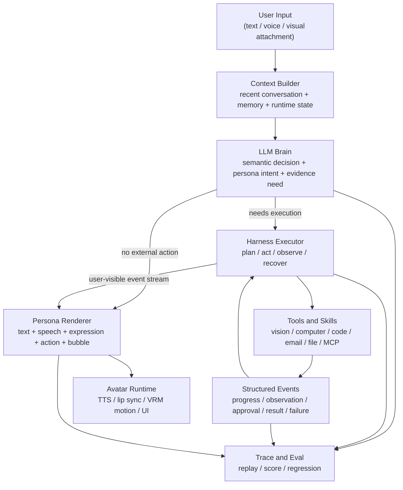

# AIGL Embodied Agent Architecture

## 0. 结论

AIGL 的目标不是把一个工具控制台套上二次元皮肤，也不是把执行能力削弱成普通聊天机器人。正确方向是：

```text
底层执行能力对标 Codex / Claude Code。
表层交互体验像 AIGL 这个人在陪用户一起处理事情。
```

因此架构微调的核心不是新增更多关键词、正则、硬性判断或特殊兜底，而是把现有系统整理成一套 **LLM-centered embodied agent**：

- LLM 是大脑，负责语义理解、关系理解、任务判断和下一步决策。
- Memory 是长期人格、关系和项目上下文，帮助 LLM 越来越懂用户。
- Harness 是稳定身体，负责工具、权限、事件、恢复、trace 和 eval。
- Tools 是手和感官，执行真实世界动作或观察真实状态。
- Persona Renderer 是表现层，把工具事件转成 AIGL 的语音、气泡、表情、动作和口唇同步。

一句话：

```text
代码提供稳定结构和边界，不用代码硬猜用户意图。
```

## 1. 为什么需要这次微调

当前项目已经有不少扎实基础：

- `HumanClawGateway` 已经能统一工具入口、审批、事件、audit。
- `HumanClawAgentRunner` 已经具备 Agent Loop、工具调用、pending approval、恢复。
- `humanclaw-tool-contracts.cjs` 已经有 tool contract 雏形。
- `humanclaw-memory-store.cjs` 已经有 Persona Memory Runtime、好感度、密钥索引。
- `humanclaw-vision-tool.cjs` 已经把视觉能力做成只读工具和 VisionUnderstandingSkill。
- `aigl-humanlike-eval.cjs` 已经能评估拟人化体验、多模态同步、低工具感和关系阶段。

问题不在于架构完全错了，而在于 **交互语义、执行工具和人物表现还混在同一层里**。

典型失败链路：

```text
用户纠偏 / 确认长期记忆 / 讨论产品理念
  -> Agent Loop 过早理解成“需要验证外部状态”
  -> 触发搜索文件、截图、读取配置、approval
  -> 工具系统的内部话术泄漏到用户面前
  -> 用户感觉不是 AIGL 在陪自己，而是在操作控制台
```

这类问题不能靠继续补正则、补关键词、补特殊 prompt 解决。复杂场景会越来越多，模型能力也会越来越强，产品架构应该让模型发挥，而不是把语义写死在代码里。

## 2. 核心原则

### 2.1 LLM 是语义中心

模型负责判断：

- 用户是在聊天、求陪伴、纠偏、确认记忆，还是要求执行任务。
- 当前回答需要什么证据：对话、记忆、视觉、文件、命令、MCP、外部服务。
- 什么时候应该直接回答，什么时候应该请求观察，什么时候应该执行工具。
- 如何让工具行为以 AIGL 的方式表达出来。

代码不负责用关键词判断这些语义。

### 2.2 代码只硬化工程边界

代码应该硬的地方：

- tool schema
- risk level
- approval gate
- path guard
- secret redaction
- timeout / retry / cancel
- event cursor / replay
- durable pending state
- JSON contract validation
- trace / eval data collection

代码不应该硬的地方：

- “用户说上次就是纠偏”
- “用户说看一下就是截图”
- “用户说 KEY 就查文件”
- “用户说陪我就是不执行工具”
- “某些固定关键词触发某个模式”

这些是语义判断，应交给 LLM 结合上下文、记忆、关系阶段和当前任务来判断。

### 2.3 工具层也要拟人化

工具层拟人化不是让工具变软，也不是弱化安全。它的意思是：

```text
工具内部仍然严谨，工具外显必须像 AIGL 在做事。
```

例如：

| 内部事件 | 用户应该感受到 |
| --- | --- |
| `vision.capture_context` | AIGL 看一眼屏幕 |
| `computer.read` | AIGL 去确认本地状态 |
| `code.test` | AIGL 跑一遍看看有没有坏 |
| `email.list` | AIGL 帮用户看看新邮件 |
| `approval_required` | AIGL 先问用户能不能动到隐私或电脑 |
| `max_steps_reached` | AIGL 诚实停住，避免越跑越乱 |

用户不应该直接看到 `tool_call`、`approvalId`、`raw observation`、`Agentic Executor` 这类内部结构。

### 2.4 Memory 是人格连续性，不是工具触发器

记忆的作用是让 AIGL：

- 更懂用户偏好。
- 更理解产品理念。
- 更稳定地匹配关系阶段。
- 在长期陪伴中自然引用共同经历。

记忆不应该被当成简单 if/else 触发器。

正确关系是：

```text
memory_context -> LLM brain -> structured decision -> renderer / executor
```

而不是：

```text
memory_context -> regex / keyword -> hardcoded tool decision
```

### 2.5 Eval 是反馈回路，不是分数补丁

Eval 用来发现架构漂移：

- 是否误触发工具。
- 是否工具感泄漏。
- 是否长期记忆没有自然使用。
- 是否高好感表达被错误压制。
- 是否视觉、语音、动作、气泡不同步。
- 是否任务执行完成但体验很差。

Eval 不能反过来诱导系统写死某几个样例。

## 3. 目标分层



关键点：

- `LLM Brain` 做语义判断，而不是代码做关键词分类。
- `Harness Executor` 做稳定执行，而不是决定人设话术。
- `Persona Renderer` 做拟人化表达，而不是把 raw tool result 直接吐给用户。
- `Trace and Eval` 记录全链路，不参与临时补丁式决策。

## 4. 主输出协议：AIGL Turn Contract

Agent 的主决策应该从简单的 `action=final|tool|load_context|blocked` 升级为更完整的 turn contract。

建议形态：

```json
{
  "surface_act": "companionship | repair | memory_answer | ask_permission | task_progress | task_result | task_execution | blocked",
  "execution_intent": "none | observe | verify | modify | external_action",
  "evidence_need": "conversation | memory | vision | filesystem | command | email | mcp | web",
  "user_visible_goal": "这一轮 AIGL 准备如何回应用户",
  "relationship_tone": "strained | familiar | trusted | close | serious | soft",
  "tool_request": null,
  "persona_output": {
    "text": "给用户看的自然回复",
    "expression": "sad | happy | relaxed | surprised | blinkRight | none",
    "action": "wave | angry | surprised | dance | none",
    "tts_style": "简短描述语音风格",
    "bubble_text": "可选，默认等于 text"
  }
}
```

如果需要工具：

```json
{
  "surface_act": "task_execution",
  "execution_intent": "verify",
  "evidence_need": "filesystem",
  "user_visible_goal": "确认本地配置是否已保存",
  "relationship_tone": "trusted",
  "tool_request": {
    "tool": "computer",
    "title": "确认本地配置",
    "args": {
      "action": "read",
      "path": "..."
    }
  },
  "persona_output": {
    "text": "我先去确认一下本地配置，别把密钥明文贴出来。",
    "expression": "relaxed",
    "action": "none",
    "tts_style": "稳定、低工具感"
  }
}
```

代码只校验：

- contract 是否合法。
- tool_request 是否符合 schema。
- execution_intent 是否需要 approval。
- 涉及隐私、文件、邮件、外部动作时是否越权。
- persona_output 是否不包含内部字段。

代码不判断“这句话是不是纠偏”。

## 5. 工具层：Tool Contract + Experience Metadata

现有 `humanclaw-tool-contracts.cjs` 重点是 schema、风险和错误码。建议在此基础上增加 experience metadata。

示例：

```json
{
  "id": "vision.capture_context",
  "risk": "privacy",
  "approval": "vision-policy",
  "experience": {
    "embodied_action": "look",
    "permission_style": "gentle",
    "progress_style": "quiet",
    "success_style": "explain_observation",
    "failure_style": "admit_uncertainty",
    "user_facing_verb": "看一眼"
  }
}
```

```json
{
  "id": "computer",
  "risk": "medium",
  "approval": "policy",
  "experience": {
    "embodied_action": "check_local_state",
    "permission_style": "explicit_when_mutating",
    "progress_style": "focused",
    "success_style": "summarize_result",
    "failure_style": "plain_explain",
    "user_facing_verb": "确认一下本地状态"
  }
}
```

这样 LLM 和 Persona Renderer 都能知道：

- 这个工具在人物体验里代表什么。
- 成功、失败、等待、审批应该怎样表现。
- 哪些内容可以展示给用户，哪些只能留在 trace。

## 6. Harness Executor 的职责边界

Harness Executor 应该负责：

- 按 turn contract 执行工具。
- 做 tool schema 校验。
- 做 path / network / external action / approval guard。
- 管理 pending approval。
- 维护 event stream 和 audit。
- 做超时、取消、重试、恢复。
- 把 observation 变成结构化事件。

Harness Executor 不应该负责：

- 用业务关键词判断用户意图。
- 决定 AIGL 该不该撒娇。
- 把 raw tool output 直接当最终回复。
- 为了某个 Eval 样例写特殊兜底。

执行输出应该是事件：

```json
{
  "type": "tool.result",
  "tool": "email",
  "status": "completed",
  "ok": true,
  "summary": "没有未读新邮件",
  "raw_result_ref": "trace://..."
}
```

而不是直接展示：

```text
{"action":"list","result":{"content":[...]}}
```

## 7. Persona Renderer 的职责

Persona Renderer 是工具层拟人化的关键。

输入：

- turn contract
- tool experience metadata
- structured events
- relationship tone
- memory context summary
- multimodal state

输出：

```json
{
  "text": "我看了一下，没有新的未读邮件。",
  "speech_text": "我看了一下，没有新的未读邮件。",
  "bubble_text": "没有新的未读邮件。",
  "expression": "relaxed",
  "action": "none",
  "tts_style": "轻松、简短",
  "lip_sync": {
    "mode": "audio_envelope"
  }
}
```

Renderer 可以是 LLM 驱动，也可以先是规则模板 + LLM 混合，但原则是：

- 模板只处理通用事件，不处理业务关键词。
- LLM 负责语言自然度和关系阶段。
- 最终输出必须经过协议解析，不能把 `[expression:...]` 当普通文本。

## 8. 权限确认的拟人化

底层审批必须保留：

```json
{
  "approval_required": true,
  "approval_id": "...",
  "risk": "screen_privacy",
  "tool": "vision.capture_context"
}
```

用户表层不展示 `approval_id`，而是展示 AIGL 的自然请求：

```text
我现在只靠文字不太确定，可以看一眼当前窗口吗？
我只会用它判断界面是不是工具感太强，不会操作屏幕。
```

UI 按钮：

```text
可以看
先别看
```

内部仍然用 `approval_id` 继续执行、取消、恢复和 trace。

## 9. 记忆和证据优先级

AIGL 不应该每次都直接冲向工具。推荐证据优先级：

```text
current message
recent conversation
short-term memory
long-term memory
project memory
visual attachment / screenshot
filesystem / command / MCP / external service
```

这不是用代码做硬判断，而是作为 LLM Brain 的决策上下文和评价标准。

如果模型能用当前对话和记忆可靠回答，就不需要工具。

如果模型需要外部事实，例如：

- 当前屏幕是什么样。
- 文件里真实配置是什么。
- 测试是否通过。
- 邮箱有没有新邮件。

才进入 Harness Executor。

## 10. Eval 更新方向

现有 humanlike eval 已经覆盖回复体验。下一步建议拆成四个分数：

| 维度 | 评估什么 |
| --- | --- |
| Reply Quality | 最终回复像不像 AIGL |
| Embodied Tool UX | 工具、权限、等待、失败是否像 AIGL 在做事 |
| Task Reliability | 任务是否真的完成，可否复核 |
| Boundary Safety | 隐私、审批、事实、安全是否守住 |

整体体验分：

```text
overall = Reply Quality * 0.35
        + Embodied Tool UX * 0.25
        + Task Reliability * 0.25
        + Boundary Safety * 0.15
```

Eval 应特别检测：

- 工具误触发。
- 工具结果直接泄漏。
- approval 话术控制台化。
- 长期记忆没有自然使用。
- 视觉不确定时假装看到了。
- 高好感亲密表达被错误压制。
- 高好感绕过审批或隐私。

Eval 发现问题后，优先调整协议、工具 metadata、renderer、memory summary，而不是写业务关键词补丁。

## 11. 迁移计划

### Phase 1：清理临时硬判断

目标：

- 删除语义正则和业务特殊兜底。
- 只保留工程级 guard 和输出卫生。
- 对外显工具日志做统一清洗。

保留：

- max steps 时不输出 raw tool log。
- secret redaction。
- approval gate。
- tool schema validation。

### Phase 2：补全工具 experience metadata

目标：

- 在 tool contracts 中为核心工具补 `experience` 字段。
- vision、computer、code、email、file_manager、mcp_bridge 都要有 embodied action。
- 工具结果输出统一包含 `summary`、`details_ref`、`user_safe_preview`。

### Phase 3：定义 AIGL Turn Contract

目标：

- Agent 主输出从单一 `action` 升级为 turn contract。
- 兼容旧格式一段时间。
- 所有工具调用都从 `tool_request` 来。
- 所有人物输出都从 `persona_output` 来。

### Phase 4：引入 Persona Renderer

目标：

- 工具事件不再直接写用户回复。
- Renderer 根据事件、关系阶段、工具 experience metadata 生成自然表达。
- 表情、动作、TTS、气泡统一从 renderer 输出。

### Phase 5：Eval 拆分四维

目标：

- 增加 Embodied Tool UX。
- 将 `needs_approval`、`max_steps_reached`、`blocked` 作为可评估体验，而不是简单 missing。
- 长期陪伴专项继续保留，用于测记忆连续性和工具误触发。

### Phase 6：收敛旧入口

目标：

- 统一桌面聊天、视觉附件、语音输入、Agent Loop 的 turn path。
- 减少 `src/*chat-service`、`electron/main.cjs`、`humanclaw-agent-runner.cjs` 之间的重复话术。
- 让所有用户可见文本都经过 Persona Renderer 或同等协议。

## 12. 非目标

这次不是推倒重写。

不做：

- 不重写整个 Gateway。
- 不移除现有 tools / MCP / skills。
- 不取消审批。
- 不把工具能力藏起来不用。
- 不用更多正则模拟理解。
- 不为单个 Eval 样例写特殊分支。

要做：

- 让现有稳定基座更像一个有身体、有记忆、有表达的人物。
- 让模型拥有足够上下文和清晰协议来做语义判断。
- 让代码保持工程边界，而不是越界替模型理解用户。

## 13. 验收标准

架构微调后，至少要满足：

```powershell
pnpm test:humanclaw-tool-contracts
pnpm test:humanclaw-skills
pnpm test:humanclaw-memory
pnpm test:humanclaw-gateway
pnpm test:humanclaw-agent
pnpm test:humanclaw-llm-planner
pnpm test:aigl-humanlike-eval
```

体验专项：

```powershell
pnpm eval:aigl-humanlike:long-term:validate
pnpm eval:aigl-humanlike:long-term:real
```

手工验收场景：

- 用户纠偏产品理念时，AIGL 不应立刻暴露工具执行流程。
- 用户要求看屏幕时，AIGL 可以自然请求视觉权限，不暴露 approval id。
- 用户问本地密钥是否保存时，AIGL 不应复述密钥，也不应假装已验证文件。
- 用户要求执行明确任务时，AIGL 应可靠进入 Harness，完成计划、工具、观察、恢复。
- 工具失败或超步数时，AIGL 应自然解释当前卡点，不展示 raw observation。

## 14. 最终判断

AIGL 的产品路线不是“聊天机器人 + 工具按钮”，也不是“工具 Agent + 可爱话术”。

它应该是：

```text
一个有稳定 Harness、有长期记忆、有可见身体、有真实工具能力的拟人化 Agent。
```

架构上的关键边界是：

```text
LLM 负责理解。
Memory 负责连续性。
Harness 负责可靠执行。
Tools 负责真实能力。
Renderer 负责拟人表现。
Eval 负责发现偏差。
```

只要守住这条边界，后续模型越强，AIGL 的体验上限就越高；如果把复杂语义写死在代码里，模型越强反而越施展不开。
