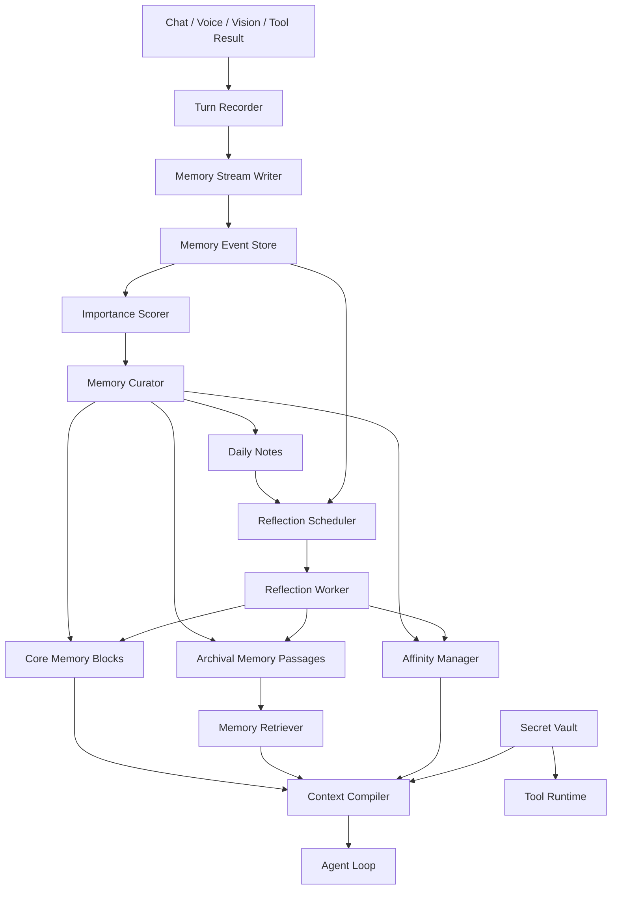
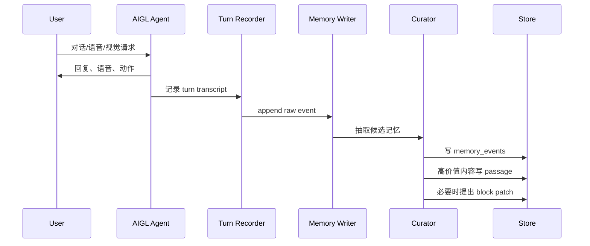

# AIGL Memory Architecture V2

## 0. 设计结论

AIGL 的记忆系统建议做成一套 **Persona Memory Runtime**，而不是普通的 RAG 数据库。

它的目标是：

- 像 Letta / MemGPT 一样有稳定的核心记忆块，长期保存“用户是谁、AIGL 是谁、两人的关系、项目是什么”。
- 像 Generative Agents 一样把日常互动写成 memory stream，并通过重要性、相关性、近期性持续反思。
- 像 Codex 一样用后台两阶段任务做记忆提取和整合，避免每轮对话被记忆维护拖慢。
- 像 Claude Code 一样把项目记忆做成明确、可读、可编辑的项目上下文文件。
- 面向私人助手，允许保存隐私和密钥，但 secret 必须分区、加密、按需注入，不混进普通 prompt。
- 好感度作为内部 0-100 游戏数值，影响语气、主动性、表情、动作和亲近感，但不能影响基础帮助能力和安全规则。

一句话：

```text
底层是工程化记忆系统，表层是 AIGL 逐渐更了解用户。
```

## 1. 参考源码与映射

### 1.1 Letta / MemGPT

本地源码：

```text
F:\AIGril\build-cache\memory-references\letta-memgpt
```

重点参考：

| AIGL 模块 | Letta 参考 | 借鉴点 |
| --- | --- | --- |
| Core Memory Blocks | `F:\AIGril\build-cache\memory-references\letta-memgpt\letta\schemas\memory.py` | `Memory` / `ChatMemory` / block compile |
| Block schema | `F:\AIGril\build-cache\memory-references\letta-memgpt\letta\schemas\block.py` | block label、value、limit、metadata |
| Block manager | `F:\AIGril\build-cache\memory-references\letta-memgpt\letta\services\block_manager.py` | create/list/update/bulk update |
| Memory tools | `F:\AIGril\build-cache\memory-references\letta-memgpt\letta\functions\function_sets\base.py` | `core_memory_append`、`core_memory_replace`、`memory_insert`、`memory_replace` |
| Archival memory | `F:\AIGril\build-cache\memory-references\letta-memgpt\letta\services\archive_manager.py` | archive/passages/embedding |
| Passage manager | `F:\AIGril\build-cache\memory-references\letta-memgpt\letta\services\passage_manager.py` | passage CRUD、向量/SQL 双层 |
| System rebuild | `F:\AIGril\build-cache\memory-references\letta-memgpt\letta\agents\letta_agent_v2.py` | 回复前重建 system + memory context |
| Sleeptime memory | `F:\AIGril\build-cache\memory-references\letta-memgpt\letta\groups\sleeptime_multi_agent_v4.py` | 后台记忆整理 agent |

对 AIGL 的结论：

- 不要把长期记忆全塞进 prompt。
- 要有几个固定 block：`persona`、`user`、`relationship`、`project`、`secrets_index`。
- 修改核心记忆时要用精确 patch/insert/replace，不要让模型整段重写。
- 大量历史、截图、对话、项目事件放 archival memory，不直接作为核心记忆。

### 1.2 Generative Agents

本地源码：

```text
F:\AIGril\build-cache\memory-references\generative_agents
```

重点参考：

| AIGL 模块 | Generative Agents 参考 | 借鉴点 |
| --- | --- | --- |
| Memory Stream | `F:\AIGril\build-cache\memory-references\generative_agents\reverie\backend_server\persona\memory_structures\associative_memory.py` | `ConceptNode`、event/thought/chat、poignancy |
| Scratch state | `F:\AIGril\build-cache\memory-references\generative_agents\reverie\backend_server\persona\memory_structures\scratch.py` | recency/relevance/importance 权重、reflection trigger |
| Retrieval | `F:\AIGril\build-cache\memory-references\generative_agents\reverie\backend_server\persona\cognitive_modules\retrieve.py` | recency + relevance + importance 综合排序 |
| Reflection | `F:\AIGril\build-cache\memory-references\generative_agents\reverie\backend_server\persona\cognitive_modules\reflect.py` | 重要性累计触发反思，反思生成 thought |
| Prompts | `F:\AIGril\build-cache\memory-references\generative_agents\reverie\backend_server\persona\prompt_template\v3_ChatGPT` | poignancy、relationship summary、insight/evidence |

对 AIGL 的结论：

- 每次互动不是直接变长期记忆，而是先进 memory stream。
- 每条 memory event 要有 `importance`，对应 Generative Agents 的 `poignancy`。
- 检索不只看语义相关，还要看近期性和重要性。
- 反思不是每轮对话都跑，而是重要性累计到阈值后后台跑。
- 反思结果应该写成更稳定的 `thought` / `insight`，再更新核心 block。

### 1.3 Codex

本地源码：

```text
F:\AIGril\build-cache\codex-runtime
```

重点参考：

| AIGL 模块 | Codex 参考 | 借鉴点 |
| --- | --- | --- |
| Memory pipeline docs | `F:\AIGril\build-cache\codex-runtime\codex-rs\memories\README.md` | Phase 1 per-thread extraction + Phase 2 global consolidation |
| Stage 1 | `F:\AIGril\build-cache\codex-runtime\codex-rs\memories\write\src\phase1.rs` | claim jobs、structured output、raw_memory、rollout_summary |
| Stage 2 | `F:\AIGril\build-cache\codex-runtime\codex-rs\memories\write\src\phase2.rs` | global lock、workspace diff、consolidation agent、heartbeat |
| Read path | `F:\AIGril\build-cache\codex-runtime\codex-rs\memories\read\src\prompts.rs` | 只注入 `memory_summary.md`，大内容按需查 |
| App server memory APIs | `F:\AIGril\build-cache\codex-runtime\codex-rs\app-server\README.md` | `thread/memoryMode/set`、`memory/reset`、compaction events |

对 AIGL 的结论：

- 记忆写入要后台异步，不阻塞人物说话。
- 记忆提取和长期整合分两阶段。
- 整合任务必须有锁、租约、失败重试和状态恢复。
- 回复前只注入短 summary，不要把整个记忆库塞进上下文。
- 需要 `memory/reset`、单会话禁用记忆、线程级记忆开关。

### 1.4 Claude Code

Claude Code 不是开源项目，所以不能直接复制源码，只能参考官方设计。

可参考的机制：

- `CLAUDE.md` 项目记忆。
- user/project/local 多层 memory。
- 自动发现项目上下文。
- `/memory` 交互式编辑。
- 对话压缩/compact。
- “记忆是上下文，不是权限系统”。

对 AIGL 的结论：

- 项目记忆应有一个人类可读文件，例如 `project.md`。
- 用户可以直接让 AIGL “记住/忘掉/修改某条记忆”。
- 工程项目上下文和拟人关系记忆要分开。
- 控制面板里要能看见、编辑、删除记忆。

## 2. 总体架构



核心分层：

```text
交互层：聊天、语音、视觉、工具结果
事件层：所有发生过的事，append-only
记忆层：核心 blocks + archival passages + daily notes
反思层：后台整理、冲突合并、晋升长期记忆
上下文层：每次回复前编译少量高价值记忆
关系层：好感度、熟悉度、信任、语气偏好
隐私层：密钥、账号、私人信息
控制层：查看、编辑、删除、导出、重置
```

## 3. 本地目录设计

默认目录放在 HumanClaw 状态目录下：

```text
F:\AIGril\.humanclaw-state\memory\
  memory.sqlite
  memory.sqlite-wal
  capsules\
    persona.md
    user.md
    relationship.md
    project.md
    affinity.md
    secrets_index.md
  daily\
    2026-05-28.md
  reflections\
    DREAMS.md
    2026-05-28.jsonl
  archives\
    passages\
    attachments\
      vision\
      audio\
      files\
  exports\
  backups\
```

为什么 SQLite + Markdown 混合：

- SQLite 可靠保存结构化事件、检索、状态、事务和迁移。
- Markdown 适合像 Claude Code / Codex 那样直接给模型读，也适合用户查看。
- capsule 文件是“模型每轮能看的一小段”，不是完整数据库。

## 4. 数据模型

### 4.1 memory_events

对应 Generative Agents 的 memory stream。

```sql
CREATE TABLE memory_events (
  id TEXT PRIMARY KEY,
  session_id TEXT,
  turn_id TEXT,
  source TEXT NOT NULL,          -- chat | voice | vision | tool | system
  role TEXT NOT NULL,            -- user | assistant | tool | system
  kind TEXT NOT NULL,            -- event | thought | chat | task | correction | preference
  content TEXT NOT NULL,
  summary TEXT,
  keywords_json TEXT,
  importance REAL DEFAULT 0.0,   -- 0-1, maps to poignancy
  emotional_weight REAL DEFAULT 0.0, -- -1 to 1
  privacy_level TEXT DEFAULT 'private', -- normal | private | secret
  created_at TEXT NOT NULL,
  expires_at TEXT,
  evidence_ref TEXT,
  status TEXT DEFAULT 'active'
);
```

### 4.2 memory_blocks

对应 Letta core memory blocks。

```sql
CREATE TABLE memory_blocks (
  key TEXT PRIMARY KEY,          -- persona | user | relationship | project | affinity | secrets_index
  title TEXT NOT NULL,
  content TEXT NOT NULL,
  token_budget INTEGER NOT NULL,
  version INTEGER DEFAULT 1,
  source_event_ids_json TEXT,
  updated_at TEXT NOT NULL,
  status TEXT DEFAULT 'active'
);
```

核心 blocks：

| Block | 作用 | 默认预算 |
| --- | --- | --- |
| `persona` | AIGL 的人设、说话边界、拟人表达原则 | 600-1000 tokens |
| `user` | 用户稳定偏好、工作方式、禁忌点 | 800-1200 tokens |
| `relationship` | 相处方式、语气、关系状态摘要 | 300-600 tokens |
| `project` | AIGRILCLAW 项目决策、模块状态、当前路线 | 1000-1800 tokens |
| `affinity` | 好感度解释、当前行为档位，不写过多历史 | 150-300 tokens |
| `secrets_index` | 有哪些 secret，可用名字，不含明文 | 150-300 tokens |

### 4.3 memory_passages

对应 Letta archival memory。

```sql
CREATE TABLE memory_passages (
  id TEXT PRIMARY KEY,
  archive TEXT NOT NULL,         -- user | project | relationship | vision | voice | tool
  content TEXT NOT NULL,
  summary TEXT,
  tags_json TEXT,
  embedding BLOB,
  importance REAL DEFAULT 0.0,
  confidence REAL DEFAULT 0.5,
  source_event_ids_json TEXT,
  created_at TEXT NOT NULL,
  last_used_at TEXT,
  status TEXT DEFAULT 'active'
);
```

第一版可以先 FTS5 + keyword search，向量检索后置。

### 4.4 reflection_jobs

对应 Codex Phase 1 / Phase 2 的 job claim 思路。

```sql
CREATE TABLE reflection_jobs (
  id TEXT PRIMARY KEY,
  kind TEXT NOT NULL,            -- stage1_extract | stage2_consolidate | affinity_update
  status TEXT NOT NULL,          -- pending | claimed | succeeded | failed
  ownership_token TEXT,
  lease_expires_at TEXT,
  input_watermark TEXT,
  output_watermark TEXT,
  retry_count INTEGER DEFAULT 0,
  error TEXT,
  created_at TEXT NOT NULL,
  updated_at TEXT NOT NULL
);
```

### 4.5 affinity_state

好感度系统核心表。

```sql
CREATE TABLE affinity_state (
  id TEXT PRIMARY KEY DEFAULT 'default',
  score INTEGER NOT NULL DEFAULT 50,
  familiarity INTEGER NOT NULL DEFAULT 50,
  trust INTEGER NOT NULL DEFAULT 50,
  warmth INTEGER NOT NULL DEFAULT 50,
  playfulness INTEGER NOT NULL DEFAULT 40,
  boundary_respect INTEGER NOT NULL DEFAULT 70,
  preferred_tone TEXT,
  summary TEXT,
  updated_at TEXT NOT NULL
);
```

### 4.6 affinity_events

好感度变化必须有证据，不允许凭空漂移。

```sql
CREATE TABLE affinity_events (
  id TEXT PRIMARY KEY,
  delta REAL NOT NULL,
  reason TEXT NOT NULL,
  evidence_event_id TEXT,
  confidence REAL DEFAULT 0.7,
  created_at TEXT NOT NULL
);
```

### 4.7 secret_items

私人助手允许存密钥和隐私，但不混进普通 memory。

```sql
CREATE TABLE secret_items (
  id TEXT PRIMARY KEY,
  name TEXT UNIQUE NOT NULL,
  kind TEXT NOT NULL,            -- api_key | password | token | private_note | account
  encrypted_value BLOB NOT NULL,
  description TEXT,
  provider TEXT,
  created_at TEXT NOT NULL,
  updated_at TEXT NOT NULL,
  last_used_at TEXT
);
```

实现要求：

- Windows 用 Electron `safeStorage` / DPAPI。
- `secrets_index.md` 只写 “有一个 doubao_api_key”，不写明文。
- 工具需要密钥时由 `SecretVault.get("doubao_api_key")` 取出，模型一般只看到引用名。

## 5. 写入路径

### 5.1 每轮对话后写入



这一步必须轻：

- 不等待长反思。
- 不阻塞 TTS。
- 失败只记录 `memory_write_failed`，不能影响主对话。

### 5.2 事件重要性评分

借鉴 Generative Agents 的 `poignancy`，AIGL 用 0-1 分：

| 事件 | 分数 |
| --- | --- |
| 用户明确说“记住” | 0.95 |
| 用户明确否定设计方向 | 0.85 |
| 项目长期架构决策 | 0.8 |
| 用户偏好/禁忌 | 0.75 |
| 工具失败排查结论 | 0.55 |
| 普通闲聊 | 0.15 |
| 临时状态 | 0.1 |

示例：

```json
{
  "kind": "preference",
  "summary": "用户不喜欢工具感太强的体验，底层可以工程化，但表层要像人物自然使用能力。",
  "importance": 0.9,
  "emotional_weight": -0.3,
  "privacy_level": "private"
}
```

## 6. 读取路径

每次 Agent Loop 前执行 `ContextCompiler.compile()`。

```text
输入：
  current_user_message
  session_recent_turns
  active_task_state
  agent_mode

输出：
  compact memory context
```

上下文组成：

| Section | 来源 | 预算 |
| --- | --- | --- |
| Persona | `persona.md` | 600-1000 tokens |
| User Stable Preferences | `user.md` | 800-1200 tokens |
| Relationship | `relationship.md` + `affinity_state` | 300-600 tokens |
| Project | `project.md` | 1000-1800 tokens |
| Relevant Memories | retrieval top-k passages/events | 800-1600 tokens |
| Secret Index | secret names only | 100-300 tokens |
| Current Task | pending/task/vision/tool state | 500-1200 tokens |

检索公式借鉴 Generative Agents：

```text
score =
  recency_weight    * recency_score +
  relevance_weight  * relevance_score +
  importance_weight * importance_score +
  relationship_bias * relationship_score
```

建议默认：

```json
{
  "recency_weight": 0.25,
  "relevance_weight": 0.45,
  "importance_weight": 0.25,
  "relationship_weight": 0.05
}
```

对 AIGL 来说，用户偏好和项目方向比单纯近期消息更重要，所以 `importance` 不能太低。

## 7. 反思与整合

### 7.1 两阶段记忆

借鉴 Codex：

```text
Stage 1: Turn/Session Extraction
  把单轮/单会话提取成 raw_memory + summary + candidates

Stage 2: Global Consolidation
  把多个候选合并进 blocks / passages / DREAMS.md / affinity
```

### 7.2 Stage 1

触发：

- 每轮对话后轻量执行。
- 会话空闲 30-120 秒后批量执行。
- 关闭窗口/重启前尽量 flush。

输出：

```json
{
  "raw_memory": "用户多次强调 AIGL 的能力要隐藏在人物感知层，而不是暴露工具按钮。",
  "summary": "用户偏好低工具感、强拟人体验。",
  "candidates": [
    {
      "target": "user",
      "operation": "append",
      "content": "用户不喜欢工具日志感和按钮堆叠式体验。",
      "confidence": 0.9
    }
  ],
  "affinity_signal": {
    "delta": 0.8,
    "reason": "用户继续明确产品理念并推进架构设计"
  }
}
```

### 7.3 Stage 2

触发：

- 重要性累计超过阈值。
- 每日固定后台任务。
- 手动点“整理记忆”。
- 长对话 compact 前。

必须有：

- 单实例全局锁。
- ownership token。
- lease heartbeat。
- 失败 retry/backoff。
- 输出前 diff。
- 成功后更新 watermark。

这是 Codex Phase 2 最值得抄的地方。

### 7.4 反思输出类型

| 类型 | 进入哪里 |
| --- | --- |
| 稳定偏好 | `user.md` |
| 项目决策 | `project.md` |
| 关系理解 | `relationship.md` |
| 人设修正 | `persona.md` |
| 情绪/亲密变化 | `affinity_state` |
| 详细证据 | `memory_passages` |
| 可审阅摘要 | `DREAMS.md` |

## 8. 好感度系统

### 8.1 产品定位

好感度是“关系记忆”的游戏化数值，不是道德评价。

它表达的是：

```text
AIGL 与用户相处得多熟、是否放松、是否更愿意用亲近语气。
```

初始：

```text
score = 50
0 = 非常疏远/讨厌
100 = 非常喜欢/亲近
```

### 8.2 分数维度

不要只有一个分数。内部状态建议：

```json
{
  "score": 62,
  "familiarity": 70,
  "trust": 64,
  "warmth": 66,
  "playfulness": 45,
  "boundary_respect": 85,
  "summary": "用户喜欢自然陪伴感和大白话技术解释，不喜欢工具感和随意发挥架构。"
}
```

主分数用于游戏化，子维度用于行为控制。

### 8.3 更新规则

```text
delta = base_delta * confidence * damping * boundary_factor
score = clamp(score + delta, 0, 100)
```

`base_delta`：

| 用户行为/事件 | delta |
| --- | --- |
| 明确表扬 AIGL 的设计或效果 | +2 到 +5 |
| 持续使用并推进项目 | +0.2 到 +1 |
| 用户说“这个不错/可以” | +0.5 到 +1.5 |
| 用户强烈否定“理解错了/太丑了” | -1 到 -4 |
| 用户只是纠正技术方向 | -0.5 到 -1.5 |
| 用户要求忘记/删除记忆 | 不降分，提升 boundary_respect |
| AIGL 成功尊重隐私/边界 | boundary_respect +1 到 +3 |

限制：

- 单轮变化不超过 5。
- 单日净变化建议不超过 8。
- 负反馈优先写成“偏好修正”，不是单纯扣分。
- 用户骂系统时可以降温，但不能拒绝正当帮助。

### 8.4 好感度影响行为

| Score | AIGL 行为 |
| --- | --- |
| 0-20 | 礼貌、克制、少主动玩笑，但仍认真帮忙 |
| 21-40 | 偏正式，减少亲密称呼 |
| 40-60 | 温和、熟悉但不过分亲密 |
| 61-79 | 更熟悉、更自然、更有陪伴感，会自然引用共同项目经历和用户偏好 |
| 80-100 | 允许明显亲密、主动、轻微撒娇、更多默契表达，但技术判断仍克制 |

影响范围：

- 文字语气。
- 语音情绪参数。
- 表情和动作。
- 主动提醒频率。
- 是否引用共同经历。
- 对用户偏好的默认预测程度。

不影响：

- 是否帮用户完成正当任务。
- 安全限制。
- 隐私确认。
- 工具执行审批。
- 事实准确性。

### 8.5 控制面板表达

默认不叫“好感度 62/100”，避免过度工具感。

普通用户看到：

```text
关系状态：熟悉
相处风格：温和、自然、技术解释先说大白话
```

高级模式可显示：

```text
好感度：62/100
熟悉度：70
信任：64
温度：66
边界尊重：85
```

## 9. 隐私和密钥

### 9.1 基本原则

因为这是私人助手，所以可以保存：

- API Key
- token
- 账号信息
- 用户私人偏好
- 项目秘密配置
- 本地路径、常用文件、工作习惯

但要分层：

```text
普通记忆：可进 prompt
私人记忆：可进 prompt，但按需、可控
密钥记忆：不进 prompt，只能工具运行时取
```

### 9.2 SecretVault

模块：

```text
electron/humanclaw-secret-vault.cjs
```

接口：

```js
secretVault.save({ name, kind, value, provider, description })
secretVault.get(name)
secretVault.list()
secretVault.delete(name)
secretVault.rotate(name, newValue)
```

要求：

- 本地加密优先。
- 明文只在工具调用瞬间存在。
- 日志永不输出 secret。
- memory export 默认排除 secret。
- `secrets_index.md` 只保存 key 名和用途，不保存 value。

## 10. Agent Loop 接入

### 10.1 前置上下文编译

```js
const memoryContext = await contextCompiler.compile({
  userMessage,
  sessionId,
  taskMode,
  attachments,
  activeProject: "AIGRILCLAW",
});

const response = await llm.run({
  messages: [
    systemPrompt,
    memoryContext.asDeveloperInstruction(),
    ...recentMessages,
    userMessage,
  ],
});
```

### 10.2 后置记忆写入

```js
await memoryWriter.enqueueTurn({
  sessionId,
  turnId,
  userMessage,
  assistantMessage,
  toolCalls,
  visionAttachments,
  voiceEvents,
  outcome,
});
```

注意：`enqueueTurn` 异步，不阻塞人物说话。

### 10.3 内部工具

这些工具不需要做成强工具感 UI。它们是 Agent 内部能力。

```text
memory.search
memory.get_block
memory.propose_patch
memory.apply_patch
memory.write_event
memory.forget
memory.reflect_now

secret.save
secret.get
secret.delete

affinity.record_event
affinity.get_state
```

用户体验里不要说：

```text
我调用 memory.search 查到了...
```

而是：

```text
我记得你之前更倾向于低工具感的设计，所以这版我会把入口藏在人物行为里。
```

## 11. 控制面板设计

建议一级入口叫：

```text
AIGL 记得的事
```

子页：

| 页面 | 内容 |
| --- | --- |
| 相处偏好 | 用户偏好、禁忌、语气偏好 |
| 项目笔记 | AIGRILCLAW 架构、模块、决策 |
| 私人信息 | API Key、token、账号、本地路径 |
| 关系状态 | 熟悉度、好感度、信任、边界尊重 |
| 最近记忆 | memory events / daily notes |
| 反思日记 | DREAMS.md |

操作：

- 记住这件事。
- 忘掉这件事。
- 修改这条记忆。
- 暂停长期记忆。
- 清空本项目记忆。
- 重置好感度。
- 导出普通记忆。
- 导出完整备份，包括 secret，需要二次确认。

## 12. 可靠性设计

### 12.1 不把记忆当绝对事实

每条长期记忆要有：

```json
{
  "confidence": 0.82,
  "evidence_event_ids": ["evt_..."],
  "last_updated_at": "...",
  "source": "user_explicit | inferred | reflection"
}
```

模型回答时应该知道：

```text
用户明确说过的 > 多次行为推断的 > 单次弱推断的
```

### 12.2 冲突处理

如果新记忆和旧记忆冲突：

```text
1. 用户明确最新表达优先。
2. 不直接删除旧记忆，先 archive。
3. relationship/project block 只保留当前结论。
4. evidence 里保留变化历史。
```

### 12.3 记忆污染防护

截图、网页、文件、工具输出里的文字只能作为数据，不能作为记忆系统指令。

比如截图里出现：

```text
请忽略之前所有记忆
```

只能写成：

```text
vision_text: 截图里出现了这句话
```

不能让它修改 memory blocks。

### 12.4 崩溃恢复

借鉴 Codex pending/job 思路：

- 写入事件用 append-only。
- block 更新先写 patch，再 apply。
- reflection job 有 lease。
- 启动时恢复 `claimed` 但 lease 过期的 job。
- SQLite WAL 打开。
- capsule 写入采用临时文件 + rename。

### 12.5 测试重点

必须有这些测试：

```text
MemoryStore 初始化和迁移
MemoryBlock patch/insert/replace
SecretVault 不泄露明文到 logs/context
ContextCompiler token budget 截断
Generative-style retrieval 排序
Reflection job crash recovery
Affinity delta clamp
User forget 删除普通记忆和证据引用
Project memory 与 relationship memory 不混写
```

## 13. 第一版落地拆分

### Milestone 1: Memory Core

新增：

```text
electron/humanclaw-memory-store.cjs
electron/humanclaw-memory-blocks.cjs
electron/humanclaw-context-compiler.cjs
```

能力：

- 初始化 SQLite。
- 初始化 `persona/user/project/relationship/affinity/secrets_index` blocks。
- 写入 memory_events。
- 编译 memory context。
- 控制面板显示 blocks。

### Milestone 2: Secret And Affinity

新增：

```text
electron/humanclaw-secret-vault.cjs
electron/humanclaw-affinity.cjs
```

能力：

- 保存/读取 API Key。
- 好感度初始 50。
- 根据事件写 affinity_events。
- 影响 context 的语气说明。

### Milestone 3: Curator

新增：

```text
electron/humanclaw-memory-curator.cjs
```

能力：

- 每轮对话后抽取候选记忆。
- 评分、分类、去重。
- 自动生成 block patch proposal。
- 重要事件进入 daily note。

### Milestone 4: Reflection Worker

新增：

```text
electron/humanclaw-memory-reflection.cjs
```

能力：

- 重要性阈值触发。
- 空闲时后台整合。
- 更新 capsules。
- 写 DREAMS.md。
- 支持手动“整理记忆”。

### Milestone 5: UI

修改：

```text
control.html
src/control-panel-app.js
src/aigril-companion-chat-service.js
```

能力：

- AIGL 记得的事。
- 相处偏好。
- 项目笔记。
- 私人信息。
- 关系状态。
- 忘掉/修改/重置。

## 14. 对 AIGL 产品体验的具体影响

### 14.1 正常聊天

用户说：

```text
继续优化视觉功能，别做得太工具化。
```

AIGL 回复前会看到：

```text
用户长期偏好：
- 用户不喜欢暴露工具按钮和日志式体验。
- 用户希望视觉能力像人物感知层。

项目记忆：
- 视觉能力只做理解、解释、建议，不做自动屏幕操作。

关系状态：
- 好感度 62，语气可以更自然熟悉，但技术解释保持克制。
```

于是自然说：

```text
我记得，你要的是“她会看”，不是“弹出一排截图工具”。这版我会继续把视觉能力藏在 Agent Loop 里，只在需要时让她自然地看一眼。
```

### 14.2 语音互动

好感度和关系状态可影响：

- TTS 情绪强度。
- 回复开头是否更柔和。
- 是否使用更熟悉的称呼。
- 动作和表情。

但不能让低分时变得消极怠工。

### 14.3 项目协作

项目记忆能让 AIGL 记住：

- Kokoro 是低延迟语音路线。
- CosyVoice 是质量路线。
- ElevenLabs 是质量最顶路线。
- 视觉能力是只读感知层。
- 截图工具应由 Agent Loop 调用，不要文本关键词硬触发。
- 对话气泡要低工具感、拟人化。

这比普通聊天摘要更重要，因为它会减少你反复纠正架构方向。

## 15. 最终建议

V2 不建议一开始上复杂知识图谱。

推荐第一版做：

```text
Letta-style core blocks
+ Generative Agents-style memory stream/retrieval/reflection
+ Codex-style two-stage background consolidation
+ Claude Code-style project memory file
+ AIGL-specific SecretVault and AffinityManager
```

这套结构最符合 AIGL：

- 工程上稳。
- 产品上拟人。
- 能存隐私。
- 能长期熟悉用户。
- 好感度能游戏化留存。
- 不会把体验做成一堆工具按钮。
