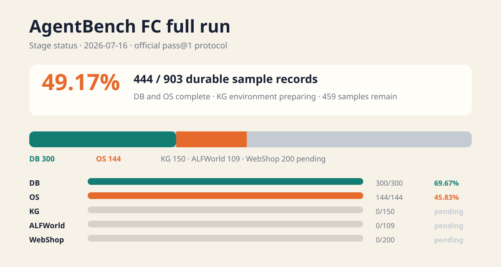
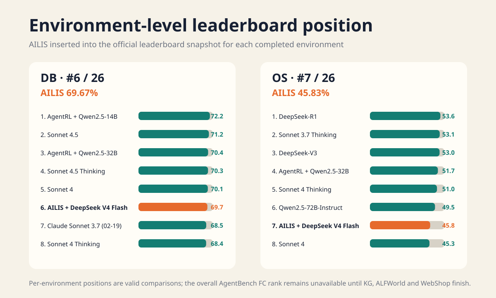
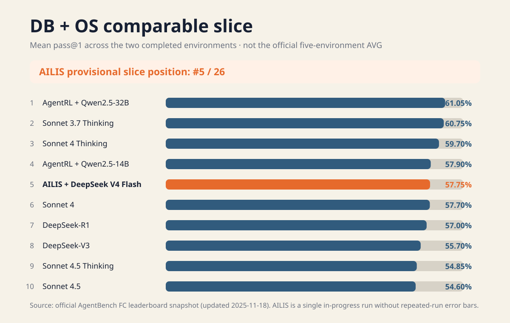

# AILIS AgentBench FC 阶段性评测报告

日期：2026-07-16
状态：官方五环境全量评测进行中
Run ID：`ailis-agentbench-fc-full-20260715`

## 结论先行

AILIS 已完成 AgentBench FC 的 DB 和 OS 两个环境，共形成 `444 / 903` 条持久化样本记录，覆盖率为 `49.17%`。DB 官方得分为 `69.67%`，OS 官方得分为 `45.83%`。当前 `275 / 444` 样本取得成功奖励，但这个 `61.94%` 只是已运行样本的直接成功率，不是官方五环境总分。

与 AgentBench FC 官方排行榜 2025-11-18 快照对照：

- DB 单环境：AILIS 若插入排行榜，位于 `6 / 26`。
- OS 单环境：AILIS 若插入排行榜，位于 `7 / 26`。
- DB 与 OS 两环境等权均值为 `57.75%`，在这个临时可比切片中位于 `5 / 26`。
- 五环境官方 AVG 和最终排名仍为 `N/A`。KG、ALFWorld、WebShop 未完成前，不得用 `57.75%` 代替官方总分。



## 评测口径

| 项目 | 本次配置 |
| --- | --- |
| Benchmark | AgentBench FC，非旧版 AgentBench v0.2 |
| 官方环境 | DB、OS、KG、ALFWorld、WebShop |
| 预期样本 | 903 |
| 协议 | 官方 function calling、pass@1、最多 20 个环境回合 |
| Provider / Model | DeepSeek / `deepseek-v4-flash` |
| 官方 Benchmark revision | `d1e4a10db08c87075c78972e48ecc182be03e2d5` |
| Persona | 不参与评测文本渲染 |
| 恢复策略 | 同一 run ID 按 JSONL 持久化记录断点恢复 |
| 基础设施失败 | 不作为模型答案计入正确率 |

官方仓库明确说明 AgentBench FC 使用 function-calling 风格，并包含 ALFWorld、DB、KG、OS 和 WebShop 五个容器化环境。官方 AVG 是五环境结果的完整汇总，不是任意已完成环境的均值。

## 阶段性得分

| 环境 | 记录 | 成功 | 官方得分 | 当前状态 |
| --- | ---: | ---: | ---: | --- |
| DB | 300 / 300 | 209 | **69.67%** | 完成 |
| OS | 144 / 144 | 66 | **45.83%** | 完成；1 个官方任务在首轮前异常 |
| KG | 0 / 150 | 0 | N/A | Freebase 环境准备中 |
| ALFWorld | 0 / 109 | 0 | N/A | 排队 |
| WebShop | 0 / 200 | 0 | N/A | 排队 |
| 合计 | **444 / 903** | **275** | **N/A** | 49.17% 覆盖 |

`samples=444`、`completed=443` 的差异来自一个 OS 官方任务在模型首轮前发生环境错误。该样本保留为可审计记录，但没有伪装成模型答案，也没有计入 `infrastructureErrors` 答案。

## 与官方排行榜对照

排行榜来源：AgentBench 官方仓库链接的 [AgentBench FC Leaderboard](https://docs.google.com/spreadsheets/d/e/2PACX-1vRR3Wl7wsCgHpwUw1_eUXW_fptAPLL3FkhnW_rua0O1Ji_GIVrpTjY5LaKAhwO-WeARjnY_KNw0SYNJ/pubhtml)，快照更新时间为 2025-11-18，共 25 个官方条目。仓库保存了只读 CSV 快照，便于复现图表。



### DB

AILIS 的 `69.67%` 低于 AgentRL + Qwen2.5-14B 的 `72.2%`、Claude Sonnet 4.5 的 `71.2%`、AgentRL + Qwen2.5-32B 的 `70.4%`、Claude Sonnet 4.5 Thinking 的 `70.3%` 和 Claude Sonnet 4 的 `70.1%`，高于排行榜其余条目。因此插入后为第 6 名。

### OS

AILIS 的 `45.83%` 低于 DeepSeek-R1 的 `53.6%`、Claude Sonnet 3.7 Thinking 的 `53.1%`、DeepSeek-V3 的 `53.0%`、AgentRL + Qwen2.5-32B 的 `51.7%`、Claude Sonnet 4 Thinking 的 `51.0%` 和 Qwen2.5-72B-Instruct 的 `49.5%`，插入后为第 7 名。

### DB + OS 临时切片



| 临时名次 | 系统 | DB + OS 等权均值 |
| ---: | --- | ---: |
| 1 | AgentRL + Qwen2.5-32B | 61.05% |
| 2 | Claude Sonnet 3.7 Thinking | 60.75% |
| 3 | Claude Sonnet 4 Thinking | 59.70% |
| 4 | AgentRL + Qwen2.5-14B | 57.90% |
| **5** | **AILIS + DeepSeek V4 Flash** | **57.75%** |
| 6 | Claude Sonnet 4 | 57.70% |
| 7 | DeepSeek-R1 | 57.00% |
| 8 | DeepSeek-V3 | 55.70% |

这个切片适合回答“AILIS 在已经完成的相同环境上大致处于什么位置”，不适合回答“AILIS 的 AgentBench FC 总排名是多少”。AILIS 只有一次运行，没有官方条目常见的重复运行误差条；与 Claude Sonnet 4 的 `0.05` 个百分点差距不具备统计意义。

官方完整 AVG 当前最高为 AgentRL + Qwen2.5-32B 的 `70.4%`。AILIS 尚无完整 AVG，不能与该数字直接作高低判断。

## 性能与开销

| 指标 | 当前值 |
| --- | ---: |
| 模型调用 | 2,499 |
| Prompt tokens | 4,088,906 |
| Completion tokens | 411,935 |
| Total tokens | **4,500,841** |
| 正式任务累计耗时 | 5,240,788 ms，约 87.35 分钟 |
| 平均 calls / record | 5.63 |
| 平均 tokens / record | 10,137 |

约 58% token 消耗发生在失败任务上。当前最明确的成本问题不是成功任务太长，而是失败任务比成功任务多走数轮并携带更大的历史。

## 失败任务特征

### DB

- 209 成功，91 失败。
- 成功任务平均约 5 轮、7,303 tokens、9.18 秒。
- 失败任务平均约 8 轮、20,246 tokens、19.26 秒。
- 79 / 91 已调用最终答案工具，但答案未通过官方验证器。
- 12 / 91 一直执行 SQL，没有及时提交最终答案。
- 高频薄弱点是日期条件、文本过滤、聚合、排序/限制和写操作精确性。

DB 的主要问题属于 Agent 推理与 verifier 对齐，而不是工具或 Provider 不可用。

### OS

- 66 成功，77 个 reward=0，另有 1 个官方任务环境错误。
- 成功任务平均约 4 轮、5,235 tokens、7.55 秒。
- 失败任务平均约 6 轮、10,216 tokens、13.88 秒。
- 43 / 77 在官方终止时仍继续调用 Bash。
- 30 个答案动作被拒绝，4 个结束动作被拒绝。
- 40 / 77 曾收到空输出，29 / 77 出现明确命令错误。

OS 的主要问题是环境状态判断、命令后验证和收口时机。

## 当前环境建设进度

KG 所需的 Freebase 压缩归档已完成 `56,324,228,100 / 56,324,228,100` 字节下载。数据库成员 `virtuoso_db/virtuoso.db` 的逻辑大小为 `148,679,688,192` 字节，正在 WSL 内部文件系统中解压。完成后还需：

1. 校验解压成员大小和 ZIP CRC。
2. 启动兼容官方接口的 Virtuoso SPARQL 服务。
3. 通过 KG 健康检查。
4. 使用同一 run ID 从 KG 断点恢复。
5. 顺序运行 ALFWorld 和 WebShop，最后执行官方汇总。

## 可以与不可以对外表述的内容

可以：

- “AILIS 正在运行官方 AgentBench FC 五环境全量评测，已完成 444 / 903 条记录。”
- “AILIS 在 DB 和 OS 上分别取得 69.67% 和 45.83%。”
- “按官方排行榜快照进行单环境插入比较，DB 暂列第 6，OS 暂列第 7。”
- “在 DB+OS 两环境临时可比切片中，AILIS 均值 57.75%，暂列第 5。”

不可以：

- “AILIS 的 AgentBench FC 总分是 57.75%。”
- “AILIS 已位列 AgentBench FC 第 5。”
- “AILIS 超过 Claude Sonnet 4”，因为当前只有两环境且无重复运行误差条。
- 把 KG 环境尚未启动描述成 AILIS 在 KG 上得 0 分。

## 复现图表

```powershell
python scripts/render-agentbench-fc-stage-charts.py
```

数据源：

- `docs/assets/benchmarks/agentbench-fc-leaderboard-20251118.csv`
- `longrun/jobs/ailis-agentbench-fc-full-20260715/progress.json`
- 官方仓库：[THUDM/AgentBench](https://github.com/THUDM/AgentBench)
