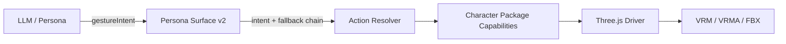

# AILIS Character Action System

## Goal

AILIS defines what a character can express before any VRM, FBX, or motion pack
VRMA, or animation clip is installed. Character assets implement the protocol;
they do not define the protocol.

The canonical catalog is
`electron/ailis-character-action-catalog.json`. It is bundled into the web
runtime and shipped beside the Electron runtime, so the model prompt, Three.js,
the Three.js runtime and Character Lab share one versioned source.

## Layers



1. **Action Intent Catalog**
   defines stable semantic action IDs, categories, descriptions, default
   surface state, aliases, and fallback intent.
2. **Persona Surface v2**
   carries `gestureIntent` and `gestureFallbacks` without naming an animation
   file or engine state.
3. **Action Resolver**
   tries the requested intent first, then each broader fallback intent.
4. **Character Package**
   declares which intent IDs each motion implements. A package may implement
   one intent with several variants or one motion for several related intents.
5. **Renderer Adapter**
   plays the selected concrete motion. It does not interpret user language.

## Resolution

For an intent such as `completed`, the standard fallback chain is:

```text
completed
  -> success
  -> celebrate
  -> acknowledge
  -> attentive
  -> idle
  -> none
```

Resolution is deterministic:

```text
for intent in [requestedIntent, ...gestureFallbacks]:
    candidates = package motions mapped to intent
    if an approved candidate exists:
        choose the highest-priority compatible variant
        stop
    if a reviewed candidate declares an approved motion fallback:
        play that safe fallback
        stop

use the package's task/emotion base motion
otherwise use safe idle
```

Missing assets therefore reduce visual specificity without deleting semantic
capability or breaking the conversation.

## Package Contract

Each package motion keeps engine-specific details local:

```json
{
  "id": "character-wave-a",
  "stateName": "Greeting",
  "loop": false,
  "gestureIntents": ["greeting", "welcome", "farewell"],
  "compatibility": "approved",
  "priority": 3
}
```

The model never sees `character-wave-a`, `Greeting`, file paths, Animator
layers, or VRMA names. It emits `greeting`, `welcome`, or `farewell`.

## Character Lab

Character Lab exposes two separate views:

- **Standard Action System** lists every canonical semantic intent, even when
  the current character does not implement it.
- **Current Character Motions** lists only concrete motions in the active
  package and allows exact `motionId` playback for asset debugging.

Support labels distinguish exact mapping, semantic fallback, motion safety
fallback, and unmapped intents.
