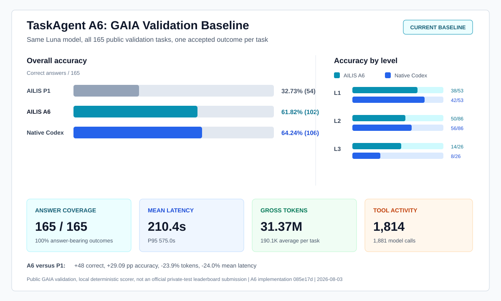

# AILIS TaskAgent A6 GAIA Baseline

- Published: 2026-08-03
- Implementation commit: `085e17d2f4a8ce0e841ee1543ad0df10e2387415`
- Model: `gpt-5.6-luna`
- Dataset: GAIA 2023 public validation, 165 tasks

## Decision

A6 is the current AILIS TaskAgent baseline.

This promotion is based on a complete 165-task run, not a focused subset. A6
returned an answer for every task, scored 102/165, and recovered most of the
gap to native Codex under the same Luna model. It also produced the strongest
L3 result in the fair Luna comparison.

A6 is the first TaskAgent revision in this evaluation line that is considered
usable as a general agent baseline rather than only an experimental GAIA
candidate.

## Headline Results

| Metric | AILIS P1 on Luna | AILIS A6 on Luna | Native Codex on Luna |
| --- | ---: | ---: | ---: |
| Correct | 54 / 165 | **102 / 165** | 106 / 165 |
| Accuracy | 32.73% | **61.82%** | 64.24% |
| L1 | 24 / 53 | **38 / 53** | 42 / 53 |
| L2 | 28 / 86 | **50 / 86** | 56 / 86 |
| L3 | 2 / 26 | **14 / 26** | 8 / 26 |
| Submitted answers | 165 / 165 | **165 / 165** | 161 / 165 |
| Gross tokens | 41.23M | **31.37M** | 69.06M |
| Effective tokens | 28.55M | **31.37M** | 8.18M |
| Mean latency | 277.0s | **210.4s** | 255.9s |
| P95 latency | 509.6s | **575.0s** | 584.7s |
| Logical tool calls | 1,138 | **1,814** | 1,959 |



P1-Luna versus A6-Luna is the strict same-model, same-manifest comparison. It
measures the accumulated TaskAgent architecture change, not one isolated code
ablation. Native Codex-Luna is an external-agent control.

## What Changed In A6

A6 changes the TaskAgent execution lifecycle rather than adding GAIA-specific
routes:

1. The model ends the task by returning a normal assistant response.
2. The runtime no longer injects a synthetic tool-free final request.
3. The TaskAgent no longer has a fixed model-round cap.
4. Canonical response items remain the source of truth across model and tool
   turns.
5. Context growth is handled by semantic compaction in the same history,
   instead of rebuilding a special final-answer context.
6. AILIS still owns tool execution, permissions, persistence, interruption,
   retries and result transport.
7. Native Responses function calls remain the model-to-tool transport.
8. Bounded evidence and source-navigation references survive projection and
   compaction.

The resulting control loop is:

```text
user task
  -> canonical model request
  -> zero or more native tool calls
  -> AILIS executes every accepted call
  -> ordered tool outputs return to canonical history
  -> compact that history when required
  -> continue until the model returns a normal final response
```

There is no task-ID routing, expected-answer injection, domain-specific final
prompt, or failed-task answer replacement in A6.

## Measured Effect

Relative to P1 under Luna, A6 gains 48 correct answers and 29.09 percentage
points while reducing total tokens by 9.86M and mean latency by 66.5 seconds.
The task-level direction is broad:

| Level | Both correct | A6 only | P1 only | Both wrong |
| --- | ---: | ---: | ---: | ---: |
| L1 | 18 | 20 | 6 | 9 |
| L2 | 21 | 29 | 7 | 29 |
| L3 | 2 | 12 | 0 | 12 |
| **All** | **41** | **61** | **13** | **50** |

The L3 result is the strongest evidence that this is not only a local repair:
A6 gains 12 L3 tasks over P1 and loses none under the same model.

## External Control

Native Codex-Luna remains four answers ahead overall, but the difference is
not uniform:

| Level | Both correct | A6 only | Codex only | Both wrong |
| --- | ---: | ---: | ---: | ---: |
| L1 | 34 | 4 | 8 | 7 |
| L2 | 41 | 9 | 15 | 21 |
| L3 | 8 | 6 | 0 | 12 |
| **All** | **83** | **19** | **23** | **40** |

Codex's aggregate advantage comes from L1 and L2. A6 solves six L3 tasks that
Codex does not, and Codex has no L3-only win in this run. The next AILIS
revision must therefore preserve all 14 A6 L3 successes as regression controls.

Codex also demonstrates a major efficiency gap. Its 69.06M gross tokens include
60.88M cached input tokens, leaving 8.18M effective tokens. The A6 bridge
reported no cache hits, so all 31.37M tokens were effective. Stable prefix
caching is the clearest resource optimization that does not require changing
the model's task policy.

## Evaluation Protocol

- Dataset: GAIA 2023 public validation.
- Manifest: 53 L1, 86 L2 and 26 L3 tasks.
- Manifest SHA-256: `0acd28eb614a756dfd6160c23c627641d8abae06bfe60ccd192c67adf8878538`.
- Fixed implementation commit: `085e17d2f4a8ce0e841ee1543ad0df10e2387415`.
- Model backend: Codex subscription bridge using `gpt-5.6-luna`.
- Task memory policy: disabled; each accepted task has an isolated session and
  workspace.
- Acceptance rule: complete artifacts, completed response, submitted answer,
  nonzero tokens, empty stderr, and no authentication or network error in the
  accepted attempt.
- Accepted set: 165 rows, 165 unique task IDs, 165 answer-bearing responses.
- Infrastructure retry policy: a failed infrastructure attempt is excluded;
  the complete task is restarted. Partial answers are never merged.
- Scoring: deterministic local visible-answer scorer against the public
  validation answers.

The resilient controller launched 216 task attempts to obtain the 165
accepted outcomes. Of those accepted outcomes, 140 were first attempts and 25
followed one or more excluded infrastructure attempts. This retry behavior is
part of evaluation reliability, not pass@N: only one complete accepted outcome
per task enters the score.

## Validity Boundaries

This result is a strong local general-agent baseline, but it is not an official
GAIA leaderboard score:

- It uses the public validation split, not the private test split.
- It uses the repository's deterministic visible-answer scorer.
- The reported result is one complete accepted outcome per task, not a
  multi-sample majority vote.
- Historical gpt-5.5 rows are context only; model changes prevent causal
  comparison with A6-Luna.
- Native Codex is a useful external control, but its agent runtime, cache and
  timeout behavior differ from AILIS.

## Baseline Contract

Future TaskAgent candidates start from A6 and must report all of the following:

1. Correct answers overall and by GAIA level.
2. Answer-bearing and terminal-outcome coverage.
3. Paired wins and regressions against A6.
4. Gross, cached and effective token counts.
5. Mean and P95 latency.
6. Model and logical tool-call counts.
7. Infrastructure exclusions separately from capability failures.

A candidate is not promoted because it fixes a focused failure. It must improve
the complete paired result without material regression in answer coverage,
resource use or A6's L3 control set.

## Next Engineering Targets

1. Add stable prompt-prefix caching while preserving canonical history.
2. Analyze A6-only and Codex-only L1/L2 paths to improve source selection and
   exact-answer extraction without changing the natural-termination policy.
3. Add timeout-safe checkpoints and replay for infrastructure recovery without
   consuming an agent reasoning turn.
4. Preserve the current native multi-call tool transport and all emitted calls.
5. Submit a frozen A6 successor to the private GAIA test split for the first
   anti-contamination external score.

## Artifacts

The repository aggregate is
[`evals/engineering/gaia-a6-luna-validation165-summary.json`](../evals/engineering/gaia-a6-luna-validation165-summary.json).
Raw transcripts and controller evidence remain outside Git because they contain
large generated logs and public benchmark task material.
