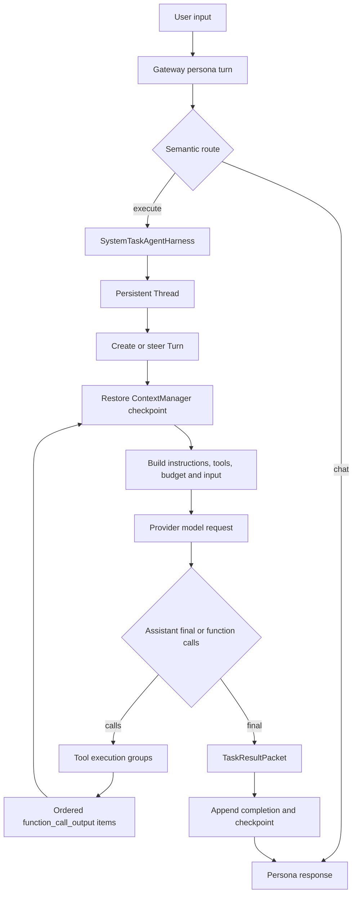
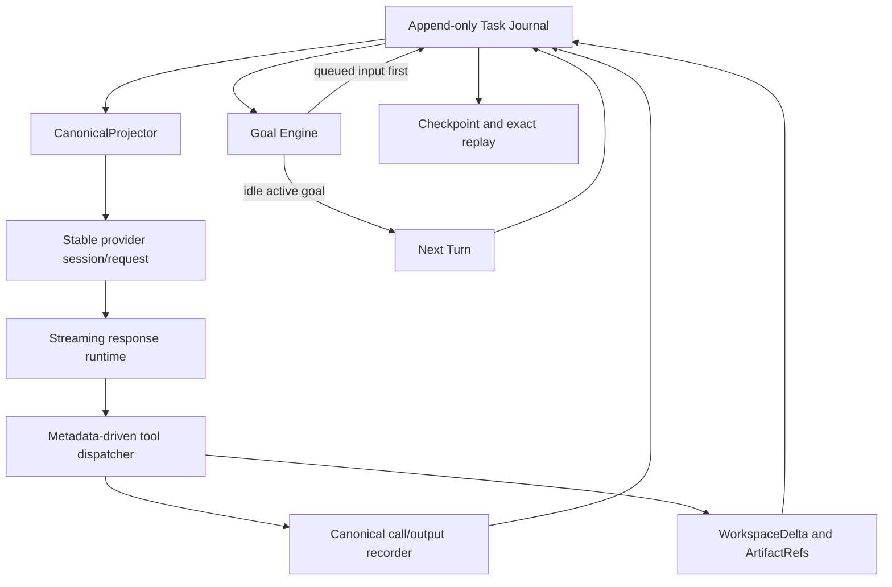

# AILIS Harness Architecture Audit and Roadmap

Last updated: 2026-08-17

Product baseline: `A7-main@fbf2454dbf32562d995b221386ce95d996b9fcb9`

Terminal mechanism source: `e3c7e7d93767df8978487b84f4219119d39726e5`

Codex source lock: `3b5ad9c0b99cdad1febc085e6eed59a86b808804`

## 1. Executive Finding

AILIS is already a real general Agent Harness. It is not missing a planner,
tools, canonical items, checkpoints, or a long context window. A7's improvement
from `53/89` to `60/89` proves that the runtime can gain broad capability by
changing context transport rather than controlling model behavior.

The remaining gap is integration quality between mechanisms that already
exist:

1. canonical history is not yet the sole request authority;
2. provider requests do not preserve a sufficiently stable prefix/session;
3. Thread/Turn/Goal objects exist, but Goal does not drive an idle long-running
   scheduler;
4. model-visible world state is still reconstructed mostly from tool prose;
5. tool calls are executed after the model response is collected, rather than
   entering an ordered in-flight runtime as calls arrive;
6. the main Runner and Gateway are large, high-blast-radius modules;
7. version and score provenance was fragmented until the new registry.

This is why the next phase should not add more benchmark prompts, final-answer
audits, special object taxonomies, or forced behavior. The work is to make
AILIS's existing data plane canonical, cacheable, replayable, and observable.

## 2. Current End-to-End Execution Chain



### 2.1 Gateway

`electron/ailis-gateway.cjs` owns the product-facing turn, Persona stream,
semantic route, TaskAgent dispatch, attachment propagation, and final surface.
It creates an immutable visible-history envelope, steers an active TaskAgent
Turn by `turnId`, and invokes the same private TaskAgent runner.

Strength: Persona and execution are separated, and TaskAgent internals do not
need to pollute the user-facing response.

Risk: Gateway visible history, Harness session projection, ContextManager
history, and Runner task state can all describe the same user intent. They are
not yet one append-only authority.

### 2.2 SystemTaskAgentHarness

`electron/ailis-task-agent-harness.cjs` now persists:

```text
Thread
  turns[]
  activeTurnId
  activeGoal
  goalHistory[]
  ledger[]
  contextCheckpoint
  output/source refs
```

Every idle user input creates a new Turn in the same Thread. Input arriving
during execution steers the exact active Turn. Goal mutation is bound to the
active `turnId`, so stale turns cannot mutate current Goal state. This is a
substantial correction over the legacy immutable-first-task design.

The limitation is equally concrete: `activeGoal` is persisted and projected,
but no Goal Engine automatically starts the next Turn after a result boundary.
The system has durable goal state, not yet durable autonomous goal execution.

### 2.3 AgentRunner

`electron/ailis-agent-runner.cjs` is the central execution loop. At the fixed
baseline it is about 11.5K lines and owns prompt profiles, model settings,
context construction, tool selection, tool execution grouping, approval,
transport recovery, final result assembly, and checkpoint output.

The loop uses native Responses items:

```text
message
function_call(call_id)
function_call_output(call_id)
assistant message
```

It propagates `parallel_tool_calls`, retains all calls, executes allowed read
calls concurrently, places serial barriers around unsafe calls, and records
outputs in call order. These are real capabilities, not JSON-simulated tools.

The remaining scheduling difference from Codex is that AILIS collects the
model response before building execution groups. Codex can create in-flight
tool futures as complete function calls arrive in the response stream, then
drain results in order. AILIS therefore leaves latency and overlap on the table.

### 2.4 ContextManager

`electron/ailis-context-manager.cjs` is the closest AILIS component to Codex's
canonical conversation history. It owns ordered ResponseItems,
`history_version`, token usage, reference context, tool-output policy, prompt
normalization, checkpoint serialization, and semantic replacement history.

A7 changed the important default:

- no compaction merely because more than six tool results exist;
- no blanket 900-character rewrite of old tool feedback;
- bounded tool outputs remain in canonical history;
- Luna semantic compaction begins near 244,800 input tokens;
- the checkpoint persists the output projection policy.

This is the main proven positive mechanism in the current Harness.

The remaining semantic compaction is still a handcrafted projection. It keeps
goal, constraints, plan, unresolved fields, references, visible messages, and
recent call/output pairs. Unlike Codex's model-read replacement history, it can
only preserve fields the runtime knew to extract. It should remain an emergency
path until exact replay and one canonical projector are established.

### 2.5 Runtime Budget and Tool Data

`electron/ailis-runtime-budget.cjs` protects the model context by bounding text,
structured values, source viewports, images, and tool schemas. Large raw output
can be retained outside the prompt and reopened through references.

This layer prevents prompt explosion, but two operations are risky:

1. oversized schemas can lose descriptions and nested structure;
2. structured tool results are compacted by generic depth/key limits.

These operations are safe only when the tool's answer-bearing fields and repair
affordances remain visible. Schema/result compaction therefore needs semantic
contract tests, not only byte-budget tests.

### 2.6 Provider Transport

`electron/desktop-llm-provider.cjs` maps AILIS ResponseItems and tools to native
Responses requests. It sends `parallel_tool_calls`, reasoning effort, tools,
instructions, and ordered input. The A7 path still rebuilds each request from
canonical client state and does not use a native `previous_response_id` chain.

Client-side rebuilding is not itself slow. The measured cost is server prefill:
small changes in instructions, tools, dynamic developer items, or early input
move the cache boundary and make a large prefix uncached.

## 3. State Ownership Audit

| State | Current owner(s) | Problem | Target owner |
| --- | --- | --- | --- |
| Visible conversation | Desktop/Gateway plus Turn envelope | Duplicated into execution context | Durable Thread journal; projected once |
| Current request | Turn, Runner message, taskState | Same fact in several mutable forms | Turn item |
| Active goal | Harness plus Runner request context | Persisted but scheduler-passive | Goal Engine backed by Thread journal |
| Canonical model history | ContextManager | Correct primary shape | ContextManager/CanonicalProjector only |
| Plan/unresolved state | Runner package plus checkpoint summary | Metadata may diverge from visible input | Typed append-only state items |
| Tool output | ContextManager plus output store | Reference can replace needed visible evidence | Bounded canonical output plus durable raw ref |
| Workspace/process/test state | Tool prose and filesystem | Model repeatedly reconstructs current state | Generic `WorkspaceDelta` items |
| Provider continuity | Provider settings plus rebuilt request | Prefix/session reuse is weak | Stable provider session plus prefix ledger |
| Recovery | Runner checkpoint, Harness checkpoint, transport retry | Exact replay is not proven end to end | One journal cursor and idempotent replay |

The architecture already has the correct nouns. The main design problem is that
several modules can author overlapping truth.

## 4. Measured Performance

### 4.1 Terminal-Bench 2.1

| Metric | AILIS A7 | Codex + Luna Max | Interpretation |
| --- | ---: | ---: | --- |
| Score | 60/89, 67.42% | 75.73% +/- 1.32% | AILIS trails 8.31 pp |
| Protocol | 1 x 89 | 5 x 89 | Stability not equally measured |
| Mean trial time | 1088.0s | 457.3s | AILIS 2.38x slower |
| Logical input/task | 2.569M | 3.183M | Codex does not win by seeing less |
| Cached input/task | 1.270M | 3.093M | Provider continuity gap |
| Uncached input/task | 1.299M | 89.9K | AILIS 14.44x higher |
| Output/task | 23.95K | 23.89K | Reasoning output is almost identical |
| Cache rate | 49.44% | 97.17% | Largest measured structural gap |
| Timeout rate | 21/89, 23.60% | 15/445, 3.37% | AILIS about 7x higher |
| Model/tool calls | 4273/4306 total | Not publicly comparable | AILIS ~48 calls of each per task |

The evidence rules out “AILIS simply gives the model too few tokens.” AILIS
processes less logical input but pays for far more uncached input and spends
more wall time. The first optimization target is stable transport of the same
evidence, not deleting evidence.

### 4.2 What A7 Proved

Against the reconstructed A6 control:

| Metric | A6 | A7 |
| --- | ---: | ---: |
| Correct | 53/89 | 60/89 |
| Semantic compactions | 20 | 4 |
| Peak request | 67,381 | 245,017 tokens |
| Fixed tasks | - | 18 |
| Regressed tasks | - | 11 |

The net gain is real, but one pass with 11 regressions is not release-stable.
The sign-test estimate `p ~= 0.265` also prevents a strong statistical claim.

### 4.3 Cross-Benchmark Interpretation

AILIS-Luna beats local Codex-Luna on the complete GAIA semantic comparison
(`119/165` versus `107/165`) while losing on Terminal-Bench. This means AILIS
already has strong web/artifact/answer-completion capabilities; it should not
be replaced by Codex or reduced to Codex prompts. Terminal weakness is more
specific: cache efficiency, timeout, world-state continuity, and time to a
testable artifact.

OSWorld `9/15` and SWE-bench Pro `6/11` are useful diagnostics but too small to
support a release claim.

## 5. Root Causes, Ranked

### 5.1 Stable Prefix and Provider Continuity

This is the largest measured gap and the safest first intervention. The model,
visible evidence, tools, timeout, and answer policy can remain identical while
the runtime records and eliminates avoidable early-prefix changes.

Required instrumentation:

```text
effective instructions hash
ordered tool-schema hash
canonical item IDs and hashes
first changed item/byte/token estimate
provider session ID
cache key
request digest
checkpoint parent
```

Target: raise A7 cache rate to at least 85% before claiming score impact, then
approach Codex's 95%+ range.

### 5.2 Multiple Request Authorities

Gateway history, Harness projection, Runner taskState, ephemeral developer
messages, and ContextManager can each affect the final request. A checkpoint can
be semantically similar yet byte-different, harming replay and caching.

Target: one `CanonicalProjector` produces the model request. All other ledgers
are telemetry or append-only inputs. Replay must reproduce the same request
digest until a new Turn item is appended.

### 5.3 No Active Goal Engine

The current Thread and Goal persistence is valuable, but completion of one
Runner invocation ends activity. A genuine long-running Harness needs:

```text
finish current Turn
-> persist result and checkpoint
-> prefer queued user input
-> if idle and active Goal remains, create next Turn
-> stop when Goal completes, blocks, is cleared, or budget/deadline requires input
```

This does not mean forcing the model to loop. A Turn ends naturally when there
is no tool continuation or pending input. Goal state decides whether a later
Turn should be scheduled.

### 5.4 Weak World-State Feedback

On `path-tracing` and `make-mips-interpreter`, the model performed long research
but did not convert it into an early testable artifact. More prompt rules are an
unreliable fix. The generic missing data is:

```json
{
  "changed_files": [],
  "processes": [],
  "checks": [],
  "artifacts": []
}
```

These facts should be tool-produced `WorkspaceDelta` items. They describe what
happened, not what the model must do. No chess, poetry, MIPS, law, or protein
object taxonomy is needed.

### 5.5 Response-Bound Tool Scheduling

AILIS supports multi-call execution, but execution begins after the response is
collected and calls are partitioned into groups. The target is an in-flight
runtime:

- start a call when its complete arguments arrive;
- use explicit read/write metadata and a global lock, not name regex;
- preserve every call even if another fails validation;
- complete concurrently where safe;
- record results in original call order by `call_id`;
- expose the whole batch to the next model request once.

This is a latency and correctness improvement, not a request to force the model
to issue parallel tools.

### 5.6 High Change Blast Radius

At the baseline, AgentRunner is about 11.5K lines and Gateway about 6.1K lines.
The current dirty worktree attempts a large Agent Loop extraction, but it also
contains unrelated changes and has no benchmark identity. Merging such a split
would make regressions impossible to attribute.

Target: extract one boundary at a time behind replay-equivalence tests. The old
Runner remains the behavioral oracle until provider payloads, tool events,
outputs, final results, and checkpoints match.

## 6. Target Architecture



### Invariants

1. The model owns intent, reasoning, action selection, and natural Turn ending.
2. The runtime owns environment facts, schemas, permissions, execution,
   persistence, budgets, and replay.
3. Canonical history is append-only except for a persisted compaction event.
4. A tool output keeps bounded answer-bearing content in the current history;
   durable raw refs supplement it rather than replacing it.
5. User input always outranks automatic Goal continuation.
6. Transport failure never becomes an Agent reasoning step.
7. No candidate contains task/site/answer-specific routing.

## 7. Development Plan

### R0: Freeze and Observe

Parent: `A7-main@fbf2454`

Behavior change: none

Deliverables:

- prompt-prefix journal and first-change report;
- exact provider-payload digest;
- state-owner assertions;
- isolated record of the current dirty Agent Loop split, without promotion.

Gate:

- fixed transcript replay produces identical tool calls, outputs, final result,
  and checkpoint;
- no model, prompt, tool, timeout, retry, or finalization change.

### R1: Stable Prefix and Provider Session

Behavior change: transport only

Deliverables:

- stable instruction and tool ordering;
- one provider client/session per TaskAgent Turn;
- dynamic runtime observations appended at the tail;
- disconnect recovery from the last canonical cursor;
- no retry count limit, but recovery respects the remaining task deadline.

Gates:

- cache rate `>=85%` on the fixed chain sample;
- uncached input `<=400K/task` initially;
- call IDs, tool results, final answers, and checkpoints remain semantically
  identical in replay;
- no stable-control regression.

### R2: One CanonicalProjector and Exact Replay

Behavior change: state plumbing only

Deliverables:

- ContextManager becomes the only request authority;
- Gateway/Harness/Runner states append typed items instead of rewriting prompt
  packages;
- checkpoint stores journal cursor, history version, tool registry version,
  provider session metadata, and completed call IDs;
- replay never repeats a completed mutating call.

Gates:

- crash after every tool boundary and recover to the same request digest;
- zero duplicated writes;
- active user steering survives recovery;
- A7 fixed/control set has zero stable regressions.

### R3: Generic WorkspaceDelta

Behavior change: additional factual observations only

Deliverables:

- changed file metadata;
- process/session lifecycle;
- latest check/test status;
- artifact existence, size, hash, and validation timestamp;
- durable raw output and artifact references.

Gates:

- `path-tracing`, `make-mips-interpreter`, and stable correct controls;
- report time to first target artifact and first executable test;
- stop if failure-side tasks do not improve or any control regresses.

### R4: Goal Engine

Behavior change: long-horizon scheduling

Deliverables:

- explicit active Goal lifecycle independent of Turn;
- queued user input priority;
- idle-only automatic next Turn;
- blocked/complete/cancel/replace transitions;
- structured approvals bound to `threadId/turnId/itemId`.

Gates:

- multi-task continuous conversation tests;
- no first-task lock;
- no natural-language approval ambiguity;
- no automatic continuation while user input is queued;
- deterministic resume after process restart.

### R5: Streaming Ordered Tool Runtime

Behavior change: scheduling only

Deliverables:

- call arrival creates an in-flight future;
- metadata-driven global read/write lock;
- all calls retained;
- ordered output commit by `call_id`;
- next model turn receives one complete result batch.

Gates:

- same outputs and side effects as serial execution;
- measurable wall-time reduction on independent-call tasks;
- no increase in model calls;
- validation failure of one call cannot drop later calls.

### R6: Controlled Modularization

Behavior change: none

Extract in this order:

1. provider request builder;
2. tool dispatcher;
3. canonical recorder/projector;
4. recovery controller;
5. result delivery.

Each extraction requires transcript and payload-digest equivalence. Do not land
the current all-at-once dirty split as a scored candidate.

## 8. Evaluation Ladder

Every mechanism follows the same ladder:

| Stage | Scope | Promotion condition |
| --- | --- | --- |
| Unit/contract | deterministic module tests | all pass |
| Shadow replay | fixed correct and failed transcripts | request/output equivalence or declared single-variable delta |
| Bilateral focused | 18 A7 fixes + 11 A7 regressions + three long chains | target improves; zero stable regression |
| Cross-benchmark control | GAIA L1/L2/L3 controls, Terminal controls, OSWorld/SWE smoke | no capability-family regression |
| Full candidate | 89 Terminal tasks, fixed commit | valid verifier for every task |
| Release gate | two complete paired 89-task runs | score, stability, response, latency, token, cache all pass |

Infrastructure-invalid attempts are isolated and rerun by task ID. Capability
failures are never selectively replaced.

## 9. Quantitative Targets

### Near-term: trustworthy A7 successor

- Terminal-Bench mean `>=68%` across two runs;
- cache rate `>=85%`;
- timeout rate `<=10%`;
- mean trial time `<=750s`;
- zero regression on stable A7 controls;
- preserve GAIA semantic `>=119/165` under the same scorer/protocol.

### Codex parity

- Terminal-Bench mean `>=75.7%` under the same Luna Max protocol;
- cache rate `>=95%`;
- mean trial time within 15% of the Codex reference;
- two-run per-task stability `>=90%`;
- no answer-completeness regression on GAIA.

### Beyond parity

Do not define “beyond Codex” as one leaderboard number. Require simultaneous
evidence on Terminal-Bench, GAIA, OSWorld, a software-engineering suite, cost,
latency, recovery, and multi-turn Goal execution. A Harness that wins one set by
losing generality is not an improvement.

## 10. Immediate Next Action

Start only R0 from a clean branch based on `fbf2454`. The first deliverable is a
prefix-diff and exact-replay report on the fixed three Terminal chains plus
stable correct controls. Do not modify prompts, add WorkspaceDelta, merge the
dirty Runner split, or start a full benchmark until R0 identifies the first
cache-breaking field and proves replay observability.

The likely first scoring candidate is R1, not R4 or R5: stable-prefix/provider
continuity attacks the largest measured cost gap while preserving A7 behavior.
