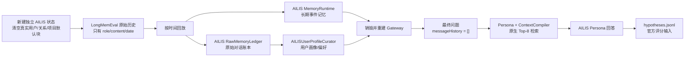

# AILIS × LongMemEval 原生记忆评测

## 评测目标

这套接入只评估 AILIS 的对话、用户画像和长期记忆，不评估 TaskAgent。

评测遵守一个核心原则：**不为 LongMemEval 修改 AILIS 的记忆策略、容量、排序权重或上下文预算**。接入层只完成生产对话天然会做、但离线 benchmark 必须显式补齐的两件事：

1. 把数据集原始 `user` / `assistant` 对话按时间写入 AILIS。
2. 保留历史消息的 benchmark 时间戳，而不是把全部历史伪装成今天刚发生。
3. 在每题开始时清空产品内置的真实用户、关系和项目默认块，保留 AILIS Persona。
4. 反复调用原生画像整理器，直到 Raw Memory 游标追平；不放大原生单批容量。

因此，当前测试会原样暴露这些生产约束：

- `MemoryRuntime` 最多保留 500 个事件。
- 单条 user/assistant 文本沿用原生 1200 字符截断。
- Persona 最终只获得原生 Top-8 Relevant Memories。
- ContextCompiler 继续使用现有分区预算。
- 用户画像继续由 `AILISUserProfileCurator` 的原生批次和阈值生成。

## 真实链路



最终问题固定满足：

- `agentRole = persona_orchestrator`
- `memoryPolicy = read_only`
- `messageHistory = []`
- `directToolExecutor = false`
- `nativeDirectTools = false`
- `requireTaskExecution = false`
- Persona 保留 AILIS 原生推理轮次预算
- AILIS runtime clock = 该题的 `question_date`

也就是说，最终答案不能依赖当前会话短期历史，不能调用 TaskAgent，也不会把问题或回答反写到记忆中。

LongMemEval 历史发生在 2023 年，而评测主机运行在 2026 年。runner 使用 AILIS 已有的 `runtimeEnvironmentOverride`，把每题的权威运行时时钟设为其 `question_date`。这模拟真实对话发生当时的主机时间，避免系统时钟与 benchmark 时间冲突，尤其避免人为破坏 temporal-reasoning；它不改变任何记忆内容或检索分数。

## 防答案泄漏

LongMemEval 的这些字段只属于评分端：

- `answer`
- `answer_session_ids`
- 消息上的 `has_answer`

回放函数只读取消息的 `role` 和 `content`。上述标签不会进入：

- `memory-state.json`
- `events.jsonl`
- Raw Memory Ledger
- 用户画像提炼提示词
- 最终问题提示词

`answer_session_ids` 和 `has_answer` 只在 AILIS 已经完成检索后，用于计算诊断性的 session Recall@K 与 turn Recall@K。它们不会改变检索结果，也不会进入模型上下文。

每道题使用独立状态目录，防止一道题的历史、问题或答案污染下一道题。

此外，AILIS 的新记忆状态原本会带有产品默认的真实用户偏好、关系描述和当前项目路径。它们不是 LongMemEval 合成用户提供的信息。评测开始时会把 `user`、`relationship`、`project` 三个块清空，并验证它们为空；`persona` 块保持原样。这样评到的是 AILIS 学习当前合成用户的能力，而不是预置真实用户资料。

## 数据校验

```powershell
pnpm eval:longmemeval:validate
```

当前本地 `.local/benchmarks/LongMemEval/data/longmemeval_s_cleaned.json` 校验结果：

- 500 道题全部有效
- 23,867 个历史会话
- 246,750 条原始消息
- 平均每题 47.734 个会话、493.5 条消息

官方 cleaned-S 中有极少量空消息。runner 把它们当作没有可写入内容的 no-op 跳过，不补造文本，也不丢弃整道题。

## 运行方法

先做三题 cleaned-S 烟测：

```powershell
pnpm eval:longmemeval:s:smoke
```

每种题型各取首题，做六题分层烟测：

```powershell
pnpm eval:longmemeval:s:stratified-smoke
```

运行完整 500 题：

```powershell
pnpm eval:longmemeval:s:parallel10
```

该正式并行命令固定使用：

- provider：`codex-model-bridge`
- model：`gpt-5.5`
- base URL：`codex://chatgpt-oauth`
- reasoning effort：AILIS Codex bridge 默认 `medium`
- 单次推理 timeout：180 秒

因此它不受桌面控制面板当前选中 DeepSeek、Qwen 或其他 provider 的影响。

单进程完整运行仍可用于对照：

```powershell
pnpm eval:longmemeval:s
```

只运行指定问题：

```powershell
node scripts/run-ailis-longmemeval.mjs `
  --dataset s `
  --question-id e47becba `
  --run-id single-e47becba
```

关闭画像提炼只用于分层诊断，不代表完整 AILIS：

```powershell
node scripts/run-ailis-longmemeval.mjs `
  --dataset s `
  --limit 3 `
  --no-profile-curation
```

runner 默认读取 AILIS 桌面版已保存的 LLM provider、endpoint、model 和 key。也可以通过环境变量覆盖：

- `AILIS_LONGMEMEVAL_PROVIDER`
- `AILIS_LONGMEMEVAL_BASE_URL`
- `AILIS_LONGMEMEVAL_MODEL`
- `AILIS_LONGMEMEVAL_API_KEY`

API key 不支持命令行参数，避免落入 shell history。

## 10 进程安全并行

不能把同一个单进程命令简单启动 10 次并指向同一个目录：那样会并发追加同一个 `results.jsonl`、覆盖 `summary.json`，状态也会互相污染。

并行编排器采用以下协议：

1. 主进程只扫描官方数据一次，按原始顺序 round-robin 分成 10 个不可变 JSON shard，每份 50 题。
2. 启动 10 个 Node 子进程；每个进程有独立数据文件、输出目录、日志和 AILIS state root。
3. 每题内部仍然使用单独 AILIS 状态，所以同时满足“进程隔离”和“问题隔离”。
4. 某个 shard 未完成时，只重启该 shard；单进程 runner 依据最新 JSONL 记录跳过已完成题，默认最多额外重试 2 轮。
5. 全部子进程退出后，仅由主进程合并。合并时按 `question_id` 取最后一次尝试，并恢复官方数据原始顺序。
6. `parallel-status.json` 每 15 秒刷新一次，记录主进程 PID、活跃子进程 PID、完成数、失败数和待处理数。

Windows 在 10 进程密集持久化时可能短暂返回 `EPERM`、`EBUSY` 或 `EACCES`。runner 只对这些基础设施文件锁错误在题内重建隔离状态并重放，默认重试 2 次；不会对错误答案做任何定向重写或重试。

仅预生成并检查分片：

```powershell
pnpm eval:longmemeval:s:parallel10:prepare
```

显式命名一次正式运行：

```powershell
node scripts/run-ailis-longmemeval-parallel.mjs `
  --dataset s `
  --workers 10 `
  --run-id self-runtime-full500-parallel10-20260729 `
  --provider codex-model-bridge `
  --base-url codex://chatgpt-oauth `
  --model gpt-5.5 `
  --timeout-ms 180000
```

并行运行期间查看状态：

```powershell
Get-Content eval-results/longmemeval-ailis/<run-id>/parallel-status.json
```

## 输出

每次运行输出到：

```text
eval-results/longmemeval-ailis/<run-id>/
├── manifest.json
├── parallel-status.json
├── results.jsonl
├── hypotheses.jsonl
├── summary.json
├── logs/
└── shards/
    ├── manifest.json
    ├── data/
    │   └── worker-00.json ... worker-09.json
    └── worker-00/ ... worker-09/
        ├── results.jsonl
        ├── hypotheses.jsonl
        ├── summary.json
        └── state/<question-id>/
```

- `manifest.json`：评测协议、模型名和隔离策略，不含 key。
- `results.jsonl`：每题的生成状态、画像提炼状态、记忆数量、检索诊断和不变量检查。
- `hypotheses.jsonl`：LongMemEval 官方评分器要求的纯 `question_id` / `hypothesis` 文件。
- `summary.json`：完成率、原生检索 Recall@8、TaskAgent/只读违规计数。
- `parallel-status.json`：10 个进程的实时进度、PID、轮次和退出状态。
- `shards/worker-*/state/`：可审计的每题 AILIS 原生记忆状态；加 `--discard-state` 可在生成结果后删除。

`nativeRetrievalSessionRecallAt8` 是定位问题的诊断指标，不是 LongMemEval 最终分数。最终成绩必须以官方 QA judge 为准。

如果升级了诊断代码但不想重新调用模型，可从已保存的每题状态离线刷新：

```powershell
node scripts/run-ailis-longmemeval.mjs `
  --dataset s `
  --run-id <existing-run-id> `
  --refresh-diagnostics-only
```

## 官方评分

LongMemEval v1 的官方评分器固定使用 `gpt-4o-2024-08-06` 判断回答是否满足参考答案。生成完成后执行：

```powershell
$env:OPENAI_API_KEY = "<your-openai-key>"
python .local/benchmarks/LongMemEval/official_source/LongMemEval/src/evaluation/evaluate_qa.py `
  gpt-4o `
  eval-results/longmemeval-ailis/<run-id>/hypotheses.jsonl `
  .local/benchmarks/LongMemEval/data/longmemeval_s_cleaned.json
```

不要用生成模型自己代替官方 judge 后把结果称为官方 LongMemEval 分数。

## 2026-07-29 早期 cleaned-S 单题烟测（协议修正前）

运行：

```powershell
node scripts/run-ailis-longmemeval.mjs `
  --dataset s `
  --limit 1 `
  --run-id self-runtime-s-smoke-20260729
```

结果：

- 题目：`e47becba`，`single-session-user`
- 原始历史：53 个会话、550 条消息
- 写入 AILIS：277 个长期事件、277 条 Raw Memory
- 重启后保留：277 个事件
- 用户画像提炼：只执行 1 次、4 个原生批次，状态 `partial_completed`
- 最终短期上下文：0 条消息
- TaskAgent 调用：0
- 问题反写记忆：否
- 证据会话原生 Recall@8：0
- AILIS 回答：未记得用户的毕业专业
- 参考答案：Business Administration
- 本题结论：错误

证据事件确实已持久化，但在当前关键词检索中排到约第 42 位，没有进入 Persona 的原生 Top-8。失败主要来自检索，而不是持久化丢失或 TaskAgent 干扰。

这次烟测暴露了两个评测协议问题：默认真实用户块没有隔离，画像游标也没有追平。因此它只保留作接入链路诊断，不能作为当前正式 baseline。

## 2026-07-29 早期六题分层诊断（协议修正前）

正确评测工作树：`F:\AILIS_self_evolution_runtime`。每种官方题型取第一题，DeepSeek 作为 AILIS 生成模型；官方 `gpt-4o-2024-08-06` judge 未配置，因此下面的 QA 正确性是逐题人工审计，不是排行榜分数。

| 题型 | Session R@8 | Turn R@8 | 人工正确 | 主要现象 |
| --- | ---: | ---: | --- | --- |
| single-session-user | 0 | 0 | 否 | 学位证据未召回 |
| multi-session | 0.667 | 0.333 | 否 | 三项只召回/回答两项 |
| single-session-preference | 1 | 1 | 是 | 正确承接 Premiere Pro 偏好 |
| temporal-reasoning | 1 | 1 | 是 | 正确回答 7 天 |
| knowledge-update | 1 | 1 | 是 | 正确回答更新后的 25:50 |
| single-session-assistant | 1 | 1 | 否 | 证据事件命中，但 260 字符 prompt 截断发生在 Sunday 排班行之前 |

汇总：

- 人工 QA：3/6（50%）
- 原生 Session Recall@8：0.778
- 原生 Turn Recall@8：0.722
- TaskAgent 调用：0
- 问题反写记忆：0
- 六题均在独立状态中完成历史写入、画像提炼、Gateway 重建和 Persona 回答

这六题发生在 synthetic-user 隔离和画像游标追平修正之前，只能作为失败分类参考，不能与修正后的 500 题正式结果直接比较。

## 完整评测的时间与调用量

早期一次画像整理的版本平均约 150 秒/题，但它经常停在 `partial_completed`，所以这个耗时不能代表正式协议。正式协议会让原生整理器继续运行直到游标追平，模型调用数取决于每题历史长度，明显高于“4 个画像批次 + 1 次回答”。10 进程用于缩短墙钟时间，不减少总调用量。

正式汇总中的以下任一值非 0，都表示本次运行不能作为有效 AILIS baseline：

- `taskAgentViolationCount`
- `readOnlyViolationCount`
- `syntheticUserIsolationViolationCount`
- `profileDrainViolationCount`
- `missing`
- `failed`

官方 judge 另需约 500 次 `gpt-4o-2024-08-06` 调用。

因此，建议顺序是：

1. 先跑 3–6 题链路烟测。
2. 再跑覆盖六种题型的小型分层 baseline。
3. 确认预算后启动完整 500 题。
4. 保存原始 baseline，之后才分别优化长期检索和用户画像。
