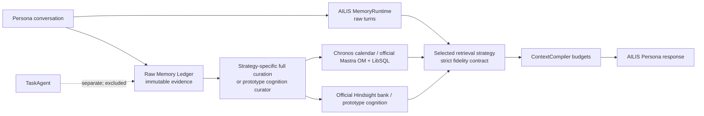

# AILIS Memory Strategy Lab

## Goal

This lab keeps AILIS and TaskAgent separate:

- AILIS owns conversation, Persona, emotion, user profile, relationship state, and long/short-term memory.
- TaskAgent owns task execution and does not write to or participate in the cognition-memory strategies.

All strategies share the same original conversation ingestion and Raw Memory Ledger. They differ only in how memory is represented, retrieved, and packed into the Persona context. This makes LongMemEval scores and human experience comparisons attributable to the memory strategy.

## Quality strategies

| Strategy ID | Fidelity | Material components |
| --- | --- | --- |
| `bm25_phrase_v1` | Verified native baseline | Existing AILIS raw-turn BM25, phrase boost, recency, importance, and session diversity |
| `hybrid_crossencoder_v2` | Full native AILIS implementation | Fielded BM25, multilingual dense retrieval, entity/temporal channels, RRF, and a mandatory real sequence-classification cross-encoder |
| `chronos_full_v1` | Full paper-equivalent reproduction | 25-turn/5-overlap temporal extraction, SVO events, ISO ranges, lexical aliases, dual calendars, dense top-100, cross-encoder top-15, ±1 turn expansion, dynamic guidance, and iterative vector/grep tools |
| `mastra_observational_full_v1` | Official runtime integration | Direct `@mastra/memory` 1.24.0 `ObservationalMemory`, direct official LibSQL storage, resource-scoped Actor/Observer/Reflector lifecycle, threshold observation/reflection, observation groups, official token counter, AILIS LanguageModelV3/context adapter, durable raw messages and restart |
| `hindsight_official_v1` | Official backend integration | Official Hindsight 0.8.6 daemon/client, isolated bank, Retain, Recall, Reflect, observations, entity/temporal/graph retrieval, and upstream reranking |

The old experiment implementations remain available only as explicitly labeled
prototypes: `hybrid_rrf_v1`, `chronos_dual_calendar_v1`,
`observational_memory_v1`, and `hindsight_cognitive_v1`. See
`docs/ailis-memory-full-fidelity-gap-audit.md` for the component-by-component
acceptance contract.

The prior Mastra source-aligned AILIS implementation is preserved as
`mastra_observational_adapter_v1` for ablation. It is intentionally excluded
from the default quality matrix and is not represented as the complete upstream
processor runtime.

Aliases `hybrid`, `chronos`, `observational`/`mastra`, and `hindsight` resolve to
the full strategies. Prototype experiments require their exact ID or the
`*-prototype` alias. `rrf` remains an alias for the historical RRF prototype.

## Shared data flow



Each full strategy has a separate state artifact. `memory-cognition.json` is the
historical prototype artifact and is not silently reused by a full strategy.
Derived records cite original MemoryRuntime turn IDs, session IDs, and
timestamps. Unsupported model output is rejected. Raw dialogue is never
replaced or deleted.

## Runtime selection

The active strategy can be selected in three ways:

1. Gateway option `memoryStrategy`.
2. Environment variable `AILIS_MEMORY_STRATEGY`.
3. Runtime API, which persists the selection in `memory/memory-strategy.json`.

Gateway endpoints:

- `GET /memory/strategies` lists all strategies and the active runtime status.
- `POST /memory/strategy` with `{"strategy":"chronos_dual_calendar_v1"}` switches and persists the strategy.
- `GET /memory/cognition/status` reports prototype-curator status.
- `POST /memory/cognition/curate` dispatches to the selected full strategy's
  native curation lifecycle; prototype strategies still use the historical
  evidence-bound curator.

Changing strategy does not delete raw turns, profiles, relationship state, or cognition artifacts.

In the desktop build, open **Settings → Advanced settings: runtime status and memory directory → Memory**. The “记忆实验方案” selector uses the same persisted runtime API. “整理认知记忆” becomes available for Chronos, Observational Memory, and Hindsight.

## LongMemEval: one strategy

Run a small smoke comparison first:

```powershell
node scripts/run-ailis-longmemeval-parallel.mjs `
  --memory-strategy hybrid_crossencoder_v2 `
  --workers 10 `
  --limit 20 `
  --memory-model-cache-dir D:\path\to\transformers-cache `
  --memory-models-offline `
  --run-id hybrid-full-smoke20
```

Run the full 500-question set:

```powershell
node scripts/run-ailis-longmemeval-parallel.mjs `
  --memory-strategy chronos_full_v1 `
  --workers 10 `
  --memory-model-cache-dir D:\path\to\transformers-cache `
  --memory-models-offline `
  --run-id chronos-full500
```

For strategies requiring cognition, `--cognition-curation auto` resolves to
`drain`. Baseline and full Hybrid resolve to `off`. Full dense strategies require
the installed local embedding model and cross-encoder; an unavailable component
fails the run instead of using a hashed vector. Use
`--no-memory-local-embeddings` only with the baseline/prototype ablations.

Before launching workers, prepare and validate the exact pinned models:

```powershell
pnpm ailis:memory-models:prepare -- `
  --endpoint https://hf-mirror.com/ `
  --cache-dir D:\path\to\transformers-cache

pnpm ailis:memory-models:doctor -- `
  --cache-dir D:\path\to\transformers-cache `
  --json
```

`--prepare-only` on the parallel runner now performs both immutable sharding and
real dense/cross-encoder warmup. Its `parallel-status.json` records exact model
IDs, immutable revisions, endpoint, cache directory, offline policy, and the
runtime that loaded each model.

Every result records:

- active strategy and runtime diagnostics;
- Session R@8 and Turn R@8;
- curation counts and whether the cursor drained;
- TaskAgent and read-only invariant violations;
- an official `hypotheses.jsonl` for the LongMemEval QA judge.

## LongMemEval: quality-strategy matrix

The default matrix evaluates the verified baseline and four full strategies
sequentially, so a machine never starts 50 workers at once. Each strategy still
uses ten isolated workers:

```powershell
node scripts/run-ailis-longmemeval-memory-matrix.mjs `
  --workers 10 `
  --limit 20 `
  --run-id memory-matrix-smoke20
```

After the smoke run is healthy, omit `--limit` for the full dataset:

```powershell
node scripts/run-ailis-longmemeval-memory-matrix.mjs `
  --workers 10 `
  --run-id memory-matrix-full500
```

To compare only selected quality strategies:

```powershell
node scripts/run-ailis-longmemeval-memory-matrix.mjs `
  --strategies bm25_phrase_v1,chronos_full_v1,hindsight_official_v1 `
  --workers 10 `
  --limit 100
```

Prototype strategies are excluded from the default matrix and must be named
explicitly. The same is true of `mastra_observational_adapter_v1`. For
`hindsight_official_v1`, the parallel orchestrator starts one
official shared daemon and gives every worker an isolated bank; it does not
launch one imitation or one daemon per question.

The root `matrix-summary.json` puts retrieval metrics for each strategy in one
table. Run the official QA judge on every strategy’s `hypotheses.jsonl` before
deciding on a winner; retrieval recall alone is not end-to-end answer quality.

For a matrix created under the default evaluation root, judge one strategy with the verbatim official LongMemEval prompt:

```powershell
node scripts/run-longmemeval-codex-judge.mjs `
  --source-run-id memory-matrix-full500/chronos_dual_calendar_v1 `
  --judge-run-id official-prompt-codex-judge `
  --workers 10
```

Repeat for each strategy. The Codex judge preserves the official prompt and binary aggregation, but its score must be labeled as a Codex-judge result rather than a leaderboard-identical GPT-4o judge result.

## Fair evaluation rules

- One isolated native AILIS state per question.
- Original LongMemEval user/assistant turns enter through MemoryRuntime and Raw Memory Ledger.
- `answer`, `has_answer`, and `answer_session_ids` never enter ingestion, query planning, Persona context, or answer generation.
- The final question has empty short-term history and a read-only memory policy.
- TaskAgent and direct task tools remain disabled.
- The LongMemEval question date is the runtime clock and temporal-retrieval reference.
- The candidate model, temperature, profile curation, worker count, and local embedding setting must be identical across comparable runs.
- Run order should be rotated or repeated if provider latency/rate limits vary substantially.

## Human companion evaluation

Use a fresh synthetic user or a copied AILIS state for each strategy. Keep the same model and Persona. Score each item from 1 to 5:

| Dimension | Suggested probe |
| --- | --- |
| Exact continuity | Ask for a name, place, date, quantity, or prior recommendation after many unrelated turns. |
| Preference continuity | State likes/dislikes, later change one, then ask for a recommendation. |
| Temporal reasoning | Ask what happened before/after an event or what changed between two periods. |
| Naturalness | Observe whether AILIS uses memory naturally rather than reciting a database record. |
| Conflict handling | Correct an old fact and verify that AILIS acknowledges the update without erasing historical context. |
| Relationship continuity | Resume after several sessions and inspect tone, shared context, and non-repetitive recognition. |
| False-memory rate | Ask about something never discussed. AILIS should express uncertainty rather than inventing it. |
| Latency | Record first-token and complete-response latency after cold start and warm retrieval. |

Do the experience test blind when possible: expose strategy labels only after scoring. LongMemEval and human experience should be reported separately; a strategy may have strong retrieval recall but produce overlong or unnatural Persona context.

## Expected trade-offs

- Baseline is cheapest and establishes regression safety.
- Full Hybrid has a dense-model and cross-encoder cold start, then a relatively
  small per-question context.
- Full Chronos adds extraction, dynamic-guidance, reranking, and iterative
  retrieval model calls, targeting multi-session and temporal failures.
- Full Mastra OM deliberately receives a much larger ContextCompiler budget so
  both stable observations and the recent raw tail survive. Cost and prompt
  latency must be measured separately.
- Mastra 1.24 does not support its asynchronous observation buffer in
  cross-session `resource` scope. The official runtime therefore uses upstream's
  required synchronous threshold mode. Sub-threshold messages remain persisted
  in official LibSQL and are injected through the bounded AILIS raw tail; this
  is a valid completed curation state, not a failed or fabricated observation.
- Official Hindsight has the broadest upstream representation and operational
  complexity. Adopt it only if QA/recall gains and human experience justify its
  daemon, model, and latency costs.

No strategy is promoted automatically. Selection remains a product decision based on benchmark quality, false-memory behavior, latency/cost, and the user’s direct experience.
