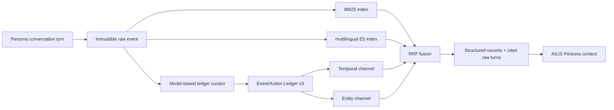

# AILIS Memory v3: Hybrid RRF + Event/Action Ledger

## Purpose

Memory v3 improves AILIS Persona dialogue memory without coupling it to
TaskAgent. It keeps the existing raw conversation log, editable core blocks,
user profile, relationship state, and recent-session context. It adds two
query-aware, rebuildable read layers:

1. Hybrid retrieval over raw conversation turns.
2. A structured Event/Action Ledger derived from those raw turns.

The raw conversation remains the source of truth. Derived records never
replace, rewrite, or delete raw memory.

## Data flow

TaskAgent sessions, sources, and roles are excluded before ledger extraction.
The ledger is not part of TaskAgent working memory.

## Files and ownership

- `events.jsonl` and `memory-state.json`: native raw AILIS memory; source of
  truth.
- `event-action-ledger.v3.json`: derived, versioned sidecar.
- `event-action-ledger-runs.v3.jsonl`: curation audit trail.
- `memory-cognition.json`: the earlier experimental cognition representation;
  not overwritten by Memory v3.

Deleting the v3 sidecar does not delete raw memory. The ledger can be rebuilt
by replaying native events through the curator.
Each completed extraction batch is atomically checkpointed so a long rebuild
can resume without replaying already accepted records.

## Retrieval layer

`hybrid_rrf_ledger_v3` uses four independent ranked channels:

| Channel | Input | Purpose |
|---|---|---|
| BM25 | raw turns and ledger text | exact words, names, and rare terms |
| multilingual E5 | raw turns and ledger text | multilingual paraphrases |
| temporal | model-planned time range plus record timestamps | time-bound evidence |
| entity | model-planned entities plus structured aliases/mappings | entity binding |

Reciprocal Rank Fusion combines the four rankings. Each selected document
records:

- fused score;
- matched channel names;
- rank and score within each channel;
- source event/session/time references.

The existing two-channel raw-turn Hybrid RRF result is retained as a raw
evidence anchor. This prevents the structured layer from hiding evidence that
the previous best retriever already found.

## Ledger record contract

Every record contains:

- `kind`: event, action, state, mapping, or measurement;
- `canonicalKey`: stable model-selected identity;
- `entity` and `entityType`;
- `actionType`;
- `status`: pending, completed, cancelled, superseded, or unknown;
- `occurredAt`, `targetAt`, and `completedAt`;
- exact quantities, name/role mappings, and state changes;
- verified temporal anchors that bind each resolved date to a verbatim source
  phrase;
- `sourceEventIds`, `sourceSessionIds`, optional `sourceMessageIds`, and full
  `sourceRefs`;
- `supersedes` and `supersededBy`;
- confidence, extraction version, and extraction timestamps.

The host accepts a record only when at least one cited event ID exists in the
exact supplied extraction batch. A fabricated or stale source ID is rejected.
Exact quantity values and name/role mappings must occur in cited evidence.
Resolved dates are accepted only when they equal the evidence timestamp or
carry a verbatim, verified temporal anchor.

The model is responsible for semantic interpretation. Deterministic runtime
code validates the schema, provenance, allowed lifecycle states, bounds, and
storage behavior; it does not infer an action from keywords.

## Lifecycle and identity

An exchange can contain more than one action. For example:

- return the old item;
- pick up the replacement.

Those actions must have distinct canonical identities. Repeated mentions of
the same replacement pickup use the same `canonicalKey` or `sameAsRecordId`
and merge their provenance instead of incrementing the count.

An older record becomes `superseded` only when the model explicitly cites new
evidence and names the earlier record in `supersedesRecordIds`. Similarity
alone cannot overwrite an old event.

## Context contract

Memory v3 gives the Persona model:

1. structured, query-relevant ledger records;
2. record state and exact fields;
3. extraction version and source IDs;
4. the corresponding immutable raw user/assistant turns.

This keeps compression useful while preserving the original evidence needed
to audit dates, numbers, names, mappings, and action counts.

## Destructive operations

- Forgetting a raw event removes only that source from derived records.
- A derived record is removed when it has no remaining source.
- Clearing AILIS memory clears the v3 sidecar together with the raw memory
  operation.
- Switching strategies does not migrate or rewrite raw events.

## LongMemEval acceptance gate

The first evaluation gate uses the same six-question stratified set as the
previous Hybrid RRF run:

- no regression on the five previously correct questions;
- clothing action count changes to `3`;
- QA reaches `6/6`;
- Session R@8 remains `1.0`;
- Turn R@8 remains at least `0.9444`;
- zero TaskAgent contamination;
- every ledger record has valid raw provenance.

The six-question gate is an engineering regression test, not an official
leaderboard result. A larger LongMemEval run is required after it passes.
