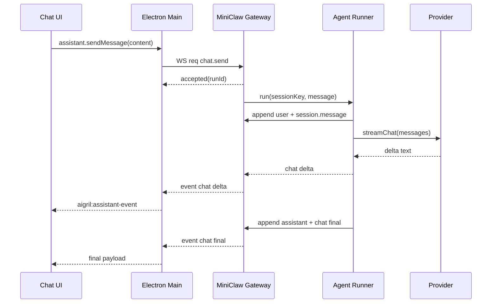

# 从 0 到 1 手搓一个小型 OpenClaw 参考

本文基于 `openclaw/openclaw` 上游源码做结构拆解，并给出一个适合当前 HumanClaw / AIGril 桌宠项目的“小型 OpenClaw”实现路线。

参考源码已下载到：

- `F:\AIGril\AIGrilClaw\.refs\openclaw-main`
- 上游仓库：<https://github.com/openclaw/openclaw>
- 本次参考版本：`package.json` 显示 `2026.5.21`

## 一句话理解

OpenClaw 不是单纯聊天 SDK。它更像一个本地优先的 AI 助手控制面：

- Gateway 常驻在本机，暴露 HTTP + WebSocket。
- 桌面端、WebChat、CLI、移动端、渠道插件都连接 Gateway。
- Agent 层负责会话、模型选择、工具、技能、转录文件、fallback。
- 插件层负责 provider、channel、tools、nodes、HTTP route、hook。
- 上层 UI 只关心几类 RPC 和事件：`chat.send`、`chat.history`、`sessions.*`、`chat` delta/final 事件。

对当前项目来说，第一阶段不用复刻完整 OpenClaw，只需要实现一个“MiniClaw Gateway + Agent Runner + Electron Bridge”。

## 上游源码主链路

### 1. CLI 入口

核心文件：

- `.refs/openclaw-main/src/entry.ts`
- `.refs/openclaw-main/src/cli/run-main.ts`
- `.refs/openclaw-main/openclaw.mjs`

启动路径大致是：

```text
openclaw.mjs
  -> src/entry.ts
  -> src/cli/run-main.ts
  -> commander command registry
  -> gateway / agent / message / sessions / doctor / plugins ...
```

上游做了很多启动优化：Node 版本检查、compile cache、help fast path、profile/container 参数、proxy/dotenv/config 预加载。小型版本不需要这些，保留一个明确入口即可。

建议最小化：

```bash
node mini-openclaw.mjs gateway --port 19011
node mini-openclaw.mjs agent --message "hello"
```

### 2. Gateway 控制面

核心文件：

- `.refs/openclaw-main/src/gateway/server.ts`
- `.refs/openclaw-main/src/gateway/server.impl.ts`
- `.refs/openclaw-main/src/gateway/server-runtime-state.ts`
- `.refs/openclaw-main/src/gateway/server-http.ts`
- `.refs/openclaw-main/src/gateway/server/ws-connection.ts`
- `.refs/openclaw-main/src/gateway/server/ws-connection/message-handler.ts`
- `.refs/openclaw-main/src/gateway/server-methods.ts`

上游 Gateway 分成几层：

```text
server.ts
  -> lazy import server.impl.ts

server.impl.ts
  -> 读配置
  -> 准备 auth / plugin / channel / runtime state
  -> 创建 HTTP server + WebSocketServer
  -> 挂载 WS 连接处理、HTTP routes、channel runtime、cron、node runtime

server-runtime-state.ts
  -> createGatewayHttpServer()
  -> attachGatewayUpgradeHandler()
  -> WebSocketServer(noServer: true)
  -> clients / broadcast / chatRunState / dedupe

server-methods.ts
  -> coreGatewayHandlers
  -> handleGatewayRequest()
  -> method registry + role/scope authorization
```

小型版本只需要这几个概念：

- 一个 HTTP server，处理 `/health`、`/ready`。
- 一个 WS server，处理 `connect` 握手。
- 一个 RPC method registry，按 `method` 分发。
- 一个事件广播器，向已连接 UI 推送 `chat`、`session.message`。
- 一个内存中的 clients 集合。

### 3. WebSocket 协议

上游协议是 request/response/event 三类帧：

```json
{ "type": "req", "id": "1", "method": "connect", "params": {} }
{ "type": "res", "id": "1", "ok": true, "result": {} }
{ "type": "event", "event": "chat", "payload": {} }
```

上游握手前会先发 `connect.challenge`，然后要求客户端发 `connect`。还会校验 protocol version、role、scopes、token/password/device identity、origin、pairing。

小型版本建议第一阶段只做：

- 仅监听 `127.0.0.1`。
- `auth: none` 只允许 loopback。
- 若开放到非 loopback，必须启用 token。
- `connect` 参数保留 `client`、`role`、`scopes` 字段，暂不实现复杂设备配对。

最小 connect 返回：

```json
{
  "server": { "name": "MiniClaw", "version": "0.1.0" },
  "methods": [
    "health",
    "chat.send",
    "chat.history",
    "chat.abort",
    "sessions.list",
    "sessions.subscribe",
    "sessions.messages.subscribe"
  ],
  "events": ["chat", "session.message", "sessions.changed"]
}
```

### 4. Agent 执行层

核心文件：

- `.refs/openclaw-main/src/commands/agent-via-gateway.ts`
- `.refs/openclaw-main/src/agents/agent-command.ts`
- `.refs/openclaw-main/src/agents/command/attempt-execution.ts`
- `.refs/openclaw-main/src/agents/harness/selection.ts`
- `.refs/openclaw-main/src/agents/model-selection.ts`

上游 Agent 路径：

```text
CLI agent command
  -> 优先 callGateway(method="agent")
  -> Gateway 不可用时 embedded fallback

agentCommand()
  -> resolve config
  -> resolve session
  -> resolve workspace / agent dir
  -> resolve model/provider/thinking/verbose
  -> load skills snapshot
  -> resolve transcript file
  -> runWithModelFallback()
  -> runAgentAttempt()
  -> CLI backend or embedded PI backend or plugin harness
  -> persist transcript
  -> deliver result
```

小型版本先保留这条简化链路：

```text
chat.send RPC
  -> create runId
  -> append user message to session JSONL
  -> broadcast chat delta start
  -> call provider adapter
  -> stream assistant text as chat delta
  -> append assistant message to session JSONL
  -> broadcast chat final
```

暂时不做：

- ACP runtime
- 多 agent routing
- complex fallback
- skills snapshot hydration
- sandbox
- cron
- channel delivery

### 5. 插件、渠道、Provider

核心文件：

- `.refs/openclaw-main/src/plugins/registry.ts`
- `.refs/openclaw-main/src/plugins/runtime.ts`
- `.refs/openclaw-main/src/channels/plugins/types.plugin.ts`
- `.refs/openclaw-main/src/gateway/server-channels.ts`
- `.refs/openclaw-main/extensions/openai/index.ts`
- `.refs/openclaw-main/extensions/telegram/index.ts`

上游插件能力很宽：

- provider：OpenAI、Anthropic、Gemini、Ollama 等。
- channel：Telegram、Discord、Slack、WhatsApp 等。
- tools：浏览器、Canvas、nodes、sessions、cron。
- HTTP route：插件自带网页或 webhook。
- hooks：agent 前后、conversation、gateway lifecycle。

小型版本建议只抽两个接口：

```js
export class ProviderAdapter {
  async *streamChat({ messages, model, signal }) {}
}

export class ChannelAdapter {
  async start({ onMessage }) {}
  async send({ target, text }) {}
  async stop() {}
}
```

第一版先内置一个 `openai-compatible` provider，不做动态插件加载。等 Gateway 和桌面桥跑稳，再把 provider/channel 改成插件注册。

## Agent、Tool、MCP 与本机系统如何打通

OpenClaw 的关键设计不是“Agent 直接拥有电脑权限”，而是把所有能力都压到一条受控链路里：

```text
用户/渠道/UI
  -> Gateway RPC 或 WebSocket event
  -> Agent command / run attempt
  -> Tool policy 计算可见工具
  -> Tool / MCP / Plugin / Channel / Node 执行
  -> before-tool-call hook / 审批 / 沙箱 / schema 校验
  -> 结果写入 transcript 并广播给 UI
```

核心分层如下：

1. Agent Runtime 是调度层。
   上游在 `src/agents/agent-command.ts` 里解析会话、workspace、模型、技能、转录文件，然后在 `runAgentAttempt()` 里选择 CLI backend、embedded PI backend 或 plugin harness。CLI backend 走 Claude/Codex/Gemini 这类外部 Agent；embedded backend 则直接把工具对象交给 PI runtime。

2. Tool Registry 是能力清单层。
   内置工具来自 `createOpenClawCodingTools()`，包括 `read/write/edit/apply_patch/exec/process`、`message`、`sessions_*`、`web_fetch/web_search`、`image/pdf/tts/nodes` 等。插件工具通过 `api.registerTool()` 注册，但必须先在插件 manifest 的 `contracts.tools` 中声明，否则注册会被拒绝。

3. Tool Policy 是权限裁剪层。
   工具不是注册了就能用。OpenClaw 会按全局配置、agent 配置、provider/model、channel group、sender、sandbox、subagent 继承权限逐层过滤。子 Agent 默认禁用 `gateway`、`agents_list`、`session_status`、`cron`、`sessions_send` 等系统级工具；叶子子 Agent 还会禁用继续 spawn/管理其他 session 的工具。

4. MCP 是适配层，不是权限源头。
   对外部 CLI Agent，OpenClaw 会把 MCP 配置注入到 Claude/Codex/Gemini 的运行参数里。对 embedded Agent，OpenClaw 自己启动 MCP client，把每个 MCP server 的 `tools/list` 物化成普通 Agent Tool，再继续走同一套 Tool Policy 和 before-tool-call hook。

5. 电脑和外部系统都被抽象成工具或 channel。
   文件/代码通常走 `read/write/edit/apply_patch/exec` 和 file-transfer 工具；浏览器走 browser plugin；远端机器走 node capability；邮件这类事件型系统走 hook/channel，例如 Gmail watcher 会启动 `gog gmail watch serve`，把 Gmail PubSub 事件转进 Gateway hook，再变成一次可审计的 Agent 输入。

对应到从 0 手搓的 MiniClaw，最小接口应该是：

```ts
type Tool = {
  name: string;
  description: string;
  inputSchema: object;
  execute(ctx: ToolContext, args: unknown): Promise<ToolResult>;
};

type ToolContext = {
  sessionKey: string;
  agentId: string;
  workspaceDir: string;
  sender?: { channel?: string; id?: string; isOwner?: boolean };
  abortSignal?: AbortSignal;
};
```

然后所有工具调用都必须经过：

```text
schema validate
  -> policy allow/deny
  -> approval/sandbox guard
  -> execute
  -> result normalize
  -> transcript + event
```

## 性能、正确性、安全性的做法

### 性能

- Gateway 常驻，插件 registry、channel runtime、MCP session runtime、WebSocket clients 都复用，不为每次聊天重新冷启动。
- Gateway 大量使用 lazy import。HTTP route、plugin route、hooks、WS message handler 都是第一次使用时再加载。
- WebSocket event 是流式广播，慢消费者会被丢弃可丢事件或断开，避免一个卡住的 UI 拖垮全局。
- MCP runtime 有 session 级缓存、catalog 缓存、lease 和 idle TTL。一次会话中 MCP server 不需要反复启动和 `tools/list`。
- `tools.allow` 会反向影响工具构造计划。只允许 `read` 时，不会把全部 shell、OpenClaw、plugin 工具都实例化出来。

### 正确性

- 所有 Gateway method 都在 method descriptor 中声明 scope，未知 method 直接拒绝。
- RPC 参数、MCP 参数、工具参数都有 schema 校验；工具 schema 在交给不同 provider 前还会做兼容性归一化。
- `chat.send`、`sessions.send` 等入口使用 `idempotencyKey` 和 runId，避免 UI 重试造成重复执行。
- transcript/session 是单独的持久层，运行结果写入后再发 `session.message`，UI 可以重连恢复状态。
- MCP 工具名会被安全重命名为 provider-safe 名称，并按 server/tool 排序，保证同一轮工具列表稳定。

### 安全性

- Gateway 默认偏本地，非 loopback 绑定会报警；HTTP/WS 有 token/password/device identity/origin/scopes/rate limit 多层校验。
- scopes 默认拒绝。没有设备身份的客户端即使自称有 scopes，也会被清空或要求重新配对。
- `tools.invoke` 只是一个入口，真正可用工具仍由 `resolveGatewayScopedTools()` 按 session、agent、channel、policy 重新计算。
- shell/exec 有三道闸：`security` 模式、allowlist/safeBins、审批。node-host 执行还要求真实的 `exec.approval.*` 记录，防止用户把 `approved=true` 塞进参数绕过审批。
- 文件能力默认应限制 workspace 或显式 allowReadPaths/allowWritePaths；file-transfer 插件的描述里明确“没有策略配置就拒绝”。
- Gmail 这类外部系统需要 pushToken/hookToken，watcher 进程可重启、可续租、可停止，不把邮箱权限直接暴露给模型。

MiniClaw 的安全底线可以更简单，但不要省掉这 5 个点：

1. Gateway 默认只监听 `127.0.0.1`。
2. Renderer 永远不能直接持有 API key、邮箱 token、文件系统全权限。
3. 工具必须有 schema、allow/deny、审计日志。
4. 写文件、发邮件、跑命令都要显式审批或白名单。
5. 所有 tool result 都写 transcript，便于回放、调试和追责。

## 当前项目接入点

当前项目已经有 OpenClaw 桥接雏形，重点文件：

- `F:\AIGril\electron\openclaw-runtime.cjs`
- `F:\AIGril\electron\main.cjs`
- `F:\AIGril\electron\preload.cjs`
- `F:\AIGril\src\openclaw-chat-service.js`
- `F:\AIGril\src\control-panel-app.js`
- `F:\AIGril\src\chat-service.js`

已有链路：

```text
control-panel
  -> backendMode = openclaw
  -> openclawGatewayUrl = ws://127.0.0.1:19011

electron/main.cjs
  -> OpenClawRuntimeSupervisor
  -> OpenClawGatewayManager
  -> IPC: assistant-status/history/send-message/abort-run/list-sessions

preload.cjs
  -> window.aigrilDesktop.assistant.*

renderer
  -> OpenClawDesktopChatService
  -> assistant.getHistory()
  -> assistant.sendMessage()
  -> assistant.onEvent(chat/session.message/status)
```

所以从 0 手搓时，最经济的做法不是重写前端，而是让你自己的 MiniClaw Gateway 兼容现有 Electron 桥期待的 RPC 和事件。

## MiniClaw MVP 文件规划

建议先放在一个独立目录，避免污染桌宠已有代码：

```text
F:\AIGril\src\mini-openclaw\
  gateway\
    server.js
    protocol.js
    clients.js
    methods.js
    auth.js
  agent\
    runner.js
    provider-openai-compatible.js
    transcript-store.js
    session-store.js
    events.js
  config\
    paths.js
    config.js
  cli\
    mini-openclaw.mjs
  README.md
```

第二阶段再接进 Electron：

```text
F:\AIGril\electron\mini-openclaw-runtime.cjs
F:\AIGril\electron\main.cjs
F:\AIGril\src\openclaw-chat-service.js
```

## MVP RPC 清单

先实现这些就能让当前桌宠聊天跑起来：

### `connect`

输入：

```json
{
  "client": { "id": "aigril-desktop", "mode": "backend", "version": "dev" },
  "role": "operator",
  "scopes": ["operator.read", "operator.write"]
}
```

输出：

```json
{
  "server": { "name": "MiniClaw", "version": "0.1.0" },
  "methods": ["health", "chat.send", "chat.history"],
  "events": ["chat", "session.message", "status"]
}
```

### `health`

输出：

```json
{ "ok": true, "status": "live" }
```

### `chat.history`

输入：

```json
{ "sessionKey": "main", "limit": 200 }
```

输出：

```json
{
  "sessionKey": "main",
  "messages": [
    { "role": "user", "content": "hello", "timestamp": 1760000000000 },
    { "role": "assistant", "content": [{ "type": "text", "text": "hi" }], "timestamp": 1760000001000 }
  ]
}
```

### `chat.send`

输入：

```json
{
  "sessionKey": "main",
  "message": "帮我整理今天的计划",
  "idempotencyKey": "uuid"
}
```

立即返回：

```json
{ "runId": "run_xxx", "sessionKey": "main", "status": "accepted" }
```

随后推事件：

```json
{
  "type": "event",
  "event": "chat",
  "payload": {
    "sessionKey": "main",
    "runId": "run_xxx",
    "state": "delta",
    "message": { "role": "assistant", "content": "..." }
  }
}
```

final：

```json
{
  "type": "event",
  "event": "chat",
  "payload": {
    "sessionKey": "main",
    "runId": "run_xxx",
    "state": "final",
    "message": { "role": "assistant", "content": "完整回答" }
  }
}
```

### `sessions.messages.subscribe`

输入：

```json
{ "key": "main" }
```

输出：

```json
{ "key": "main" }
```

之后每次落盘消息都推：

```json
{
  "type": "event",
  "event": "session.message",
  "payload": {
    "sessionKey": "main",
    "message": { "role": "assistant", "content": [{ "type": "text", "text": "..." }] }
  }
}
```

## 从 0 到 1 阶段计划

### P0：项目边界

目标：先不要做完整 OpenClaw，只做桌宠能用的 Gateway。

产物：

- `mini-openclaw` 独立目录。
- 一个可执行 CLI。
- 一个本地状态目录，例如 `F:\AIGril\tmp\mini-openclaw-home`。

验收：

- `node src/mini-openclaw/cli/mini-openclaw.mjs gateway --port 19011`
- 浏览器访问 `http://127.0.0.1:19011/health` 返回 `{ ok: true }`。

### P1：WS 协议和 RPC

目标：兼容 Electron 侧 GatewayClient 的基本 request/event 模式。

实现：

- `protocol.js`：解析 JSON 帧，校验 `type/id/method/params`。
- `clients.js`：保存 client、subscriptions、send/broadcast。
- `methods.js`：注册 `health`、`chat.history`、`chat.send`。

验收：

- 手写一个 Node WS client 能 connect。
- 调 `chat.history` 返回空数组。
- 调 `chat.send` 能收到 delta/final 事件。

### P2：Session 和 Transcript

目标：所有对话可恢复。

状态文件建议：

```text
mini-openclaw-home\
  sessions\
    sessions.json
    main.jsonl
```

`sessions.json`：

```json
{
  "main": {
    "sessionId": "main",
    "sessionKey": "main",
    "updatedAt": 1760000000000,
    "title": "Main"
  }
}
```

`main.jsonl` 每行一条：

```json
{"role":"user","content":"hello","timestamp":1760000000000}
{"role":"assistant","content":[{"type":"text","text":"hi"}],"timestamp":1760000001000}
```

验收：

- 重启 Gateway 后 `chat.history` 仍能读取历史。
- 前端打开聊天面板能展示历史。

### P3：Provider Adapter

目标：先接一个 OpenAI-compatible provider。

配置：

```json
{
  "provider": {
    "baseUrl": "https://api.openai.com/v1",
    "apiKeyEnv": "OPENAI_API_KEY",
    "model": "gpt-4.1-mini"
  }
}
```

接口：

```js
async function* streamChat({ messages, model, signal }) {
  // yield { type: 'delta', text: '...' }
  // yield { type: 'final', text: '...' }
}
```

验收：

- `chat.send` 能真实调用模型。
- UI 逐步显示流式文本。
- AbortSignal 能停止一次运行。

### P4：接入 Electron 桌宠

目标：让现有 `OpenClawDesktopChatService` 不用大改即可使用 MiniClaw。

两种路线：

1. 兼容上游 GatewayClient 协议，让 `electron/openclaw-runtime.cjs` 继续工作。
2. 新增 `electron/mini-openclaw-runtime.cjs`，在里面直接用 `ws` 实现简化客户端。

推荐路线 2，原因是可控、容易调试；等协议稳定后再考虑复用上游 SDK。

验收：

- 控制面板选择 OpenClaw 后端。
- 自动启动本地 MiniClaw Gateway。
- 聊天面板发送消息，桌宠能显示流式回复。

### P5：工具系统

目标：让助手能调用有限本地能力。

第一批工具：

- `desktop.expression.set`：改表情。
- `desktop.action.play`：触发动作。
- `memory.note.add`：写入本地记忆。
- `file.read`：只读白名单目录。

工具调用先不做复杂 function calling。可以让模型输出控制标签：

```text
[action:wave]
[expression:happy]
你好，我在。
```

这和当前 `src/chat-service.js` 的 `parseReplyMarkup()` 兼容。

### P6：插件化

等 MVP 稳定后再抽插件：

```js
export function defineMiniClawPlugin(plugin) {
  return plugin;
}

plugin.register({
  registerProvider(adapter) {},
  registerTool(tool) {},
  registerChannel(channel) {}
});
```

第一版只需要本地加载：

```text
mini-openclaw/plugins/openai-compatible.js
mini-openclaw/plugins/desktop-tools.js
```

不用一开始就做 npm 插件、manifest 扫描、热更新。

## 建议不要一开始复刻的部分

OpenClaw 上游很强，但第一版小型实现不要碰这些：

- 全渠道消息系统。
- 设备配对、节点权限、移动端 node。
- ACP control-plane。
- Docker/SSH/OpenShell sandbox。
- Cron heartbeat 自动任务。
- 插件市场、安装器、版本兼容。
- provider 大模型目录和价格系统。
- 多 agent fallback / auth profile / skills snapshot。

这些都可以在 MiniClaw 的核心链路跑通后逐步长出来。

## 安全底线

即使是小型版，也要保留这些规则：

- 默认只绑定 `127.0.0.1`。
- 非 loopback 必须 token。
- 所有文件读写工具必须有白名单根目录。
- Shell 工具默认关闭。
- Renderer 不能直接拿 API key，只能经 Electron main 或 Gateway。
- `chat.send` 需要 idempotencyKey，避免 UI 重试造成重复运行。
- 每个 run 都要能 abort。

## 最小数据流



## 第一轮落地清单

建议按这个顺序做：

1. 新建 `src/mini-openclaw/gateway/server.js`，跑通 `/health`。
2. 加 `ws` 服务和 `connect` 握手。
3. 加 `chat.history`，读取 JSONL。
4. 加 `chat.send`，先用假 provider 每 50ms 输出几个 delta。
5. 接到 `electron/mini-openclaw-runtime.cjs`。
6. 控制面板选择 OpenClaw 后端，自动启动 MiniClaw。
7. 替换假 provider 为 OpenAI-compatible provider。
8. 增加 abort、错误事件、重连。
9. 增加 transcript/session 单元测试。
10. 再考虑 tools 和插件化。

## 和上游的映射表

| MiniClaw 模块 | 上游参考 | 作用 |
| --- | --- | --- |
| `gateway/server.js` | `src/gateway/server-runtime-state.ts`、`server-http.ts` | HTTP + WS server |
| `gateway/methods.js` | `src/gateway/server-methods.ts` | RPC registry |
| `gateway/protocol.js` | `src/gateway/protocol/*`、`ws-connection/message-handler.ts` | frame shape、connect |
| `agent/runner.js` | `src/agents/agent-command.ts` | 会话、模型、运行 |
| `agent/provider-openai-compatible.js` | `extensions/openai/index.ts` | provider adapter |
| `agent/transcript-store.js` | `src/config/sessions/transcript*.ts` | JSONL 历史 |
| `agent/events.js` | `src/infra/agent-events.ts`、`server-chat.ts` | delta/final 广播 |
| `electron/mini-openclaw-runtime.cjs` | 当前 `electron/openclaw-runtime.cjs` | 桌面桥 |

## 关键取舍

第一版不要追求“像 OpenClaw 一样完整”，而是追求“协议像、数据流像、能接桌宠”。只要 `connect`、`chat.history`、`chat.send`、`chat` 事件和 `session.message` 事件稳定，HumanClaw 就已经拥有了 OpenClaw 式的本地助手核心。

## OpenClaw 借用的标准、SDK 和开源实现

一个判断先说在前面：OpenClaw 不是把 Agent、Tool、MCP、邮件、聊天、浏览器、代码智能这些东西从头全发明了一遍。它更像一个统一接线层，自己负责：

- Gateway、Session、Transcript、事件广播。
- Tool registry、策略过滤、审批、hook、沙箱边界。
- 把不同生态的能力收束成一套统一运行时。

真正的“底层协议”和“现成实现”，大多来自行业标准、官方 API、官方 SDK 或成熟开源项目。

### 1. MCP：跨 Agent 工具接入的主标准

源码证据：

- `@modelcontextprotocol/sdk` 直接出现在上游依赖里。
- [mcp-transport.ts](/F:/AIGril/AIGrilClaw/.refs/openclaw-main/src/agents/mcp-transport.ts:1) 明确支持 `stdio`、`sse`、`streamable-http`。
- [mcp-http.handlers.ts](/F:/AIGril/AIGrilClaw/.refs/openclaw-main/src/gateway/mcp-http.handlers.ts:1) 直接实现 `initialize`、`tools/list`、`tools/call`。

对应生态：

- 标准：Model Context Protocol。
- 官方实现：`modelcontextprotocol/typescript-sdk`。
- 作用：把外部工具、资源、prompt server 统一暴露给 Agent。

这部分几乎就是“直接借标准”，OpenClaw 自己主要补了会话隔离、policy、hook、loopback auth 和工具物化。

### 2. Tool 调用：没有完全统一的行业标准，OpenClaw 做的是适配层

这里要分两层看：

- 模型侧：OpenAI Responses tools、Anthropic `tool_use`、Gemini function calling，各家格式相近，但并不完全统一。
- OpenClaw 内部：把这些 provider-native tool API 统一映射成自己的 Tool registry。

也就是说，OpenClaw 不是发明了“工具调用”这件事，而是把多家模型厂商各自的 tool API 接成一套。

如果你从 0 到 1 手搓一个 MiniClaw，最稳的路线通常是：

1. 先只支持一家 provider 的 function calling。
2. 再加 MCP，把外部工具标准化。
3. 最后再补一个内部 Tool registry，统一本地工具、MCP 工具、provider 工具。

### 3. Tool 参数描述：JSON Schema / Zod / TypeBox / AJV 这套生态

源码证据：

- 上游依赖里有 `ajv`、`zod`、`typebox`。
- Gateway 和 plugin/tool 注册流程里有 schema 校验与归一化。

对应生态：

- 标准：JSON Schema。
- 常见实现：AJV、Zod、TypeBox。
- 作用：描述工具参数、做输入校验、做 provider 之间的 schema 归一化。

这也是 OpenClaw 正确性的重要来源之一：不是模型说传什么就传什么，而是先过 schema。

### 4. RPC 与代码智能：JSON-RPC + LSP

源码证据：

- [pi-bundle-lsp-runtime.ts](/F:/AIGril/AIGrilClaw/.refs/openclaw-main/src/agents/pi-bundle-lsp-runtime.ts:1) 里直接写了 “Minimal LSP JSON-RPC framing over stdio”。
- 同文件里实现了 `Content-Length` framing、`initialize`、`shutdown`、`$/cancelRequest` 这一类标准 LSP/JSON-RPC 行为。

对应生态：

- 标准：JSON-RPC 2.0。
- 标准：Language Server Protocol。
- 作用：代码 hover、definition、references、completion、diagnostics 这一类“代码语义工具”。

这意味着 OpenClaw 并不是自己写一套“代码理解协议”，而是直接站在 LSP 生态上吃现成能力。

### 5. 浏览器 / 电脑交互：Playwright + CDP

源码证据：

- 上游依赖和浏览器插件依赖里有 `playwright-core`。
- [extensions/browser/package.json](/F:/AIGril/AIGrilClaw/.refs/openclaw-main/extensions/browser/package.json:1) 直接依赖 `playwright-core`。
- [browser-cdp.ts](/F:/AIGril/AIGrilClaw/.refs/openclaw-main/src/plugin-sdk/browser-cdp.ts:1) 说明它也接了 CDP URL 这一层。

对应生态：

- 开源实现：Playwright。
- 协议/接口：Chrome DevTools Protocol。
- 作用：截图、点按、输入、页面控制、浏览器自动化。

所以“电脑交互”通常也不是 Agent 直接碰 OS，而是先走浏览器自动化框架或受控 runtime。

### 6. 邮件与外部事件：OAuth 2.0 + Gmail API + Pub/Sub + Webhook

源码证据：

- [gmail-watcher.ts](/F:/AIGril/AIGrilClaw/.refs/openclaw-main/src/hooks/gmail-watcher.ts:1) 会启动 `gog gmail watch serve`。
- 代码注释已经写明：这是在 Gateway 启动时自动起 Gmail watcher。

对应生态：

- 认证标准：OAuth 2.0。
- 邮件 API：Gmail API。
- 事件分发：Google Cloud Pub/Sub。
- 推送方式：Webhook / HTTP callback。

这条链路不是 OpenClaw 自造邮箱协议，而是：

1. 用 OAuth 拿 Gmail 权限。
2. 用 Gmail push notification 订阅邮箱变化。
3. 由 Pub/Sub 把事件送到你的后端。
4. OpenClaw 的 hook runtime 再把事件转成 Agent 输入。

### 7. 聊天与外部渠道：Bot API / Webhook / 官方平台 SDK

源码证据：

- `wizard` 文案和 channel runtime 里已经能看到 `telegram`、`line`、`google chat`、`synology chat`、`imessage-webhook` 这些渠道痕迹。
- [server-channels.ts](/F:/AIGril/AIGrilClaw/.refs/openclaw-main/src/gateway/server-channels.ts:1) 是统一的 channel 生命周期管理器。
- [webhook-request-guards.ts](/F:/AIGril/AIGrilClaw/.refs/openclaw-main/src/plugin-sdk/webhook-request-guards.ts:1) 是统一 webhook 防护层。

对应生态：

- Telegram：Bot API。
- LINE：Messaging API + webhook。
- Slack：incoming webhook / Web API。
- Google Chat：incoming webhook / Chat app API。

OpenClaw 自己做的不是“聊天协议本身”，而是：

- 统一 channel runtime。
- 统一 webhook 入口。
- 统一 session 映射。
- 统一 agent dispatch。

### 8. Webhook 安全：不是一个 RFC，但已有社区规范和成熟做法

源码证据：

- 上游 lockfile 里有 `standardwebhooks`。
- [webhook-request-guards.ts](/F:/AIGril/AIGrilClaw/.refs/openclaw-main/src/plugin-sdk/webhook-request-guards.ts:1) 实现了方法限制、Content-Type 限制、限流、并发 in-flight 限制、body size limit。

对应生态：

- 社区规范：Standard Webhooks。
- 常见做法：签名校验、重放保护、请求体大小限制、速率限制、异步处理、SSRF 防护。

OpenClaw 在这层补的值非常大，因为“能收 webhook”不难，“能安全稳定地收 webhook”才难。

### 9. 文件系统 / Shell / 本机能力：通常没有统一协议，重点在沙箱和权限边界

这一层反而最不像 MCP/LSP 那样有漂亮标准。通常做法是：

- 文件系统：直接走 Node/Python/Rust 的本地 I/O API。
- Shell：走受控 `spawn/exec`。
- 目录权限：workspace allowlist / denylist。
- 高危能力：审批流、safe bins、沙箱容器、只读挂载。

OpenClaw 自己补的是这部分最难的工程化部分：

- 工具是否可见。
- 工具是否可调用。
- 调用前是否要审批。
- 参数是否越权。
- 执行是否在 sandbox。
- 结果是否需要审计和落 transcript。

所以这层没有一个“万能标准”，更多是工程纪律。

### 10. 代码结构理解：Tree-sitter 这类增量解析生态也很重要

源码依赖里还有：

- `web-tree-sitter`
- `tree-sitter-bash`

这类库不是像 LSP 那样负责“编辑器到语言服务”的协议，而是负责：

- 语法树。
- 增量解析。
- 更稳的代码块/命令解析。
- prompt 构造前的结构化抽取。

它们通常和 LSP 互补：LSP 给语义能力，Tree-sitter 给轻量快速的结构解析。

## 一张归纳表

| 能力层 | OpenClaw 更像什么 | 常见标准 / 开源实现 |
| --- | --- | --- |
| Agent 与外部工具 | 统一适配层 | MCP、provider-native tool APIs |
| Tool 参数 | schema 归一化层 | JSON Schema、AJV、Zod、TypeBox |
| 代码语义 | LSP runtime 宿主 | LSP、JSON-RPC |
| 浏览器交互 | 浏览器工具编排层 | Playwright、CDP |
| 邮件事件 | hook + watcher runtime | OAuth 2.0、Gmail API、Pub/Sub、Webhook |
| 聊天渠道 | channel runtime | Telegram Bot API、LINE webhook、Slack webhook、Google Chat webhook |
| Webhook 接入 | 安全入口层 | Standard Webhooks、签名、限流、异步处理 |
| 文件 / Shell / 本机 | 权限与审批层 | 本地 I/O API、spawn/exec、sandbox、approval |

## 对你手搓 MiniClaw 的直接建议

如果你的目标不是复刻整个 OpenClaw，而是先做一个“能跑起来、能扩展”的 HumanClaw，我建议依赖顺序这样选：

1. 模型工具调用：先选一家 provider，先跑通 OpenAI Responses tools 或 Gemini function calling。
2. 外部工具协议：优先接 MCP，不要先自造远程工具协议。
3. 本地工具 schema：统一用 JSON Schema 或 Zod。
4. 代码能力：优先 LSP，补 Tree-sitter。
5. 浏览器：优先 Playwright，不要自己造浏览器控制协议。
6. 邮件/聊天：优先 webhook + 官方 API，不要自己碰底层 IM/邮箱协议。
7. 安全：从第一天就做 allowlist、审批、日志、transcript。

一句话总结就是：OpenClaw 的强，不是“把所有零件都自己重新造了”，而是“知道哪些地方该借标准，哪些地方该自己做统一编排和安全边界”。

## 参考资料（官方 / 规范）

- MCP 规范：[modelcontextprotocol.io/specification](https://modelcontextprotocol.io/specification/2025-06-18)
- MCP TypeScript SDK：[github.com/modelcontextprotocol/typescript-sdk](https://github.com/modelcontextprotocol/typescript-sdk)
- JSON-RPC 2.0：[jsonrpc.org/specification](https://www.jsonrpc.org/specification)
- OAuth 2.0：[RFC 6749](https://www.rfc-editor.org/rfc/rfc6749)
- JSON Schema：[json-schema.org](https://json-schema.org/)
- LSP 3.17：[Language Server Protocol](https://microsoft.github.io/language-server-protocol/specifications/lsp/3.17/specification/)
- Playwright：[playwright.dev/docs/intro](https://playwright.dev/docs/intro)
- Chrome DevTools Protocol：[chromedevtools.github.io/devtools-protocol](https://chromedevtools.github.io/devtools-protocol/)
- Gmail Push Notifications：[developers.google.com/workspace/gmail/api/guides/push](https://developers.google.com/workspace/gmail/api/guides/push)
- Telegram Bot API：[core.telegram.org/bots/api](https://core.telegram.org/bots/api)
- LINE Messaging API Webhook：[developers.line.biz](https://developers.line.biz/en/docs/messaging-api/receiving-messages/)
- Slack Incoming Webhooks：[api.slack.com/messaging/webhooks](https://api.slack.com/messaging/webhooks)
- Google Chat Webhooks：[developers.google.com/workspace/chat/quickstart/webhooks](https://developers.google.com/workspace/chat/quickstart/webhooks)
- Standard Webhooks：[standardwebhooks.com](https://www.standardwebhooks.com/)
- Tree-sitter：[tree-sitter.github.io](https://tree-sitter.github.io/tree-sitter/)
